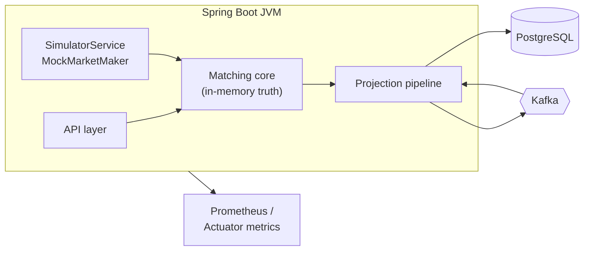
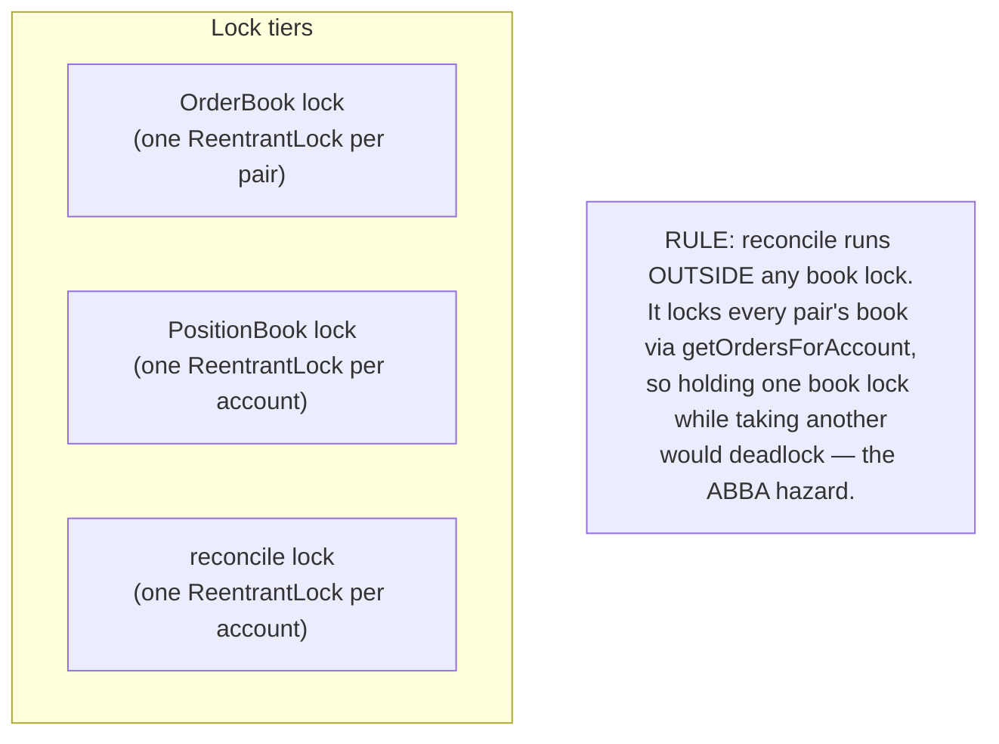

# 01 — Architecture

## Process layout

`fx-oee` is a **single Spring Boot process** ([FxOeeApplication.java](../src/main/java/com/fxoee/FxOeeApplication.java))
that embeds:

- the **matching core** (`com.fxoee.engine`, `com.fxoee.matching`) — pure Java, no framework
  dependencies, holding all authoritative trading state in memory;
- a **REST + WebSocket API** (`com.fxoee.api`) for order entry, account queries, market data, and debug;
- an **async projection pipeline** (`FillQueue` → `PersistenceWorker` → Kafka → consumers) that writes
  PostgreSQL and an in-memory mirror;
- a **market simulator** and **mock market maker** for load testing and a live price feed.

External infrastructure: **PostgreSQL** (projection + durable event log) and **Kafka** (event
transport). Both are optional in dev — with `kafka.enabled=false` the engine runs standalone and all
publish calls become no-ops (the `OrderEventProducer` / `FillQueue` beans are simply absent).

## Bean wiring

Two `@Configuration` classes wire the core:

- [MatchingConfig.java](../src/main/java/com/fxoee/config/MatchingConfig.java) builds one
  `OrderBook` and one `MatchingEngine` **per currency pair**, exposed as
  `Map<CurrencyPair, OrderBook>` and `Map<CurrencyPair, MatchingEngine>` (`EnumMap`).
- [EngineConfig.java](../src/main/java/com/fxoee/engine/EngineConfig.java) is the *only* class in
  `com.fxoee.engine` that touches Spring. It builds the `Margin`, `PositionBook`, `MarginLedger`,
  `PreTradeValidator`, `MarketBuyEstimator`, and the `MatchingService` facade. The Kafka producer and
  `FillQueue` are injected via `ObjectProvider`, so the engine works identically whether or not Kafka
  is present.

The `MarginLedger` bean **pre-seeds the house account** (`HouseAccount.HOUSE_UUID`) with $10M so
reconcile never flags mock-maker orders as unfunded before the first user trade.

## Concurrency & locking model

The engine uses **two tiers of fine-grained locks** and one rule that ties them together.

| Lock | Scope | Held during | Source |
|------|-------|-------------|--------|
| Book lock | per **pair** | the whole match loop + reserve + applyFills | [OrderBook.java:51](../src/main/java/com/fxoee/matching/OrderBook.java) |
| Position lock | per **account** | one `applyFill` / `netQty` / `lots` read | [PositionBook.java:62](../src/main/java/com/fxoee/engine/position/PositionBook.java) |
| Reconcile lock | per **account** | one `reconcile` pass | [MatchingService.java:94](../src/main/java/com/fxoee/engine/MatchingService.java) |

### Why per-account position locks

A previous whole-object `synchronized` monitor on `PositionBook` meant the simulator (N accounts × 7
pairs per tick) held one global lock for every order's `applyFill` + reconcile, starving Tomcat REST
threads and making the API unreachable under load. Per-account `ReentrantLock`s remove cross-account
contention: orders on different accounts never block each other.

### The ABBA deadlock and how it's avoided

`reconcile(account)` recomputes an account's locked margin from its held positions **plus its live
resting orders across all pairs** — so it acquires book locks for every pair. If `submit` called
`reconcile` while still holding the aggressor pair's book lock, two concurrent submits on different
pairs could each hold one book lock and wait for the other (ABBA). The fix
([MatchingService.submit](../src/main/java/com/fxoee/engine/MatchingService.java:189)):

1. Do validation, reserve, match, and apply-fills **inside** the book lock.
2. **Release** the book lock.
3. Run `reconcileGuarded(account)` and any Kafka sends **outside** it.

`reconcileGuarded` takes a per-account reconcile lock so two recomputes for the same account never
race, while different accounts still reconcile in parallel. This bug and fix are captured in a
regression test (`MatchingServiceTest.concurrentDifferentPairs_noDeadlock`).

### Kafka sends are never under a book lock

`kafkaTemplate.send()` can block up to `max.block.ms` (default 60s) when the producer buffer is full.
All events are *built* inside the lock (while order fields are stable) and *sent* after release, so a
slow broker never freezes a pair's hot path.

## Configuration

Key properties from [application.yml](../src/main/resources/application.yml):

| Property | Default | Effect |
|----------|---------|--------|
| `fxoee.funding.mode` | `FULL_NOTIONAL` | `MARGIN` (leveraged) vs `FULL_NOTIONAL`. See [doc 04](04-funding-pnl-conservation.md) |
| `fxoee.engine.authoritative` | `true` | WebSocket + debug APIs read in-JVM `MatchingService` state |
| `fxoee.mock-market.enabled` | `false` | Inject mock-maker LIMIT depth every 500ms |
| `kafka.enabled` | `true` | Enables producer, `FillQueue`, `PersistenceWorker`, consumers |
| `spring.datasource.hikari.maximum-pool-size` | `30` | FillConsumer (7 threads) + worker + bootstrap + REST each hold connections |
| `spring.kafka.consumer.auto-offset-reset` | `latest` | Consumers start from newest on a fresh group |
| `spring.kafka.producer` | `acks=all`, `enable.idempotence=true`, `retries=5` | Exactly-once-ish delivery semantics |

Observability is via Spring Actuator + Micrometer Prometheus (`/actuator/prometheus`).

## Failure model in one paragraph

The `trade_events` table is written **before** an event is published to Kafka. A crash *before* the
insert loses an order that was never durably committed — engine and DB agree it never happened. A
crash *after* the insert is recovered by re-publishing unpublished rows on restart; consumer dedup
makes the replay idempotent. The engine itself is rebuilt from the same log. Because both projections
derive from one committed log, they cannot diverge. Details in [doc 05](05-event-sourcing-persistence.md).
