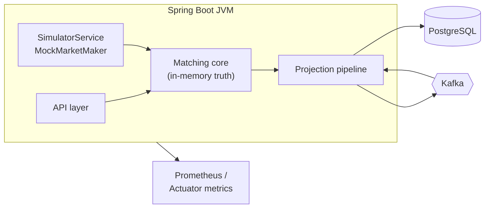
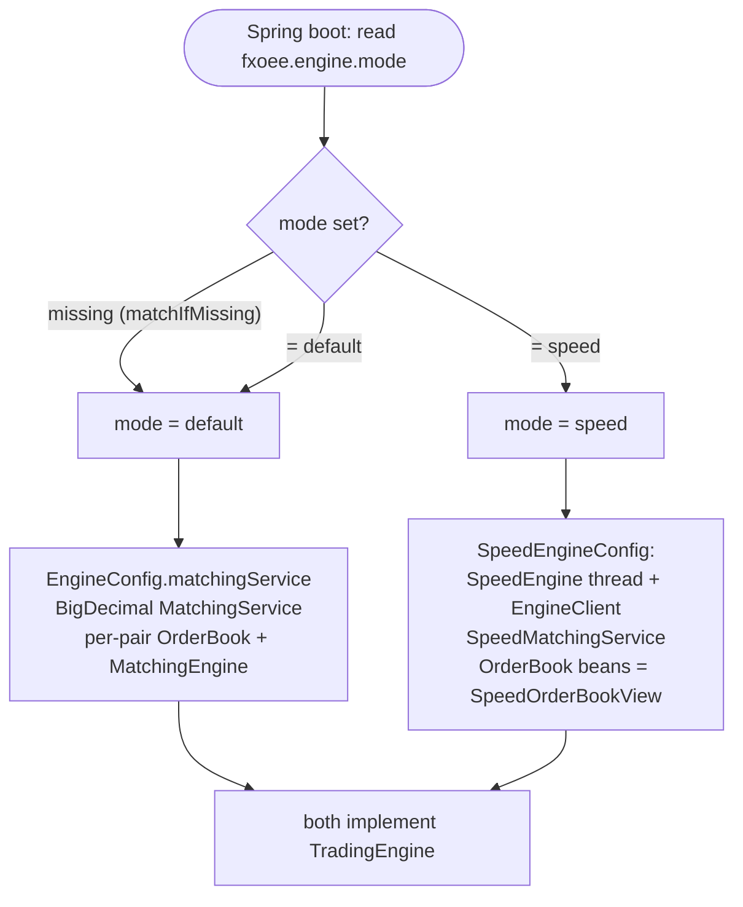
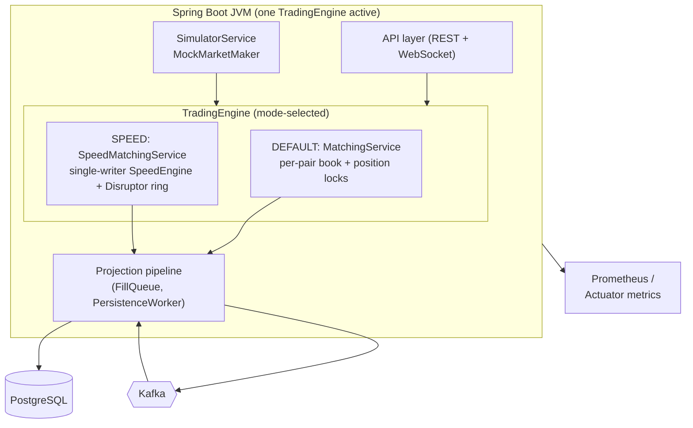
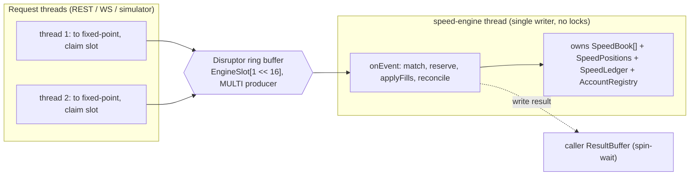

# 01 - Architecture

_Last updated: 2026-06-13 BST._

## Process layout

`fx-oee` is a **single Spring Boot process** ([FxOeeApplication.java](../src/main/java/com/fxoee/FxOeeApplication.java))
that embeds:

- the **matching core** (`com.fxoee.engine`, `com.fxoee.matching`): pure Java, no framework
  dependencies, holding all authoritative trading state in memory. There are **two interchangeable
  engine implementations** behind the same [TradingEngine](../src/main/java/com/fxoee/engine/TradingEngine.java)
  contract, selected by `fxoee.engine.mode` (see [Engine selection](#engine-selection-default-vs-speed));
- a **REST + WebSocket API** (`com.fxoee.api`) for order entry, account queries, market data, and debug;
- an **async projection pipeline** (`FillQueue` → `PersistenceWorker` → Kafka → consumers) that writes
  PostgreSQL and an in-memory mirror;
- a **market simulator** and **mock market maker** for load testing and a live price feed.

External infrastructure: **PostgreSQL** (projection + durable event log) and **Kafka** (event
transport). Both are optional in dev. With `kafka.enabled=false` the engine runs standalone and all
publish calls become no-ops (the `OrderEventProducer` / `FillQueue` beans are simply absent).

## Engine selection (default vs speed)

The matching core has two co-equal implementations of the
[TradingEngine](../src/main/java/com/fxoee/engine/TradingEngine.java) interface. Both share the same
trading semantics (margin-locked funding, price-time priority with maker pricing and STP
cancel-newest, FIFO lot netting, recompute-authoritative reservation reconcile) and emit the **same
Kafka / FillQueue projection events**, so the persistence and read layers are identical regardless of
which engine is active. They differ only in execution model: ✅

| | **default** ✅ | **speed** ✅ |
|--|----------------|--------------|
| Class | [MatchingService](../src/main/java/com/fxoee/engine/MatchingService.java) | [SpeedMatchingService](../src/main/java/com/fxoee/engine/speed/SpeedMatchingService.java) |
| Arithmetic | `BigDecimal` | fixed-point `long` ([Fixed](../src/main/java/com/fxoee/engine/speed/Fixed.java)) |
| Concurrency | per-pair book locks + per-account locks | single-writer thread over an LMAX Disruptor ring, no locks on the match path |
| State owner | per-pair `OrderBook` / `PositionBook` / `MarginLedger` | one `SpeedEngine` thread owns books, positions, ledger, account registry |
| Hot-path allocation | yes (BigDecimal) | zero in steady state (pooled nodes, reusable scratch) |

Selection is by the `fxoee.engine.mode` property
([EngineConfig.java:82-84](../src/main/java/com/fxoee/engine/EngineConfig.java),
[SpeedEngineConfig.java:34](../src/main/java/com/fxoee/engine/speed/SpeedEngineConfig.java),
doc note in [TradingEngine.java:22](../src/main/java/com/fxoee/engine/TradingEngine.java)):

- `default` is the Spring conditional default (`matchIfMissing=true`). The committed
  [application.yml](../src/main/resources/application.yml) has **no** `fxoee.engine.mode` key, so a
  plain `mvn spring-boot:run` boots the **default** engine.
- `speed` is enabled by [performance.properties](../src/main/resources/performance.properties)
  (`fxoee.engine.mode=speed`) and by the Kubernetes deployment
  ([k8s/base/backend/configmap.yaml:27](../k8s/base/backend/configmap.yaml),
  `FXOEE_ENGINE_MODE=speed`).

The two engines are wired by mutually exclusive `@ConditionalOnProperty` `@Bean` methods, so exactly
one `TradingEngine` exists at runtime; every caller (REST, WebSocket, simulator, recovery) depends on
the interface and is unaware which engine answers.

Both engines feed the **same** projection/persistence layer: identical `TradeExecuted` /
`OrderMatched` events through `FillQueue` → `PersistenceWorker` (and Kafka when enabled), and the same
Micrometer meters, so dashboards and the DB see one engine at a time with no schema or event
differences.

## Bean wiring

Wiring depends on `fxoee.engine.mode` (see [Engine selection](#engine-selection-default-vs-speed)).

**Default mode** (`fxoee.engine.mode` missing or `default`):

- [MatchingConfig.java](../src/main/java/com/fxoee/config/MatchingConfig.java) builds one
  `OrderBook` and one `MatchingEngine` **per currency pair**, exposed as
  `Map<CurrencyPair, OrderBook>` and `Map<CurrencyPair, MatchingEngine>` (`EnumMap`).
- [EngineConfig.java](../src/main/java/com/fxoee/engine/EngineConfig.java) is the *only* class in
  `com.fxoee.engine` that touches Spring. It builds the `Margin`, `PositionBook`, `MarginLedger`,
  `PreTradeValidator`, `MarketBuyEstimator`, and (under
  `@ConditionalOnProperty(name="fxoee.engine.mode", havingValue="default", matchIfMissing=true)`,
  [EngineConfig.java:82-84](../src/main/java/com/fxoee/engine/EngineConfig.java)) the
  `MatchingService` facade. The Kafka producer and `FillQueue` are injected via `ObjectProvider`, so
  the engine works identically whether or not Kafka is present. The `MarginLedger` bean **pre-seeds
  the house account** (`HouseAccount.HOUSE_UUID`) with $10M so reconcile never flags mock-maker
  orders as unfunded before the first user trade.

**Speed mode** (`fxoee.engine.mode=speed`):

- [SpeedEngineConfig.java](../src/main/java/com/fxoee/engine/speed/SpeedEngineConfig.java) (under
  `@ConditionalOnProperty(name="fxoee.engine.mode", havingValue="speed")`) builds the
  `SpeedEngine` (started here, stopped via `destroyMethod="stop"`), an `EngineClient` handshake, and
  the `SpeedMatchingService` facade. It **replaces** both the per-pair `OrderBook` bean map (the books
  become `SpeedOrderBookView`s over the long-native core) and the default `MatchingService` bean. The
  `Margin` / `PositionBook` / `MarginLedger` / validator beans from `EngineConfig` are still
  constructed but unused on the speed hot path; `SpeedMatchingService.seedHouse($10M)` mirrors the
  default `MarginLedger` house pre-seed. The Disruptor command ring is sized `1 << 16`
  ([SpeedEngineConfig.java:42](../src/main/java/com/fxoee/engine/speed/SpeedEngineConfig.java)).

The Kafka producer and `FillQueue` are `ObjectProvider`-injected in **both** modes, so either engine
runs standalone without Kafka.

## Concurrency & locking model

The two engines take opposite approaches to concurrency. The **default** engine uses fine-grained
locks (below); the **speed** engine uses a single-writer thread and no locks on the match path (see
[Speed engine: single-writer concurrency](#speed-engine-single-writer-concurrency)).

### Default engine: two-tier locking

The default engine uses **two tiers of fine-grained locks** and one rule that ties them together.

| Lock | Scope | Held during | Source |
|------|-------|-------------|--------|
| Book lock | per **pair** | the whole match loop + reserve + applyFills | [OrderBook.java:53](../src/main/java/com/fxoee/matching/OrderBook.java) |
| Position lock | per **account** | one `applyFill` / `netQty` / `lots` read | [PositionBook.java:45](../src/main/java/com/fxoee/engine/position/PositionBook.java) |
| Reconcile lock | per **account** | one `reconcile` pass | [MatchingService.java:145](../src/main/java/com/fxoee/engine/MatchingService.java) |

### Why per-account position locks

A previous whole-object `synchronized` monitor on `PositionBook` meant the simulator (N accounts × 7
pairs per tick) held one global lock for every order's `applyFill` + reconcile, starving Tomcat REST
threads and making the API unreachable under load. Per-account `ReentrantLock`s remove cross-account
contention: orders on different accounts never block each other.

### The ABBA deadlock and how it's avoided

`reconcile(account)` recomputes an account's locked margin from its held positions **plus its live
resting orders across all pairs**, so it acquires book locks for every pair. If `submit` called
`reconcile` while still holding the aggressor pair's book lock, two concurrent submits on different
pairs could each hold one book lock and wait for the other (ABBA). The fix
([MatchingService.submit](../src/main/java/com/fxoee/engine/MatchingService.java:263)):

1. Do validation, reserve, match, and apply-fills **inside** the book lock.
2. **Release** the book lock.
3. Run `reconcileGuarded(account)` and any Kafka sends **outside** it.

`reconcileGuarded` takes a per-account reconcile lock so two recomputes for the same account never
race, while different accounts still reconcile in parallel. This bug and fix are captured in a
regression test (`MatchingServiceTest.concurrentDifferentPairs_noDeadlock`).

### Kafka sends are never under a book lock

`kafkaTemplate.send()` can block up to `max.block.ms` (default 60s) when the producer buffer is full.
All events are *built* inside the lock (while order fields are stable) and *sent* after release, so a
slow broker never freezes a pair's hot path.

### Speed engine: single-writer concurrency

The speed engine ([SpeedEngine.java](../src/main/java/com/fxoee/engine/speed/SpeedEngine.java))
sidesteps the lock tiers entirely. **One thread owns all mutable state** (every pair's
[SpeedBook](../src/main/java/com/fxoee/engine/speed/SpeedBook.java), the
[SpeedPositions](../src/main/java/com/fxoee/engine/speed/SpeedPositions.java),
[SpeedLedger](../src/main/java/com/fxoee/engine/speed/SpeedLedger.java), and the
[AccountRegistry](../src/main/java/com/fxoee/engine/speed/AccountRegistry.java)), so the match path
takes no locks at all. Request threads never touch engine state directly: they convert the order to
fixed-point longs, claim a slot on a multi-producer **LMAX Disruptor 4.0.0** ring buffer
([EngineSlot](../src/main/java/com/fxoee/engine/speed/EngineSlot.java)), publish a command
(`SUBMIT` / `CANCEL` / `BOOK_ADD` / `MATCH_RAW` / `EXEC`), then spin-wait on a caller-owned
[ResultBuffer](../src/main/java/com/fxoee/engine/speed/ResultBuffer.java). The
[EngineClient](../src/main/java/com/fxoee/engine/speed/EngineClient.java) implements that handshake.

Because there is exactly one writer, the cross-pair reconcile that forces ABBA-avoidance in the
default engine is a plain method call here: no lock ordering, no per-account reconcile lock. The
default `BusySpinWaitStrategy` keeps the consumer thread hot (sub-microsecond pickup) at the cost of
pinning one core. **OpenHFT thread affinity** pins the engine thread to a fixed CPU
(`fxoee.engine.speed.cpu`, default `2` in
[performance.properties](../src/main/resources/performance.properties)) to remove cross-core
cache-warming stalls; it is a **no-op on macOS / unsupported platforms** and only takes effect on
Linux. The only data shared lock-free with other threads is the per-side top-of-book price, published
through a Disruptor `Sequence` so `getBestBid` / `getBestAsk` are plain volatile reads rather than
ring round-trips. The submit pipeline is detailed in [Engine core](03-engine-core.md#speed-engine-submit-path).

## Configuration

Key properties from [application.yml](../src/main/resources/application.yml):

| Property | Default | Effect |
|----------|---------|--------|
| `fxoee.engine.mode` | `default` (matchIfMissing) | `default` (BigDecimal `MatchingService`) vs `speed` (long fixed-point single-writer engine). `speed` is set in `performance.properties` + the k8s configmap |
| `fxoee.engine.speed.wait-strategy` | `busy-spin` | Speed engine only: `busy-spin` / `yielding` / `blocking` Disruptor consumer wait strategy |
| `fxoee.engine.speed.book-map-capacity` | `65536` | Speed engine only: Agrona book-map pre-size (slots per side) to avoid resize churn |
| `fxoee.engine.speed.cpu` | `-1` (`2` in `performance.properties`) | Speed engine only: CPU core to pin the single-writer thread to (Linux only; `<0` disables) |
| `fxoee.funding.mode` | `FULL_NOTIONAL` | `MARGIN` (leveraged) vs `FULL_NOTIONAL`. See [doc 04](04-funding-pnl-conservation.md) |
| `fxoee.engine.authoritative` | `true` | WebSocket + debug APIs read in-JVM engine state |
| `fxoee.mock-market.enabled` | `false` | Inject mock-maker LIMIT depth every 500ms |
| `kafka.enabled` | `true` | Enables producer, `FillQueue`, `PersistenceWorker`, consumers |
| `spring.datasource.hikari.maximum-pool-size` | `30` | FillConsumer (7 threads) + worker + bootstrap + REST each hold connections |
| `spring.kafka.consumer.auto-offset-reset` | `latest` | Consumers start from newest on a fresh group |
| `spring.kafka.producer` | `acks=all`, `enable.idempotence=true`, `retries=5` | Exactly-once-ish delivery semantics |

Observability is via Spring Actuator + Micrometer Prometheus (`/actuator/prometheus`).

## Failure model in one paragraph

The `trade_events` table is written **before** an event is published to Kafka. A crash *before* the
insert loses an order that was never durably committed; engine and DB agree it never happened. A
crash *after* the insert is recovered by re-publishing unpublished rows on restart; consumer dedup
makes the replay idempotent. The engine itself is rebuilt from the same log. Because both projections
derive from one committed log, they cannot diverge. Details in [doc 05](05-event-sourcing-persistence.md).
