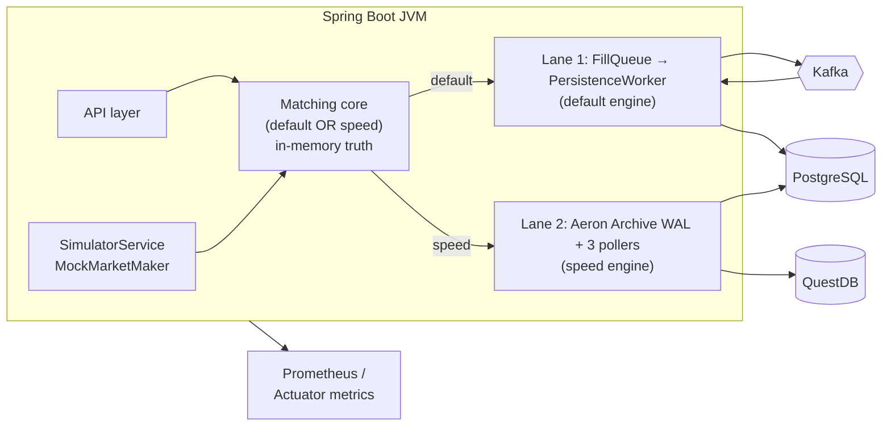

# 01 - Architecture

_Last updated: 2026-06-21 BST._

## Process layout

`fx-oee` is a **single Spring Boot process** (`FxOeeApplication.java`)
that embeds:

- a **matching core** (`com.fxoee.engine`, `com.fxoee.matching`): pure Java, no framework
  dependencies, holding all authoritative trading state in memory. There are **two** of these,
  selected at boot (see below);
- a **REST + WebSocket API** (`com.fxoee.api`) for order entry, account queries, market data, and debug;
- a **durability lane** that writes the chosen durable store and an in-memory mirror, off the hot path;
- a **market simulator** and **mock market maker** for load testing and a live price feed.

External infrastructure: **PostgreSQL** (projection + durable event log), **Kafka** (Lane 1 event
transport), and **QuestDB** (Lane 2 trade-history tape). All are optional in dev. With
`kafka.enabled=false` the default engine runs standalone and all publish calls become no-ops (the
`OrderEventProducer` / `FillQueue` beans are simply absent). The speed engine's Aeron lane is off by
default and entirely embedded (no external broker).

### Two engine modes

The boot-time switch is `fxoee.engine.mode`. Each mode wires a different matching core and a different
durability lane; the API, WebSocket snapshots, risk gate, and circuit breaker are shared.

| Mode | Core | Wiring | Durability |
|------|------|--------|------------|
| `default` | lock-based `MatchingService`, `BigDecimal`, `OrderBook`×7, per-pair `MatchingEngine` locks | `EngineConfig.java:72` (`matchIfMissing=true`) | Lane 1: Kafka → Postgres |
| `speed` | single-writer LMAX Disruptor ring, fixed-point **longs**, zero-alloc hot path, optional core pinning | `SpeedEngineConfig.java:46` (`havingValue="speed"`) | Lane 2: Aeron Archive WAL |

`performance.properties:31` and `application-local.yml` set `speed`; otherwise the lock engine runs.
The two cores were once `speed` / `speed2`; that was consolidated, so there is one speed engine and
the legacy variant is deleted. See [Speed engine](speed-engine.md).

## Bean wiring

Two `@Configuration` classes wire the core:

- `MatchingConfig.java` builds one
  `OrderBook` and one `MatchingEngine` **per currency pair**, exposed as
  `Map<CurrencyPair, OrderBook>` and `Map<CurrencyPair, MatchingEngine>` (`EnumMap`).
- `EngineConfig.java` is the *only* class in
  `com.fxoee.engine` that touches Spring. It builds the `Margin`, `PositionBook`, `MarginLedger`,
  `PreTradeValidator`, `MarketBuyEstimator`, and the `MatchingService` facade. The Kafka producer and
  `FillQueue` are injected via `ObjectProvider`, so the engine works identically whether or not Kafka
  is present.

The `MarginLedger` bean **pre-seeds the house account** (`HouseAccount.HOUSE_UUID`) with $10M
(`EngineConfig.java:52`) so reconcile never flags
mock-maker orders as unfunded before the first user trade. The speed engine
mirrors this in `SpeedEngineConfig.java:154`
(`service.seedHouse(...)`).

## Durability lanes

The matching core is authoritative in both modes; the lane is a pure projection of engine-stamped
effects. Which lane runs follows the engine mode.

### Lane 1: Kafka → Postgres (default engine)

`FillQueue` → single-threaded `PersistenceWorker` → **append `TradeExecuted` to `trade_events` first,
then publish to Kafka** (`PersistenceWorker.java:30`),
mark-published on the broker ack callback. `FillConsumer` / `SnapshotConsumer` write PostgreSQL and
the in-memory `AccountState` mirror. The Kafka producer is on by default; the consumer side is gated
by `KAFKA_ENABLED` (default `false`). Warm restart rebuilds the engine from `trade_events` when
`fxoee.recovery.replay-on-startup=true`. This is the lane documented in detail in [doc 05](05-event-sourcing-persistence.md).

### Lane 2: Aeron Archive WAL (speed engine, ADR 0007)

JVM-only, **no Kafka**. The speed engine records each fill to an embedded **Aeron Archive** WAL
(`AeronWal.java`) from its own thread; the recording is
position-addressable, one writer and many independent readers. Three pollers project from it:

| Poller | Reads to | Source |
|--------|----------|--------|
| `AeronWalProjector` | trade tape: `TradeStore` + WS `TradeEvent` | `AeronWalProjector.java:41` |
| `WalDbProjector` (Phase B) | Postgres balances + position lots; periodic catch-up, idempotent via `fill_dedup`, incremental cursor | `WalDbProjector.java:33` |
| `QuestDbTapeSink` (Phase D) | QuestDB over ILP (lazy connect) | `QuestDbTapeSink.java` |

Bounded warm restart is **Phase E**: periodic + on-shutdown engine snapshots tagged with the exact
Archive position, plus a recover-on-boot hook (`SpeedEngineConfig.java:303`)
that restores the snapshot and replays only the Archive tail. With `persist-archive=true` this is a
**database-off durable lane**. Every `fxoee.wal.*` flag is **off by default** in `application.yml`;
the local dev profile (`application-local.yml`) turns the WAL on. The branch added a DEBUG screen for
the lane, backed by `OrderBookDebugController.pipelineStats()`
(`OrderBookDebugController.java:657`,
`GET /api/debug/pipeline-stats`), which reports publication vs recording position and per-poller lag.

### Ingress shed (Fix B)

Because the speed engine spins on Aeron back-pressure when the WAL drain falls behind, the submit path
rejects **new** orders with `OVERLOADED` once WAL lag (publication minus recording position) exceeds
`fxoee.wal.aeron.lag-threshold-bytes` (`SpeedMatchingService.java:177`).
The default is **48 MiB** (`50331648`), 75% of the 64 MiB IPC term buffer, auto-capped to 90% of the
term buffer if set higher. This sheds cleanly at ingress instead of stalling the engine thread.

## Concurrency & locking model

> This section describes the **default** (lock-based) engine. The `speed` engine is a single writer
> over a Disruptor ring and holds no book locks; see [Speed engine](speed-engine.md).

The engine uses **two tiers of fine-grained locks** and one rule that ties them together.

| Lock | Scope | Held during | Source |
|------|-------|-------------|--------|
| Book lock | per **pair** | the whole match loop + reserve + applyFills | `OrderBook.java:39` |
| Position lock | per **account** | one `applyFill` / `netQty` / `lots` read | `PositionBook.java:44` |
| Reconcile lock | per **account** | one `reconcile` pass | `MatchingService.java:128` |

### Why per-account position locks

A previous whole-object `synchronized` monitor on `PositionBook` meant the simulator (N accounts × 7
pairs per tick) held one global lock for every order's `applyFill` + reconcile, starving Tomcat REST
threads and making the API unreachable under load. Per-account `ReentrantLock`s remove cross-account
contention: orders on different accounts never block each other.

### The ABBA deadlock and how it's avoided

`reconcile(account)` recomputes an account's locked margin from its held positions **plus its live
resting orders across all pairs**, so it acquires book locks for every pair. If `submit` called
`reconcile` while still holding the aggressor pair's book lock, two concurrent submits on different
pairs could each hold one book lock and wait for the other (ABBA). The fix
(`MatchingService.submit`):

1. Do validation, reserve, match, and apply-fills **inside** the book lock.
2. **Release** the book lock (`MatchingService.java:367`).
3. Run `reconcileGuarded(account)` (`MatchingService.java:372`) and any Kafka sends **outside** it.

`reconcileGuarded` takes a per-account reconcile lock so two recomputes for the same account never
race, while different accounts still reconcile in parallel. This bug and fix are captured in a
regression test (`MatchingServiceTest.concurrentDifferentPairs_noDeadlock`).

### Kafka sends are never under a book lock

`kafkaTemplate.send()` can block up to `max.block.ms` (default 60s) when the producer buffer is full.
All events are *built* inside the lock (while order fields are stable) and *sent* after release, so a
slow broker never freezes a pair's hot path.

## Configuration

Key properties from `application.yml`:

| Property | Default | Effect |
|----------|---------|--------|
| `fxoee.engine.mode` | `default` | `default` (lock-based) vs `speed` (Disruptor). Picks the matching core **and** the durability lane |
| `fxoee.funding.mode` | `FULL_NOTIONAL` | `MARGIN` (leveraged) vs `FULL_NOTIONAL`. See [doc 04](04-funding-pnl-conservation.md) |
| `fxoee.engine.authoritative` | `true` | WebSocket + debug APIs read in-JVM engine state |
| `fxoee.mock-market.enabled` | `false` | Inject mock-maker LIMIT depth every 500ms |
| `kafka.enabled` | `true` (consumer `false`) | Lane 1: producer + `FillQueue` + `PersistenceWorker`; consumers gated by `KAFKA_ENABLED` |
| `fxoee.wal.aeron.enabled` | `false` | Lane 2: embedded Aeron Archive WAL (speed engine only). On in the local profile |
| `fxoee.wal.postgres.enabled` | `false` | Lane 2: `WalDbProjector` writes Postgres balances + lots |
| `fxoee.wal.questdb.enabled` | `false` | Lane 2: `QuestDbTapeSink` writes the QuestDB trade tape |
| `fxoee.wal.aeron.lag-threshold-bytes` | `50331648` (48 MiB) | Lane 2 ingress shed: reject `OVERLOADED` above this WAL lag |
| `spring.datasource.hikari.maximum-pool-size` | `30` | FillConsumer (7 threads) + worker + bootstrap + REST each hold connections |
| `spring.kafka.consumer.auto-offset-reset` | `latest` | Consumers start from newest on a fresh group |
| `spring.kafka.producer` | `acks=all`, `enable.idempotence=true`, `retries=5` | Exactly-once-ish delivery semantics |

Observability is via Spring Actuator + Micrometer Prometheus (`/actuator/prometheus`). The full
property list with env-var overrides is in [doc 10](10-configuration.md).

## Failure model in one paragraph

**Lane 1.** The `trade_events` table is written **before** an event is published to Kafka. A crash
*before* the insert loses an order that was never durably committed; engine and DB agree it never
happened. A crash *after* the insert is recovered by re-publishing unpublished rows on restart;
consumer dedup makes the replay idempotent. The engine itself is rebuilt from the same log. Because
both projections derive from one committed log, they cannot diverge. Details in [doc 05](05-event-sourcing-persistence.md).
**Lane 2.** The engine records each fill to the Aeron Archive WAL before acking; the projectors are
downstream replicas that may lag and catch up (cursor advances only after a batch commits, so a crash
mid-flush replays rather than skips). With `persist-archive=true` plus an engine snapshot, the engine
warm-restarts from the durable Archive tail with no database in the loop. See [ADR 0007](adr/0007-aeron-archive-wal-questdb-tape.md).
