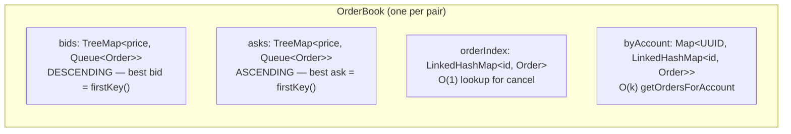
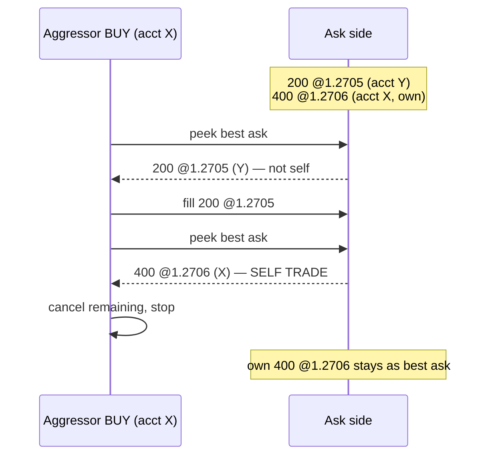

# 02 — Matching engine

_Last updated: 2026-06-04 21:57 BST._

The matching engine is two classes per currency pair:
[OrderBook.java](../src/main/java/com/fxoee/matching/OrderBook.java) (state) and
[MatchingEngine.java](../src/main/java/com/fxoee/matching/MatchingEngine.java) (algorithm). They are
pure and stateless beyond the book; `MatchingService` owns one pair of them per `CurrencyPair`.

## OrderBook data structure

- **Price priority**: bids sorted descending, asks ascending, so the best price is always `firstKey()`.
- **Time priority**: each price level is a FIFO `Queue<Order>` (a `LinkedList`); same-price orders
  match in arrival order.
- **`orderIndex`** gives O(1) cancel-by-id.
- **`byAccount`** is a secondary index added because `reconcile` calls `getOrdersForAccount` for 7
  pairs × every touched account on every fill; a full scan of the book was the CPU bottleneck under
  simulation load. It is now O(k) where k = that account's resting orders.

Every public method takes the book's single `ReentrantLock` ([OrderBook.java:51](../src/main/java/com/fxoee/matching/OrderBook.java)).
`clearAll()` wipes all four structures atomically (used by reset/bootstrap).

## The matching algorithm

`MatchingEngine.match(Order incoming)` acquires the book lock, sweeps the opposite side, then decides
the order's final disposition. The five documented rules:

1. **Price priority** — better-priced resting orders match first.
2. **Time priority** — FIFO within a price level.
3. **Partial fills** — when sizes differ, the larger order rests with reduced quantity.
4. **MARKET orders** — match best-available; the unfilled remainder is **rejected** (IOC), never rests.
5. **Self-trade prevention (STP)** — cancel-newest.

### Execution price = the maker's price

`executeTrade` is always called with the **resting (passive) order's price** — never the aggressor's,
never inferred from timestamps ([MatchingEngine.java](../src/main/java/com/fxoee/matching/MatchingEngine.java)).
A buyer crossing a book of asks at 1.2705 then 1.2709 pays each maker's price in turn (price
improvement), not their own limit. This is verified by `SpecWorkedExamplesTest.priceImprovement`.

### Partial fills and resting

`executeTrade` matches `min(buyRemaining, sellRemaining)` and calls `Order.fill(qty)` on both, which
decrements `remainingQuantity` and flips status to `FILLED` or `PARTIALLY_FILLED`. After the sweep,
`parkOrReject`:

- a still-active **LIMIT** remainder is added to the book (it rests and becomes liquidity);
- a still-active **MARKET** remainder is **rejected** — there is no more liquidity, and MARKET orders
  never rest (immediate-or-cancel).

### Self-trade prevention (cancel-newest)

When the aggressor would match its own resting order (same non-null `accountId`), the engine leaves
the resting order intact and **cancels the aggressor's remaining quantity** — the aggressor never
rests, and the sweep stops. STP is checked per resting order, *after* any fills against other
accounts at better prices have already happened. Orders with a `null` accountId (mock / internal) are
exempt and never self-trade.

Verified by `SpecWorkedExamplesTest.stpCancelNewest` and `MatchingServiceTest.stpReleasesAggressorReservation`.

## MARKET BUY sizing (forward reference)

A MARKET BUY has no limit price, so its margin can't be sized before the sweep. The
[MarketBuyEstimator](../src/main/java/com/fxoee/engine/match/MarketBuyEstimator.java) walks the ask
depth under the same book lock to compute the exact sweep cost — see
[Engine core](03-engine-core.md#market-buy-funding).

## Where this is tested

`MatchingEngineTest`, `MatchingEngineParameterizedTest`, `MatchingEngineMarketSimulationTest`,
`OrderBookTest`, and the perf benchmark `com.fxoee.perf.MatchingEngineBenchmark` (JMH). See
[Testing](08-testing.md).
