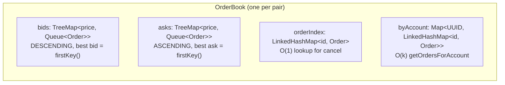
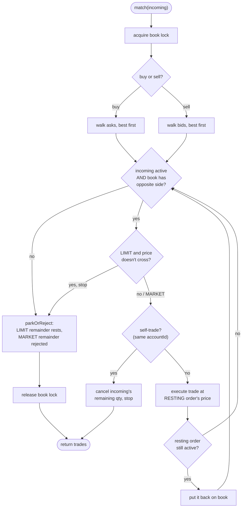
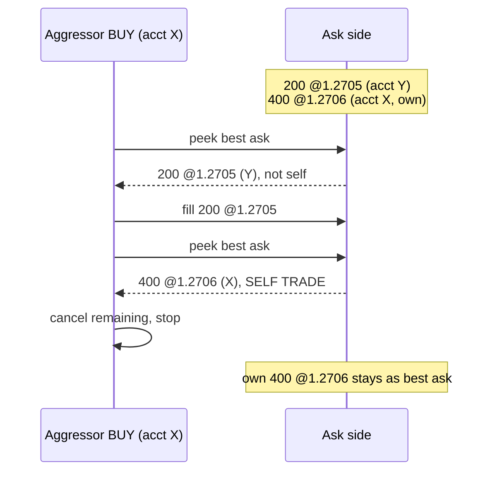
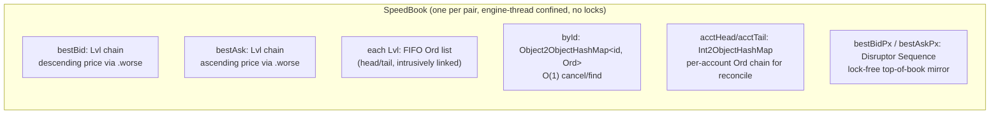

# 02 - Matching engine

_Last updated: 2026-06-21 BST._

The matching engine is two classes per currency pair:
[OrderBook.java](../src/main/java/com/fxoee/matching/OrderBook.java) (state) and
[MatchingEngine.java](../src/main/java/com/fxoee/matching/MatchingEngine.java) (algorithm). They are
pure and stateless beyond the book; `MatchingService` owns one pair of them per `CurrencyPair`.

This page covers the **`default`** (lock-based) engine. In **`speed`** mode the per-pair `OrderBook` +
`MatchingEngine` are replaced by one lock-free `SpeedBook` matched on the single-writer engine thread,
with the same five rules; see [Speed engine: SpeedBook matching](#speed-engine-speedbook-matching)
below and [01 - Architecture](01-architecture.md#two-engine-modes).

## OrderBook data structure

- **Price priority**: bids sorted descending, asks ascending, so the best price is always `firstKey()`.
- **Time priority**: each price level is a FIFO `Queue<Order>` (a `LinkedList`); same-price orders
  match in arrival order.
- **`orderIndex`** gives O(1) cancel-by-id.
- **`byAccount`** is a secondary index added because `reconcile` calls `getOrdersForAccount` for 7
  pairs × every touched account on every fill; a full scan of the book was the CPU bottleneck under
  simulation load. It is now O(k) where k = that account's resting orders.

Every public method takes the book's single `ReentrantLock` ([OrderBook.java:39](../src/main/java/com/fxoee/matching/OrderBook.java)).
`clearAll()` wipes all four structures atomically (used by reset/bootstrap)
([OrderBook.java:250](../src/main/java/com/fxoee/matching/OrderBook.java)).

## The matching algorithm

`MatchingEngine.match(Order incoming)` acquires the book lock
([MatchingEngine.java:33](../src/main/java/com/fxoee/matching/MatchingEngine.java)), sweeps the
opposite side, then decides the order's final disposition. The five documented rules:

1. **Price priority**: better-priced resting orders match first.
2. **Time priority**: FIFO within a price level.
3. **Partial fills**: when sizes differ, the larger order rests with reduced quantity.
4. **MARKET orders**: match best-available; the unfilled remainder is **rejected** (IOC), never rests.
5. **Self-trade prevention (STP)**: cancel-newest.

### Execution price = the maker's price

`executeTrade` is always called with the **resting (passive) order's price**, never the aggressor's,
never inferred from timestamps ([MatchingEngine.java:67](../src/main/java/com/fxoee/matching/MatchingEngine.java)
passes `bestAsk.getPrice()`, [:93](../src/main/java/com/fxoee/matching/MatchingEngine.java) passes `bestBid.getPrice()`).
A buyer crossing a book of asks at 1.2705 then 1.2709 pays each maker's price in turn (price
improvement), not their own limit. This is verified by `SpecWorkedExamplesTest.priceImprovement`.

### Partial fills and resting

`executeTrade` matches `min(buyRemaining, sellRemaining)` and calls `Order.fill(qty)` on both
([MatchingEngine.java:126](../src/main/java/com/fxoee/matching/MatchingEngine.java)), which
decrements `remainingQuantity` and flips status to `FILLED` or `PARTIALLY_FILLED`. A partially-filled
maker is **not** polled off and re-added (that would lose its FIFO position): it stays in place and is
only removed once fully filled ([MatchingEngine.java:71](../src/main/java/com/fxoee/matching/MatchingEngine.java)).
After the sweep, `parkOrReject` ([MatchingEngine.java:110](../src/main/java/com/fxoee/matching/MatchingEngine.java)):

- a still-active **LIMIT** remainder is added to the book (it rests and becomes liquidity);
- a still-active **MARKET** remainder is **rejected**: there is no more liquidity, and MARKET orders
  never rest (immediate-or-cancel).

### Self-trade prevention (cancel-newest)

When the aggressor would match its own resting order (same non-null `accountId`), the engine leaves
the resting order intact and **cancels the aggressor's remaining quantity**
([MatchingEngine.java:62](../src/main/java/com/fxoee/matching/MatchingEngine.java) /
[:88](../src/main/java/com/fxoee/matching/MatchingEngine.java)). The aggressor never rests, and the
sweep stops. STP is checked per resting order, *after* any fills against other accounts at better
prices have already happened. Orders with a `null` accountId (mock / internal) are exempt and never
self-trade ([MatchingEngine.java:104](../src/main/java/com/fxoee/matching/MatchingEngine.java)).

Verified by `SpecWorkedExamplesTest.stpCancelNewest` and `MatchingServiceTest.stpReleasesAggressorReservation`.

## MARKET BUY sizing (forward reference)

A MARKET BUY has no limit price, so its margin can't be sized before the sweep. The
[MarketBuyEstimator](../src/main/java/com/fxoee/engine/match/MarketBuyEstimator.java) walks the ask
depth under the same book lock to compute the exact sweep cost. See
[Engine core](03-engine-core.md#market-buy-funding).

## Speed engine: SpeedBook matching

In speed mode (`fxoee.engine.mode=speed`) the per-pair `OrderBook`/`MatchingEngine` pair is replaced
by one [SpeedBook](../src/main/java/com/fxoee/engine/speed/SpeedBook.java) per pair, matched **inside
the single-writer engine thread** ([SpeedEngine.match](../src/main/java/com/fxoee/engine/speed/SpeedEngine.java)).
It implements the **same price-time priority + maker pricing + STP cancel-newest** semantics as the
default engine, with a different data structure and zero locks.

Key differences from the default `OrderBook`:

- **No `TreeMap`, no locks.** Price levels are pooled `Lvl` nodes linked into a sorted chain per side
  (`better` toward top of book, `worse` away); the best level is the chain head. Orders are pooled
  `Ord` nodes intrusively linked FIFO within their level (price-time priority). All of it is owned by
  the one engine thread, so no synchronization is needed.
- **Pooled nodes, zero steady-state allocation.** `newOrd` / `freeOrd` and `newLvl` / `freeLvl`
  recycle nodes; the Agrona open-addressing index maps (`byId`, `bidLevels`, `askLevels`, account
  chains) allocate only on resize, which is why they are pre-sized (`fxoee.engine.speed.book-map-capacity`).
- **Lock-free top of book.** `bestBidPx()` / `bestAskPx()` read a Disruptor `Sequence` written only by
  the engine thread on every best-level change, so observers (mid-price, simulator) read the top of
  book as a plain volatile without a ring round-trip.
- **`byAccount` equivalent.** `firstForAccount(idx)` walks the per-account `Ord` chain, the speed
  counterpart of the default `byAccount` index, used by reconcile.

The matching algorithm itself is the identical five rules. `SpeedEngine.match(book, agg, out)` walks
the opposite side best-first, stops a LIMIT when its price no longer crosses, and on each crossing
level:

1. **Price priority**: `bestLevel(!aggBuy)` is always the best opposite price.
2. **Time priority**: it fills `best.head` first (FIFO within the level); a partially-filled maker
   keeps its place (`noteFill` decrements the level aggregate without unlinking), and is only unlinked
   when fully filled.
3. **Partial fills**: it fills `min(agg.remaining, maker.remaining)`; the larger side keeps the
   remainder.
4. **MARKET remainder rejected (IOC)**: after the sweep, an unfilled MARKET aggressor is `REJECTED`
   and never rests; a LIMIT remainder is `rest()`ed (mirrors the default `parkOrReject`).
5. **STP cancel-newest**: when `maker.acctIdx == agg.acctIdx` (both non-MOCK), `match` returns `true`
   immediately: the resting order is left intact and the aggressor's remaining quantity is cancelled
   (`CANCELLED`), exactly as the default engine cancels the newest. Orders with the MOCK account index
   (null accountId) are exempt.

Execution is always at the **maker's `priceRaw`** (the fill records `maker.priceRaw`), never the
aggressor's, matching the default engine's maker-pricing rule. The aggressor disposition
(`FILLED` / `PARTIALLY_FILLED` / `PENDING` / `REJECTED` / `CANCELLED`) is decided after the sweep in
`onSubmit`, mirroring `MatchingEngine.parkOrReject` + STP.

## Where this is tested

Default engine: `MatchingEngineTest`, `MatchingEngineParameterizedTest`,
`MatchingEngineMarketSimulationTest`, `OrderBookTest`, and the perf benchmark
`com.fxoee.perf.MatchingEngineBenchmark` (JMH). Speed engine (`com.fxoee.engine.speed`):
`SpeedBookTest`, `SpeedMatchingEngineTest`, `SpeedMatchingServiceTest`, plus
`EngineDifferentialFuzzTest` which cross-checks the speed engine against the default engine for
matching parity, and `SpeedEngineBench`. See [Testing](08-testing.md).
