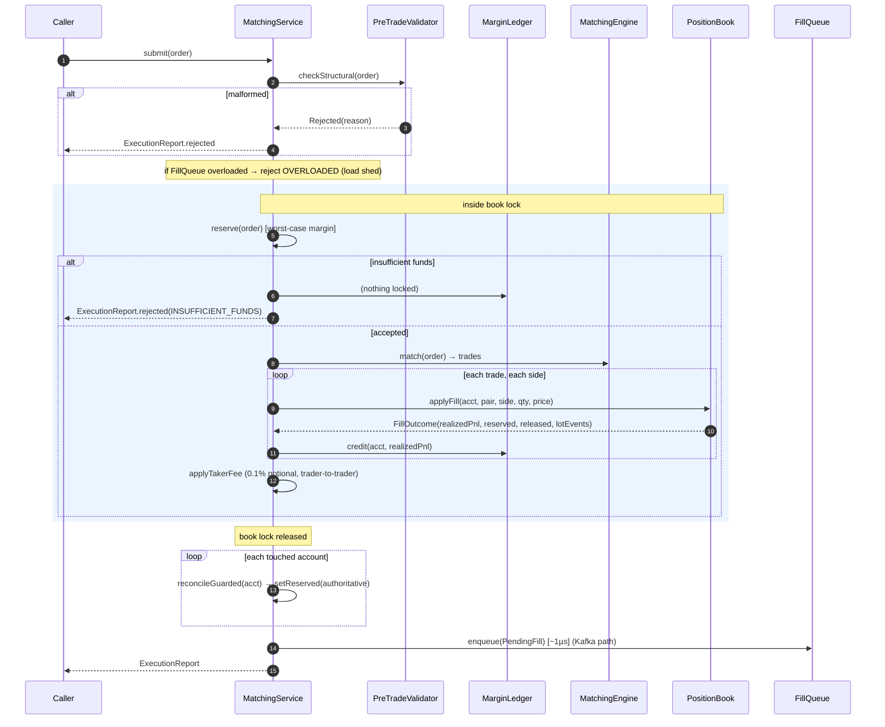
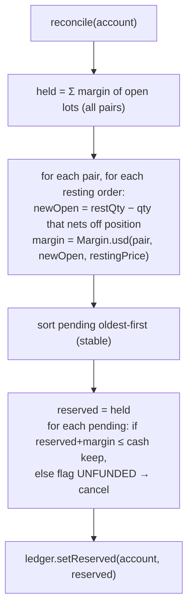
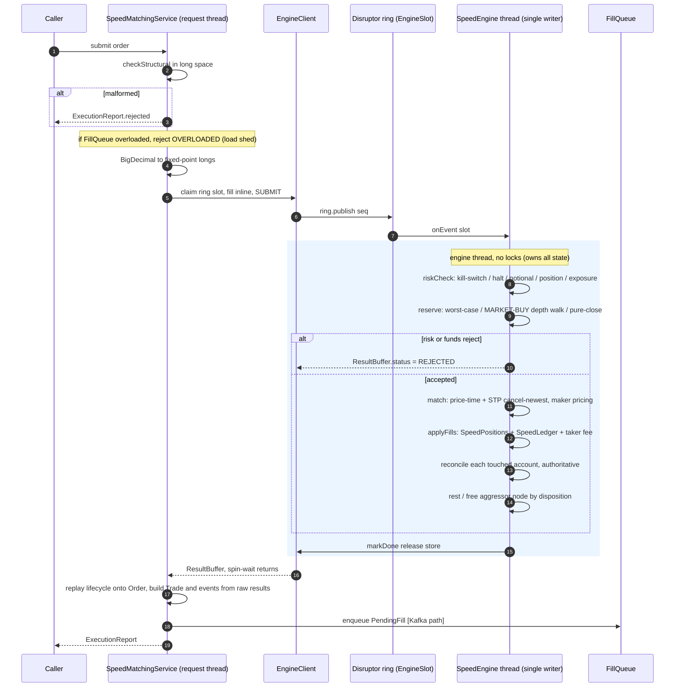
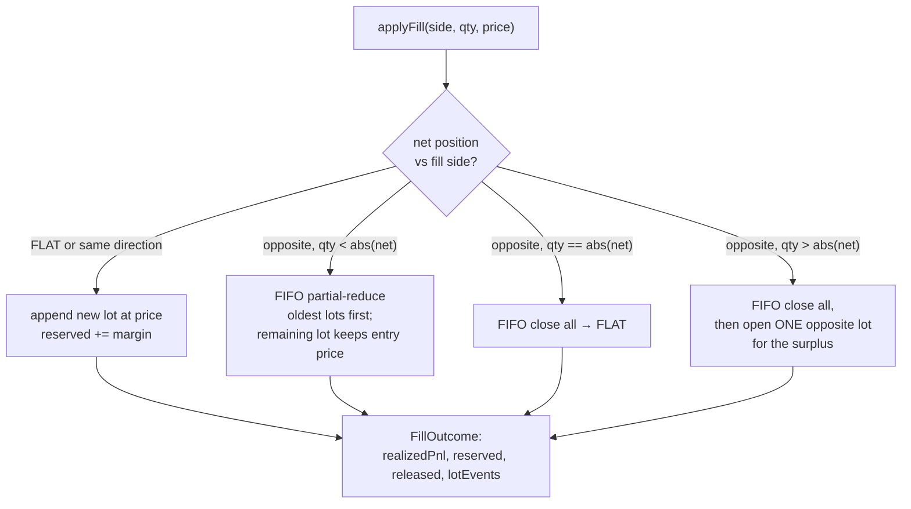

# 03 - Engine core

_Last updated: 2026-06-13 BST._

This is the spine of the system. The active engine is the **source of truth**; everything else
projects from it. There are two co-equal implementations behind the
[TradingEngine](../src/main/java/com/fxoee/engine/TradingEngine.java) interface, selected by
`fxoee.engine.mode` (see [Architecture, Engine selection](01-architecture.md#engine-selection-default-vs-speed)).
This document covers the **default** [MatchingService](../src/main/java/com/fxoee/engine/MatchingService.java)
first, then the **speed** engine's [submit path](#speed-engine-submit-path). Both apply the same
five logical phases and emit the same projection events.

## Default engine

`MatchingService` coordinates five collaborators, all pure (no Spring/Kafka/DB):

| Collaborator | Responsibility | Source |
|--------------|----------------|--------|
| `MatchingEngine` + `OrderBook` | price-time matching per pair | [doc 02](02-matching-engine.md) |
| `PreTradeValidator` | structural + funds checks, reserve margin | [PreTradeValidator.java](../src/main/java/com/fxoee/engine/validate/PreTradeValidator.java) |
| `PositionBook` | FIFO position netting, realized P&L, lot events | [PositionBook.java](../src/main/java/com/fxoee/engine/position/PositionBook.java) |
| `MarginLedger` | cash + locked margin per account | [MarginLedger.java](../src/main/java/com/fxoee/engine/ledger/MarginLedger.java) |
| `Margin` | the single funding-requirement calculator | [Margin.java](../src/main/java/com/fxoee/engine/ledger/Margin.java) |

## The submit pipeline

`MatchingService.submit(Order)` runs five phases. Phases 1-4 are inside the pair's book lock; phase 5
runs after release (see [Architecture, ABBA section](01-architecture.md#the-abba-deadlock-and-how-its-avoided)).

### Phase 1: structural validation

`PreTradeValidator.checkStructural` enforces (spec §10.1): pair present and supported; quantity > 0
and a multiple of `minLotSize`; for LIMIT orders, price > 0 and a multiple of `tickSize`. Any failure
returns a `RejectReason` (`UNSUPPORTED_PAIR` / `INVALID_QUANTITY`) and an immediate rejected report.

### Phase 2: funds reservation (worst case)

`MatchingService.reserve` computes the **worst-case** margin and locks it on the ledger before
matching. The whole-order rule applies: an order is fully funded or fully rejected, never partially.

- **LIMIT / MARKET SELL**: `PreTradeValidator.validate(order, fundsPrice)`. `fundsPrice` is the limit
  price, or for a MARKET SELL the current **best bid**.
- **Pure close** (a SELL that only reduces a long, or a BUY that only reduces a short) reserves
  **nothing**; that margin is already held. The validator computes `openShort = qty − netLong` (or
  `openLong = qty − netShort`); when ≤ 0 it returns `Accepted(0, 0)`.
- **Flip** (close then open opposite) uses one **atomic** ledger pass: `reserveNet(release, reserve)`
  succeeds iff `free + released − reserve ≥ 0`, where `released` is the margin currently held on the
  side being closed. This is spec §10.3's single worst-case test.

#### MARKET BUY funding

A MARKET BUY has no price, so [MarketBuyEstimator](../src/main/java/com/fxoee/engine/match/MarketBuyEstimator.java)
walks the ask depth (best to worst) under the **same book lock** as the match. Because the book can't
change between estimate and sweep, the depth-walk cost **equals** the actual sweep cost: the
reservation is exact, not over-reserved. (Best-ask alone is not worst-case; asks ascend, so deeper
levels cost more.) Any unfilled remainder (STP or thin liquidity) is released afterward by reconcile.

### Phase 3: match

`engine.match(order)` runs the [matching algorithm](02-matching-engine.md) and returns the trades.

### Phase 4: apply fills to positions + credit P&L

For each trade, `applyFills` applies **both** sides to the `PositionBook` (aggressor and resting
account) and credits each side's realized P&L to the ledger. **Cash moves only by realized P&L**;
margin is locked, never spent. Each side's effect is captured as a `TradeExecuted` event carrying the
exact cash delta, realized P&L, and engine-assigned lot ids, so downstream projections apply it
verbatim. Mock/house counterparties (null account) are skipped.

The **taker fee** (0.1% of notional) is charged to the aggressor only when *both* sides are real,
non-house traders. See [doc 04](04-funding-pnl-conservation.md#taker-fee).

### Phase 5: reconcile (authoritative margin)

After the book lock is released, `reconcile(account)` sets locked margin to its **authoritative**
value: held-position margin + the margin required by each live resting order (each netted against the
current position, so a resting order that merely closes a position locks nothing). This replaces the
worst-case amount reserved in phase 2 and **releases any excess**.

Hard invariant (§10.2): `reserved ≤ cash`. Held-position margin is fixed (positions can't be
un-opened), so the budget for resting orders is `cash − held`. Resting orders are funded
**oldest-first**; any that no longer fit (typically a close-order whose position another fill already
flattened, leaving it a naked open the account can't afford) are flagged `unfunded` and **cancelled**
once the lock is released. This is what auto-rejects over-reserving orders.

## Speed engine submit path

In speed mode (`fxoee.engine.mode=speed`) the same five phases run, but the request thread does almost
none of the work: it converts the order to fixed-point longs, hands a command to the single-writer
[SpeedEngine](../src/main/java/com/fxoee/engine/speed/SpeedEngine.java) thread over a Disruptor ring,
and the engine thread runs structural-aware reservation, matching, fill application, and reconcile
**without any lock** (it owns all state). The facade
[SpeedMatchingService.submit](../src/main/java/com/fxoee/engine/speed/SpeedMatchingService.java)
materialises the report and projection events from primitive results afterward. ✅

The phase mapping is 1:1 with the default engine:

| Phase | Default (`MatchingService`) | Speed (`SpeedEngine`, engine thread) |
|-------|-----------------------------|--------------------------------------|
| 1. Structural validation | `PreTradeValidator.checkStructural` (request thread) | `SpeedMatchingService.checkStructural` in long space (request thread) |
| Risk gate + load-shed | risk gate + `FillQueue.isOverloaded` (request thread) | same checks; structural + overload on the request thread, the long-native risk gate (`riskCheck`) on the engine thread |
| 2. Funds reservation | `reserve` + `PreTradeValidator` | `SpeedEngine.reserve` (same worst-case/MARKET-BUY-depth-walk/pure-close rules, fixed-point) |
| 3. Match | `MatchingEngine.match` | `SpeedEngine.match` (price-time + STP) |
| 4. Apply fills + P&L + taker fee | `applyFills` | `SpeedEngine.applyFills` (`SpeedPositions` + `SpeedLedger`) |
| 5. Reconcile (authoritative) | `reconcileGuarded` after lock release | `SpeedEngine.reconcile` per touched account, no lock (single writer, no ABBA) |

The request thread fills the ring slot **inline** (no capturing lambda, so no per-order allocation),
publishes, and spin-waits on its thread-local `ResultBuffer`; the engine thread writes results into
that buffer and calls `markDone()` (a release store that unblocks the waiter). The aggressor's
lifecycle (`fill` / `markPending` / `reject` / `cancel`) is then replayed onto the caller's `Order`,
and the same `TradeExecuted` / `OrderMatched` / `OrderPlaced` events plus the `PendingFill` are built
from the primitive results and enqueued to `FillQueue` (or sent to Kafka) exactly as in default mode.

A fast path skips the full reconcile when a LIMIT rests with no fills (`recordCleanRest` bumps the
per-pair pending-margin cache in O(1)); any fill or non-resting disposition reconciles the touched
pair. See [Architecture, single-writer concurrency](01-architecture.md#speed-engine-single-writer-concurrency)
for the threading model and [doc 02](02-matching-engine.md#speed-engine-speedbook-matching) for the
book structure.

## PositionBook: FIFO netting

No-hedge, FIFO-netting position store. Lots are held per `(account, pair)` in arrival order. One
`applyFill` turns a fill into position changes + realized P&L and returns a
[FillOutcome](../src/main/java/com/fxoee/engine/position/FillOutcome.java); it never touches cash.

`FillOutcome.cashDelta() = realizedPnlUsd + marginReleasedUsd − marginReservedUsd`. Invariants upheld
(spec §13): an `(account, pair)` never holds LONG and SHORT lots at once; a fully-closed lot is
removed and never reappears; `netQty == Σ signed lot qty`. Each mutation emits a `LotEvent`
(`Open` / `PartialClose` / `FullClose`) carrying the engine lot id, so projections key their lots
identically.

## MarginLedger: cash & locked margin

Per account: `cash`, `reserved` (locked margin), `realizedPnl`. The derived value `free = cash −
reserved` is what new orders may draw on.

| Method | Semantics |
|--------|-----------|
| `seed(id, cash)` | reset account (cash set, reserved & realizedPnl zeroed) |
| `reserveNet(id, release, reserve)` | atomically swap; succeeds iff `cash − (reserved − release + reserve) ≥ 0` |
| `tryReserve(id, amt)` | `reserveNet(id, 0, amt)`; whole-order reservation |
| `setReserved(id, amt)` | authoritative set (floored at 0); used by reconcile |
| `release(id, amt)` | unconditional release, floored at 0; no-op on null/≤0 |
| `credit(id, delta)` | apply realized cash movement; also accrues `realizedPnl`; no-op on null/0 |

All mutations synchronize on the per-account object. `reserveNet` is the one primitive that gates
affordability; on failure it leaves state completely unchanged.

## Other entry points on MatchingService

| Method | Purpose |
|--------|---------|
| `cancel(acct, pair, orderId)` | cancel a resting order + reconcile the owner |
| `closeNet(acct, pair)` | flatten the whole net position with an opposing MARKET order |
| `closeLot(acct, pair, lotId)` | close one lot's quantity (FIFO, so closes oldest up to that qty) |
| `forceFlat(acct, mids)` | credit unrealized P&L at given mids, then wipe positions + margin (used when a MARKET close finds no counterparty) |
| `snapshot(acct, mids)` | account view: cash, notional, unrealized/realized P&L, equity, positions |
| `seedForReplay` / `replayFill` / `reconcileReserved` | warm-restart recovery, see [doc 05](05-event-sourcing-persistence.md) |
| `reset(acct, cash)` | drop positions and reseed cash (debug) |

Tested by `MatchingServiceTest`, `MatchingServiceCornerCasesTest`, `PositionBookTest`,
`PositionBookCornerCasesTest`, `MarginLedgerTest`, `LedgerCornerCasesTest`, `PreTradeValidatorTest`,
`MarketBuyEstimatorTest`, and the `EngineConservationFuzzTest`. See [Testing](08-testing.md).
