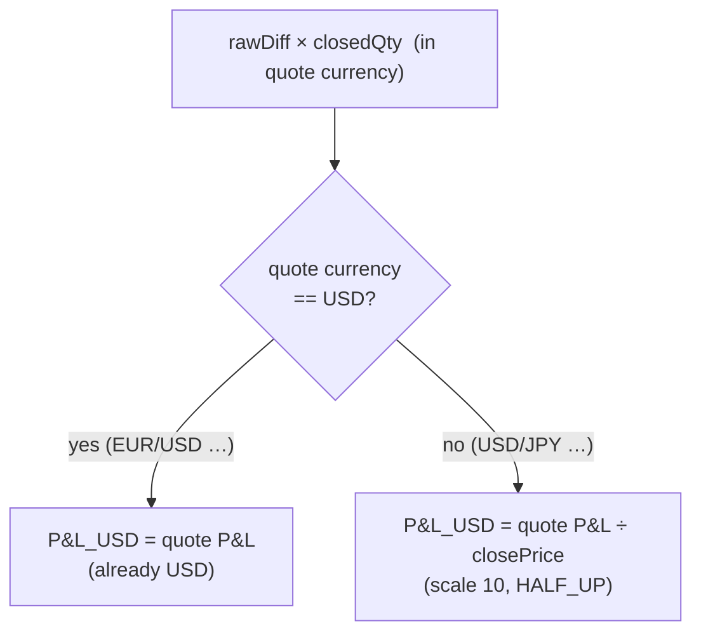
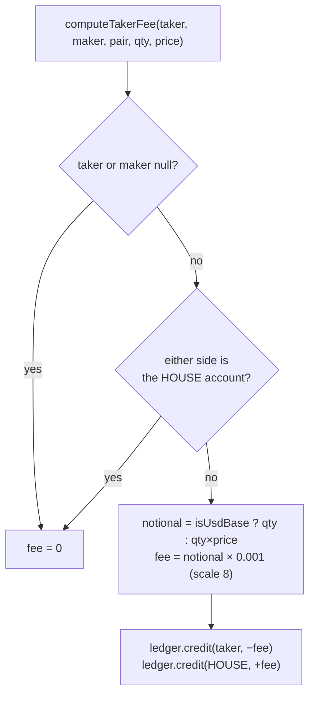
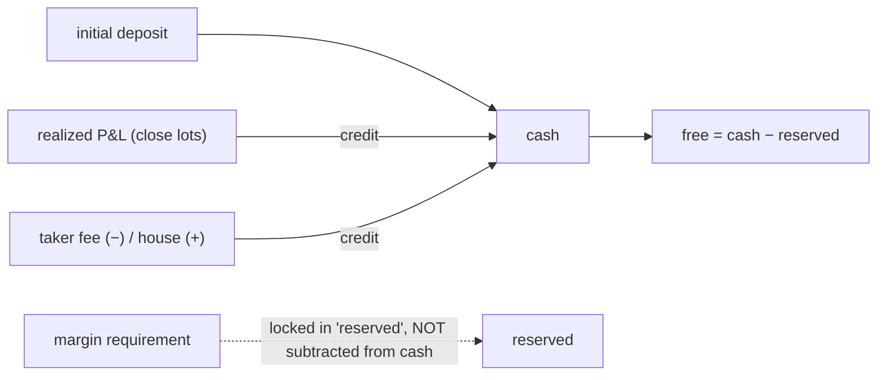

# 04 - Funding, P&L & conservation

_Last updated: 2026-06-21 BST._

All monetary values in the engine are **USD**. This doc covers how dollars are computed: the margin
requirement, the two funding modes, P&L conversion (which differs for USD-base pairs), the taker fee,
and the conservation invariant that ties it all together.

> This is the **canonical money model**, written from the `default` (lock-based, `BigDecimal`) engine.
> The `speed` engine replicates the exact same rules in fixed-point longs (same `isUsdBase` branching,
> same conservation invariant); see [Speed-engine mirror](#speed-engine-mirror-the-same-money-math-in-fixed-point)
> below for the scales and the per-operation mapping.

## Margin: the single funding calculator

Every reserve / hold / release routes through [Margin.usd(pair, qty, price)](../src/main/java/com/fxoee/engine/ledger/Margin.java),
so the global funding mode changes the whole system in one place.

```
notional_usd = pair.isUsdBase() ? qty : qty × price        // USD-base: qty is already USD
requirement  = mode == FULL_NOTIONAL ? notional_usd
                                     : notional_usd × pair.marginRate()
             → rounded HALF_UP to 2 dp
```

### Notional conversion

- **USD-quote pairs** (EUR/USD, GBP/USD, AUD/USD, NZD/USD): notional = `qty × price`.
- **USD-base pairs** (USD/JPY, USD/CHF, USD/CAD): the quantity *is* the USD amount, so notional =
  `qty` and price does not enter the notional.

### Funding modes

[FundingMode](../src/main/java/com/fxoee/engine/ledger/FundingMode.java), selected by
`fxoee.funding.mode`:

| Mode | Reserves | Leverage |
|------|----------|----------|
| `MARGIN` | `notional × marginRate` (0.05) | 20:1 |
| `FULL_NOTIONAL` | full `notional` | 1:1 (none) |

`MARGIN` is exactly `marginRate × FULL_NOTIONAL` for identical inputs (asserted in
`LedgerCornerCasesTest.marginIsRateTimesNotional`). The repo currently defaults to `FULL_NOTIONAL`.

**Worked example (MARGIN, GBP/USD):** BUY 1000 @ 1.2700 → `1000 × 1.2700 × 0.05 = 63.50` reserved.

## P&L conversion to USD

Realized P&L is computed by `PositionBook` when closing lots; the quote-currency P&L is converted to
USD. The conversion **differs by pair type** ([PositionBook.pnlUsd](../src/main/java/com/fxoee/engine/position/PositionBook.java)):



where `rawDiff` = `closePrice − entryPrice` when closing a LONG, or `entryPrice − closePrice` when
closing a SHORT.

**USD-quote example:** LONG GBP/USD 1000 @ 1.2700, close @ 1.2750 → `(1.2750−1.2700)×1000 = 5.00 USD`.

**USD-base example:** LONG USD/JPY 1000 @ 150.00, close @ 151.50 → quote P&L `1.50 × 1000 = 1500 JPY`,
÷ 151.50 = **9.9009900990 USD** (asserted in `PositionBookCornerCasesTest.closeLongUsdBase` and
`MatchingServiceCornerCasesTest.usdJpyConservation`).

> The same USD-base ÷close logic appears in `MatchingService.snapshot` for **unrealized** P&L at mid
> and in `AccountState` (the in-memory mirror), so realized and unrealized agree.

## Taker fee

`MatchingService.applyTakerFee` charges **0.1% of notional** (`TAKER_FEE_RATE = 0.001`) to the
aggressor (taker), credited to the house account.



Fees are zero-sum across `taker + house`, so they don't break conservation (see below). USD-base
example: a 1000-unit USD/JPY fill → fee `1000 × 0.001 = 1.00 USD`
(`MatchingServiceCornerCasesTest.takerFeeUsdBase`).

## Speed-engine mirror: the same money math in fixed-point

The default engine above uses `BigDecimal`. The speed engine (`fxoee.engine.mode=speed`) recomputes
all three money operations (margin requirement, P&L conversion, taker fee) in branch-free `long`
fixed-point so the hot path never allocates. The scales are pinned in
[Fixed](../src/main/java/com/fxoee/engine/speed/Fixed.java):

| Quantity | Scale | Example |
|----------|-------|---------|
| Money (USD) | 8 (`MONEY_SCALE`) | `1.00000000 USD == 100_000_000` |
| Quantity (base units) | 2 (`QTY_SCALE`) | |
| Price | 5 for non-JPY-quote, **3 for JPY-quote** (USD/JPY) | `PRICE_SCALE[pair]` |
| Margin rate | 6 (micros, `MARGIN_RATE_MICRO`) | `0.05 → 50_000` |

The mirror is exact-by-construction, not a re-derivation:

- [Fixed.marginUsdRaw](../src/main/java/com/fxoee/engine/speed/Fixed.java:130) mirrors `Margin#usd`:
  notional (USD-base = qty, else qty × price), then `× marginRate` in `MARGIN` mode, then
  **cent-rounded** (`roundToCent`, scale 2, HALF_UP) like the default engine's `setScale(2, HALF_UP)`.
- [Fixed.pnlUsdRaw](../src/main/java/com/fxoee/engine/speed/Fixed.java:142) mirrors
  `PositionBook.pnlUsd`: USD-quote pairs are already USD; USD-base pairs divide by close price (the
  same ÷close logic, same defensive `closePrice <= 0` branch).
- [Fixed.takerFeeRaw](../src/main/java/com/fxoee/engine/speed/Fixed.java:153) mirrors
  `computeTakerFee`: notional `/ 1000` (= 0.1%, `TAKER_FEE_DIVISOR`) at money scale, HALF_UP.

Rounding is HALF_UP throughout. Because both engines double-round independently, they may differ by
**<= 1 ulp** on midpoint cases; they are independent engines, not bit-for-bit replicas.

## The conservation invariant

The defining property of the ledger model:

> **`cash == initial_deposit + Σ realized P&L`**. Cash moves *only* by realized P&L credits
> (including negative ones and the taker fee). Margin is locked, never spent.



Because cash never moves for opening/holding a position (only `reserved` changes), the invariant holds
by construction. Equity (`snapshot.equity`) is `cash + unrealized P&L`.

### How it's verified

- `MatchingServiceTest.cashConservationCrossPath`: a trader↔trader open then house-close cycle is
  zero-sum across all accounts.
- `MatchingServiceTest.cashConservationUsdBaseJpyDriftBounded`: on USD-base pairs a *tiny* bounded
  drift exists; it is an FX-translation artefact of the ÷close conversion, **not** a bug.
- `EngineConservationFuzzTest`: after **every** order in a 1500-order randomized multi-account,
  multi-pair session, asserts `cash == deposit + Σ realizedPnl`, `free ≥ 0`, no-hedge, `netQty == Σ
  lots`, and `reserved == held margin` whenever the account has no resting orders.

See [Testing](08-testing.md) for the full map.
