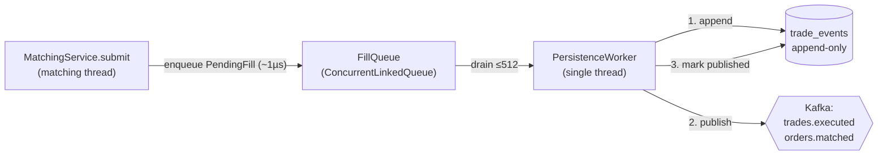
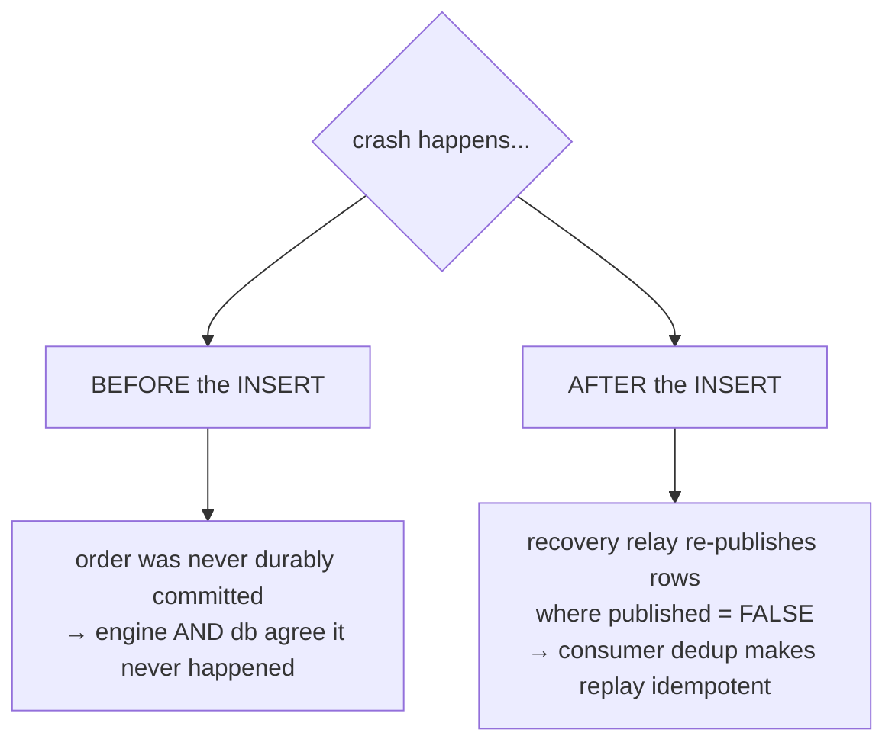
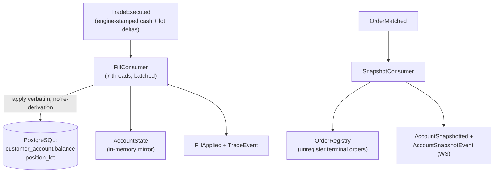
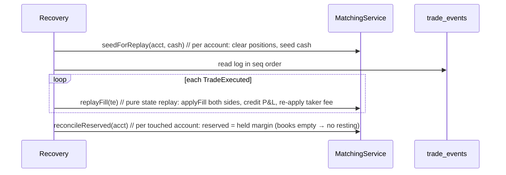

# 05 — Event sourcing & persistence

_Last updated: 2026-06-04 21:57 BST._

The engine is authoritative and in-memory. Durability and the read-model come from an **append-only
event log** plus Kafka projections. This doc traces a fill from the matching thread to PostgreSQL and
back through a warm restart.

All of this is gated on `kafka.enabled=true`. With it off, `OrderEventProducer`, `FillQueue`, and
`PersistenceWorker` beans don't exist and the engine runs as a pure in-memory system.

## The hot path doesn't block on Kafka

When the engine finishes a fill it has the authoritative effects in hand. Instead of publishing to
Kafka inline (a network round-trip on the matching thread), it packages them into a
[PendingFill](../src/main/java/com/fxoee/engine/PendingFill.java) and offers it to the
[FillQueue](../src/main/java/com/fxoee/engine/FillQueue.java) in ~1µs.



### Backpressure / load shedding

`FillQueue` is unbounded, but `isOverloaded()` returns true at the `HIGH_WATER` mark (50,000 pending
fills). `MatchingService.submit` checks this **before mutating any engine state** and, if the worker
is falling behind, rejects the order with reason `OVERLOADED` — no book lock, no fill, no reservation.
This bounds heap instead of growing the queue until OOM. Worker re-enqueues (after a failed batch) go
through `enqueue` directly and are exempt from shedding.

### PersistenceWorker ordering guarantee

The worker ([PersistenceWorker.java](../src/main/java/com/fxoee/engine/PersistenceWorker.java)) drains
batches of up to 512 and, per item: **(1)** appends each `TradeExecuted` to `trade_events`, **(2)**
publishes to Kafka, **(3)** marks the row published, **(4)** then publishes the terminal
`OrderMatched`. Append happens **before** publish, so the log is the single committed source both
projections derive from. Failed batches are re-enqueued, never dropped.

## The durable log: `trade_events`

[V9__create_trade_events.sql](../src/main/resources/db/migration/V9__create_trade_events.sql):

```sql
CREATE TABLE trade_events (
    seq         BIGSERIAL  PRIMARY KEY,   -- replay order
    event_id    UUID       NOT NULL UNIQUE,
    pair        VARCHAR(10) NOT NULL,
    payload     JSONB      NOT NULL,      -- the serialized TradeExecuted
    published   BOOLEAN    NOT NULL DEFAULT FALSE,
    occurred_at TIMESTAMPTZ NOT NULL DEFAULT now()
);
```

This is the crux of the no-divergence guarantee:



Both the **engine** (rebuilt by replaying the log) and the **DB projection** (written by `FillConsumer`
off the Kafka stream the log feeds) derive from the same committed rows, so they cannot diverge.

## Kafka topics

[KafkaTopicConfig](../src/main/java/com/fxoee/config/KafkaTopicConfig.java) — partition count =
number of currency pairs (7); messages are keyed by `pair.name()` so all events for a pair land on one
partition (per-pair ordering).

| Topic | Event | Producer | Consumer |
|-------|-------|----------|----------|
| `orders.placed` | `OrderPlaced` | submit (audit) | — |
| `trades.executed` | `TradeExecuted` | PersistenceWorker | `FillConsumer` |
| `orders.matched` | `OrderMatched` | PersistenceWorker | `SnapshotConsumer` |
| `fills.applied` | `FillApplied` | `FillConsumer` | (downstream / WS) |
| `account.snapshotted` | `AccountSnapshotted` | `SnapshotConsumer`, reset/forceFlat | (downstream / WS) |

## Projections



### FillConsumer

[FillConsumer](../src/main/java/com/fxoee/events/kafka/FillConsumer.java) applies the engine-stamped
cash and lot effects to the DB and the `AccountState` mirror **without re-deriving** any open/close or
cash math — it replays exactly what the engine decided, keyed on engine lot ids. It batches DB writes
via `FillBatchRepository` and rolls back the in-memory batch on a DB failure. **Dedup** is in-memory,
keyed `tradeId:side` and `tradeId:FEE`, so a Kafka redelivery is idempotent.

### SnapshotConsumer

[SnapshotConsumer](../src/main/java/com/fxoee/events/kafka/SnapshotConsumer.java) consumes
`OrderMatched`: unregisters terminal orders from `OrderRegistry`, builds an account snapshot (throttled
~1s), and publishes `AccountSnapshotted` + a Spring `AccountSnapshotEvent` for the WebSocket layer.
Snapshots may briefly lag fills (separate topic, no cross-topic ordering). Dedup by `eventId`.

## Warm-restart recovery (engine replay)

On restart the books are empty and in-memory state is gone. The engine is rebuilt from `trade_events`:



`replayFill` does **no** validate/reserve/match — the trade already happened and is durably logged. It
applies each non-null side's fill to the `PositionBook`, credits realized P&L, and re-applies the
taker fee to taker/house. Because resting orders don't survive a restart, `reconcileReserved` over the
empty books yields `reserved == held position margin`. This round-trip is tested end-to-end in
`MatchingServiceCornerCasesTest.replayRoundTrip`.

> The recovery **relay** (re-publishing `published = FALSE` rows after a crash) is indexed by
> `idx_trade_events_unpublished`. A `processed_events` table exists for durable consumer dedup; the
> consumers currently use in-memory dedup.
