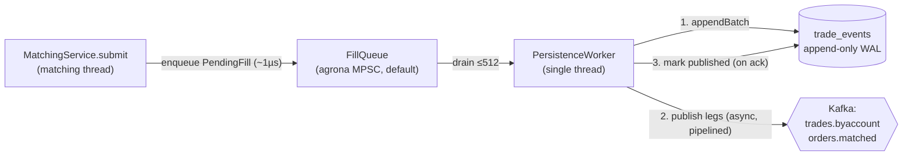
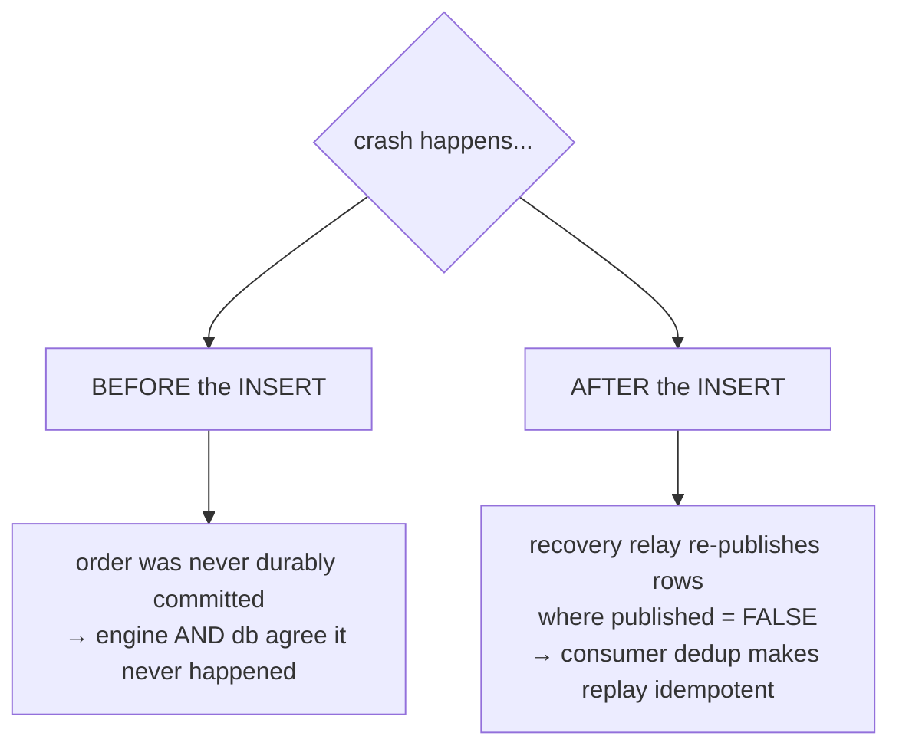
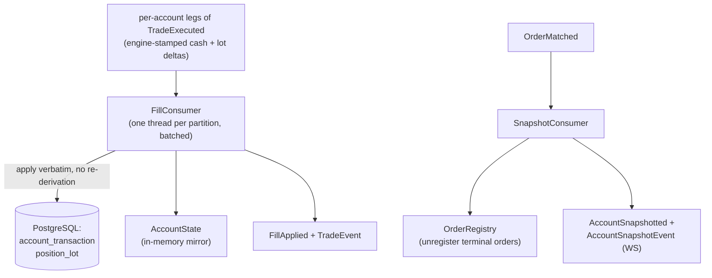
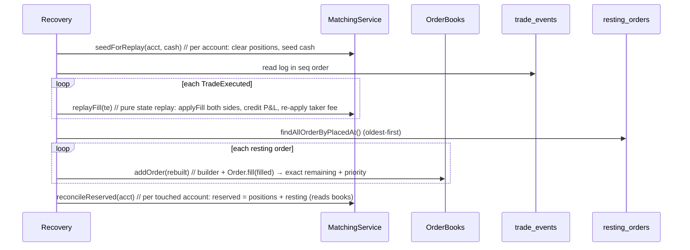
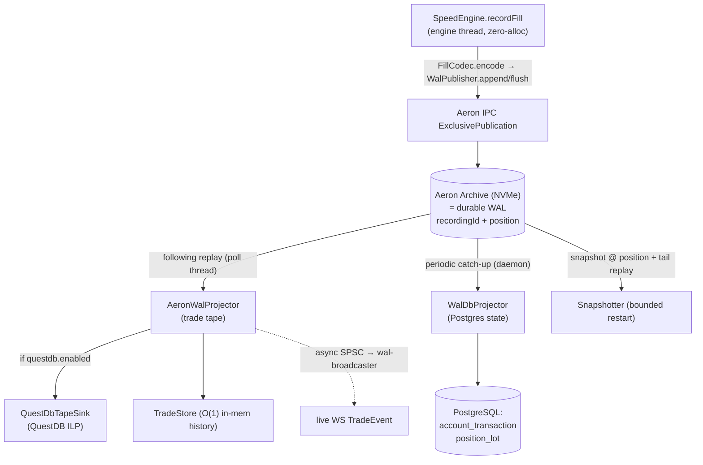
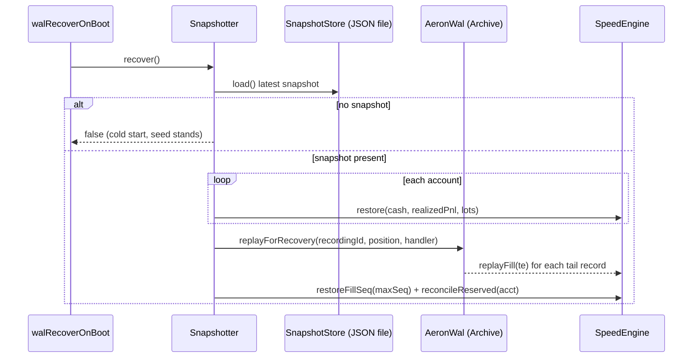

# 05 - Event sourcing & persistence

_Last updated: 2026-06-27 BST._

The engine is authoritative and in-memory. Durability and the read-model are projections of an
**append-only log**. There are **two durability lanes**, picked by `fxoee.engine.mode`, and they use
different logs:

| Lane | Engine mode | Append-only log | Read-model writers | Active by default? |
|------|-------------|-----------------|--------------------|--------------------|
| **Lane 1** (original event sourcing) | `default` (locks) | `trade_events` (Postgres table) via Kafka | `FillConsumer` / `SnapshotConsumer` + `AccountState` mirror | engine `default` is the boot default; Kafka **producer** on, **consumer** off |
| **Lane 2** (ADR 0007) | `speed` (Disruptor) | embedded **Aeron Archive** WAL, no Kafka | `AeronWalProjector` (tape) + `WalDbProjector` (Postgres) + `QuestDbTapeSink` (QuestDB) | all `fxoee.wal.*` flags **off** by default |

The invariant that both lanes share, **"engine computes, projection applies"**, has not changed and is
the spine of this doc. What changed is the transport under it: Lane 2 swaps the Kafka + `trade_events`
durability path for an Aeron Archive WAL whose recording position is the engine-stamped sequence
([ADR 0007](adr/0007-aeron-archive-wal-questdb-tape.md)).

> Which lane runs is a deploy choice. `application.yml` boots `default` (Lane 1) with the Kafka producer
> on and the consumer gated by `KAFKA_ENABLED` (default `false`). `performance.properties` flips
> `engine.mode=speed`; the dev `scripts/dev-local-backend.sh --wal` turns on the full Lane 2 Aeron path.

## The invariant: engine computes, projection applies

When the engine finishes a fill it has the authoritative effects in hand: per-side `cashDelta`, realized
`pnl`, and lot events carrying **engine lot ids**. Every event it emits (e.g.
[TradeExecuted](../src/main/java/com/fxoee/events/kafka/event/TradeExecuted.java)) carries those effects,
so **every projection is a pure writer** that applies them verbatim. No consumer re-derives open/close,
cash, or P&L; reservations live in the engine only. This is what keeps the DB and the in-memory mirror
from drifting away from the engine, and it holds identically in both lanes.

---

## Lane 1 - default engine: Kafka + `trade_events`

### The hot path doesn't block on Kafka

When the lock engine finishes a fill it packages the effects into a
[PendingFill](../src/main/java/com/fxoee/engine/PendingFill.java) and offers it to the
[FillQueue](../src/main/java/com/fxoee/engine/FillQueue.java) in ~1µs. Kafka and DB writes never happen
under the book lock. The default `FillQueue` impl is `agrona` (unbounded Agrona MPSC); `clq`
(`ConcurrentLinkedQueue`, sheds at high-water) and `disruptor` are alternatives (`fxoee.queue.type`).



This lane only exists when `kafka.enabled=true` (producer side; on by default). With it off,
`OrderEventProducer`, `FillQueue`, and `PersistenceWorker` beans don't exist and the engine runs as a
pure in-memory system.

### Backpressure / load shedding

When the `clq` queue is used, `isOverloaded()` returns true at the `HIGH_WATER` mark.
`MatchingService.submit` checks this **before mutating any engine state** and, if the worker is falling
behind, rejects the order with reason `OVERLOADED`: no book lock, no fill, no reservation. The default
`agrona` queue is unbounded and never sheds. Worker re-enqueues (after a failed batch) go through
`enqueue` directly and are exempt from shedding.

### PersistenceWorker ordering guarantee

The worker ([PersistenceWorker.java](../src/main/java/com/fxoee/engine/PersistenceWorker.java), drains
`fxoee.persistence.batch-max`, default 512) does, per drained batch: **(1)** `appendBatch`'s each
`TradeExecuted` to `trade_events` ([PersistenceWorker.java:148](../src/main/java/com/fxoee/engine/PersistenceWorker.java#L148)),
**(2)** publishes the per-account legs to Kafka, **(3)** marks the rows published once **all** legs are
broker-confirmed (per-event countdown, on the ack callback,
[PersistenceWorker.java:176](../src/main/java/com/fxoee/engine/PersistenceWorker.java#L176)), **(4)** then
emits the terminal `OrderMatched`. Append happens **before** publish, so the log is the single committed
source both projections derive from. The sends are pipelined async (no per-batch broker join); a partial
publish re-enqueues the owner. Failed batches are re-enqueued, never dropped.

Producer settings ([application.yml](../src/main/resources/application.yml)): `acks=all`,
`enable.idempotence=true`, `max.in.flight.requests.per.connection=5`, `batch-size=262144`,
`compression-type=zstd`, `buffer-memory=67108864` (64 MiB), `linger.ms=20`. This pipelining + batching is
what makes the worker the end-to-end throughput bottleneck (~300-1000 trades/s local), not matching CPU.

### The durable log: `trade_events`

[V9__create_trade_events.sql](../src/main/resources/db/migration/V9__create_trade_events.sql):

```sql
CREATE TABLE trade_events (
    seq         BIGSERIAL  PRIMARY KEY,   -- replay order
    event_id    UUID       NOT NULL UNIQUE,
    pair        VARCHAR(10) NOT NULL,
    payload     JSONB      NOT NULL,      -- the serialized TradeExecuted
    published   BOOLEAN    NOT NULL DEFAULT FALSE,
    occurred_at TIMESTAMPTZ NOT NULL DEFAULT now()
);
```

This is the crux of the no-divergence guarantee:



Both the **engine** (rebuilt by replaying the log) and the **DB projection** (written by `FillConsumer`
off the Kafka stream the log feeds) derive from the same committed rows, so they cannot diverge.

### Kafka topics

[KafkaTopicConfig](../src/main/java/com/fxoee/config/KafkaTopicConfig.java) declares the topics.
Partition count = number of currency pairs (7); messages are keyed so all events for a key land on one
partition (per-pair / per-account ordering).

| Topic | Event | Producer | Consumer |
|-------|-------|----------|----------|
| `orders.placed` | `OrderPlaced` | submit (audit) | `OrderAuditConsumer` (writes the `orders` table) |
| `trades.byaccount` | per-account legs of `TradeExecuted` | PersistenceWorker | `FillConsumer` |
| `orders.matched` | `OrderMatched` | PersistenceWorker | `SnapshotConsumer` + `OrderAuditConsumer` (terminal status) |
| `fills.applied` | `FillApplied` | `FillConsumer` | (downstream / WS) |
| `account.snapshotted` | `AccountSnapshotted` | `SnapshotConsumer`, reset/forceFlat | (downstream / WS) |
| `engine.snapshots` | `EngineSnapshot` | `EngineSnapshotter` (log-compacted) | `bootstrap.SnapshotStore` (bounded restart, off by default) |
| `trading.halted` | `TradingHaltedEvent` | `CircuitBreaker` (on a tripped pair) | none (produced only) |

`fills.applied`, `account.snapshotted`, and `trading.halted` have **no `@KafkaListener`** inside the
app: they exist for downstream / WebSocket consumers. `trading.halted` is the thinnest of the three. It
is produced only when the circuit breaker halts a pair
([CircuitBreaker.onTrade](../src/main/java/com/fxoee/service/CircuitBreaker.java#L74), gated on
`fx.circuit-breaker.enabled`) and nothing else reads it; the live WebSocket halt broadcast goes out
separately via `wsHandler.broadcastStatus`, so the topic is effectively a stub fan-out.

> The durable fill stream is **keyed by account** (`trades.byaccount`), not by trade: ADR 0006 Phase 2
> re-keyed it so each account is single-writer, which let the DB projector drop `SELECT … FOR UPDATE` and
> its global dedup. `AccountFill.split` turns one `TradeExecuted` into its per-account legs.

### Projections



#### FillConsumer

[FillConsumer](../src/main/java/com/fxoee/events/kafka/FillConsumer.java) consumes
`trades.byaccount` and applies the engine-stamped cash and lot effects to the DB and the `AccountState`
mirror **without re-deriving** any open/close or cash math. It replays exactly what the engine decided,
keyed on engine lot ids. **Dedup** is durable: the `fill_dedup` table
([V12__create_fill_dedup.sql](../src/main/resources/db/migration/V12__create_fill_dedup.sql)) claims a
row per `(trade_id, leg)` inside the same transaction as the projection write (`leg ∈ {BUY, SELL,
FEE_TAKER, FEE_HOUSE}`), so a Kafka redelivery or a warm-restart relay is idempotent and a rolled-back
projection rolls back its claim.

#### SnapshotConsumer

[SnapshotConsumer](../src/main/java/com/fxoee/events/kafka/SnapshotConsumer.java) consumes
`OrderMatched`: unregisters terminal orders from `OrderRegistry`, builds an account snapshot (throttled
to one per second), and publishes `AccountSnapshotted` + a Spring `AccountSnapshotEvent` for the
WebSocket layer. Snapshots may briefly lag fills (separate topic, no cross-topic ordering). Dedup by
`eventId`.

### Lane 1 warm-restart recovery (engine replay)

On restart the books are empty and in-memory state is gone. The engine is rebuilt **1:1** from two
durable sources: `trade_events` (positions + cash) and `resting_orders` (the live order books).



`replayFill` does **no** validate/reserve/match. The trade already happened and is durably logged, so
it just applies each non-null side's fill to the `PositionBook`, credits realized P&L, and re-applies
the taker fee to taker/house. The resting orders are then rebuilt onto the books, so
`reconcileReserved` (which reads resting margin **from the books**) re-locks `reserved == Σ position
margin + Σ resting margin`. This round-trip is tested in `MatchingServiceCornerCasesTest.replayRoundTrip`
(positions/cash) and `…warmRestartRecoversRestingOrders` (resting orders).

#### Resting (open, unfilled) orders are recovered 1:1

`trade_events` records **fills only**, so it cannot rebuild a resting LIMIT order that never matched.
The dedicated **`resting_orders`** table is the authoritative mirror of the live books: a row exists
iff the order is currently resting. It is maintained incrementally by `PersistenceWorker` (the same
off-hot-path worker that persists fills), so it has the same durability as `trade_events` and adds
**no** cost to the matching/HTTP threads.

```mermaid
flowchart LR
    A["order rests<br/>(LIMIT, leftover qty)"] -->|upsert| T[("resting_orders")]
    B["resting order partially fills"] -->|upsert (lower remaining)| T
    C["fully fills / cancelled"] -->|delete| T
    T -->|warm restart: findAllOrderByPlacedAt| D["rebuild Order + addOrder"]
    D --> E["reconcile → margin re-locked"]
```

`MatchingService.submit` captures the deltas under the book lock it already holds (`findOrder` per
touched order: present means upsert with current remaining, absent means delete), packages them into
the `PendingFill` already handed to the `FillQueue`, and the worker applies them in the same durable
step as the trade-events append. Cancels enqueue a delete. Net effect of a restart:

| Pre-crash state | After warm restart |
|-----------------|--------------------|
| Filled position (`trade_events`) | restored; margin re-locked |
| Resting LIMIT order (`resting_orders`) | **restored**: same id, price, remaining qty, time priority |
| `reserved` | restored to `Σ position margin + Σ resting margin` (reconcile reads the rebuilt books) |

Scope: **all** resting orders are restored, including house/sim (null-account) liquidity. A
partially-filled order is reconstructed exactly via `Order.fill(originalQty − remaining)`. Covered by
`MatchingServiceCornerCasesTest.warmRestartRecoversRestingOrders` (engine) and
`WarmRestartIntegrationTest` (submit → persist → restart → back on the book).

> The recovery **relay** (re-publishing `published = FALSE` rows after a crash) is indexed by
> `idx_trade_events_unpublished`. A `processed_events` table exists for durable consumer dedup; the
> Kafka consumers now dedup on the `fill_dedup` table (FillConsumer) and `eventId` (SnapshotConsumer).

#### Bounded restart (Lane 1, ADR 0006, off by default)

`AccountBootstrapper.recoverFromLog` replays the **whole** `trade_events` log, so restart time grows
with lifetime trade volume. [ADR 0006](adr/0006-engine-snapshots-bounded-restart.md) adds optional
bounded restart behind `fxoee.recovery.snapshots.enabled` (default `false`, needs `kafka.enabled=true`):
`EngineSnapshotter` periodically publishes each account's `{cash, realizedPnl, lots, coveredSeq}` to the
log-compacted `engine.snapshots` topic, and recovery loads the latest snapshot per account
(`engine.restore`) and replays only the `trade_events` tail past the snapshot's `coveredSeq`. It is
**opt-in** because the consistent cut is opportunistic (the engine runs ahead of the WAL); see ADR 0006
for the enqueue-lag caveat. ADR 0007's Aeron lane (below) makes this cut exact via the Archive position.

---

## Lane 2 - speed engine: Aeron Archive WAL (ADR 0007)

When `fxoee.engine.mode=speed` **and** `fxoee.wal.aeron.enabled=true`, matching is JVM-only with **no
Kafka**. The engine records every fill to an embedded **Aeron Archive** on local NVMe, and that recording
is the single source of truth. Three downstream pollers read the Archive; the engine stays authoritative
for balances, so neither Kafka nor the `FillQueue` is wired
([SpeedEngineConfig.java:124-150](../src/main/java/com/fxoee/engine/speed/SpeedEngineConfig.java#L124)).
All `fxoee.wal.*` flags are off by default; `scripts/dev-local-backend.sh --wal` turns the lane on
(`--questdb` adds the QuestDB tape, `--wal-durable` adds a persisted Archive + snapshots).

### Recording: engine thread → Aeron Archive

The SBE `FillRecord` ([FillCodec](../src/main/java/com/fxoee/engine/speed/wal/FillCodec.java),
[FillRecordData](../src/main/java/com/fxoee/engine/speed/wal/FillRecordData.java); generated codecs in
`com.fxoee.engine.speed.wal.sbe`) is a whole-trade record (per-side cashDelta/pnl, fees, lot events with
engine lot ids). The engine encodes a fill into its reusable `FillRecordData` and calls
`wal.append(r)` / `flushWal()` on the **engine thread**
([SpeedEngine.java:442](../src/main/java/com/fxoee/engine/speed/SpeedEngine.java#L442)).
[WalPublisher](../src/main/java/com/fxoee/wal/WalPublisher.java) batches many fills into one Aeron
message (flush at ~60 KiB so per-message recorder overhead is paid once per batch, not per fill) and
offers it to an `ExclusivePublication` on the IPC channel; the embedded
[AeronWal](../src/main/java/com/fxoee/wal/AeronWal.java) `ArchivingMediaDriver` records that stream. The
record buffer grows on demand so a large lot-event group can never overrun it.

The Archive **recording position is the engine-stamped monotonic sequence** ADR 0006 lacked, so the
snapshot cut is exact (no opportunistic guard). Trade and lot ids are deterministic functions of the fill
sequence ([WalIds](../src/main/java/com/fxoee/engine/speed/wal/WalIds.java)), so replay reproduces
identical ids and dedup is idempotent.



### Poller 1 - AeronWalProjector: the trade tape

[AeronWalProjector](../src/main/java/com/fxoee/wal/AeronWalProjector.java) subscribes to a **following
replay** of the Archive (so a slow tape consumer can't gate the engine's live publication,
[AeronWal.java:160](../src/main/java/com/fxoee/wal/AeronWal.java#L160)) and runs two threads:

- `wal-projector` (`pollLoop`): drains the WAL at memory speed, `WalFillConverter.toTrade` → `TradeStore`
  (O(1) in-mem history), and offers each `TradeEvent` to a bounded SPSC queue
  (`fxoee.wal.aeron.broadcast-queue-capacity`, default 8192).
- `wal-broadcaster` (`broadcastLoop`): drains the queue and does the per-client WS JSON publish.

This is plan "Fix A": the drain thread never blocks on a slow WS client. On queue overflow the **live
broadcast is dropped** (`wal.broadcast.dropped.total`), never the durable record (`tradeStore.add`
already ran). When `fxoee.wal.questdb.enabled=true` it also calls `questDb.record(trade)` per fill and
`questDb.flush()` once per drained poll, on the poll thread (the ILP `Sender` is not thread-safe).

### Poller 2 - WalDbProjector: Postgres account state

[WalDbProjector](../src/main/java/com/fxoee/wal/WalDbProjector.java)
(`fxoee.wal.postgres.enabled=true`) is an **off-engine periodic catch-up** (`wal-db-projector` daemon,
`interval-ms` default 200) that replays the Archive tail and lands per-account balances + position lots in
Postgres, so `/api/debug/state` tracks the engine instead of a frozen initial deposit. It is a lagging
downstream replica, not on the hot path. Key properties:

- **Idempotent** via the same `fill_dedup` table (`flushLegs`'s `(trade_id, leg)` claim).
- **Incremental cursor.** `catchUp` commits the durable cursor at **fragment boundaries throughout** the
  replay (not only at the very end), so a large backlog shows steady progress and a crash re-replays at
  most one batch ([WalDbProjector.java:197-243](../src/main/java/com/fxoee/wal/WalDbProjector.java#L197)).
  The cursor lives in `wal_projection_offset`
  ([V14__wal_projection_offset.sql](../src/main/resources/db/migration/V14__wal_projection_offset.sql),
  one row: `recording_id + position + last_seq`) via
  [WalProjectionOffsetRepository](../src/main/java/com/fxoee/persistence/WalProjectionOffsetRepository.java).
- **Seeds a bounded backfill.** First run seeds from the latest snapshot (`seedIfNeeded` →
  `fills.seedFromSnapshot`) or cold-starts at recording position 0
  ([WalDbProjector.java:102](../src/main/java/com/fxoee/wal/WalDbProjector.java#L102)).
- **Prune-safe.** A cursor from a pruned/reset Archive is detected via `AeronWal.isReplayable` and
  triggers `clearAndReseed` (the fresh engine reissues the same deterministic trade ids from 0, so a
  surviving `fill_dedup` would otherwise drop every re-projected leg).
- **Hard-reset without deadlock.** `runExclusive` serialises the catch-up loop against destructive ops
  (TRUNCATE + `resetToArchiveEnd`) under one `projectionLock`, so a `TRUNCATE` can't deadlock an in-flight
  `flushLegs` that grabs the same tables in the opposite order
  ([WalDbProjector.java:156-184](../src/main/java/com/fxoee/wal/WalDbProjector.java#L156)).
- **Self-diagnosing.** `lastError` / `lastCatchUpMs` / `lagBytes` (gauge `wal.db.lag.bytes`) surface to
  the debug screen.

> Recent perf work: commit `064dfbb` sped this projection ~5-10x; `6fc9d50` added the incremental
> fragment-boundary cursor and the `runExclusive` / `projectionLock` hard-reset deadlock fix. Both are
> reflected above.

### Poller 3 - QuestDbTapeSink: SQL trade history

[QuestDbTapeSink](../src/main/java/com/fxoee/wal/QuestDbTapeSink.java)
(`fxoee.wal.questdb.enabled=true`) writes the SQL-queryable trade tape to QuestDB over ILP
(`fxoee.wal.questdb.ilp`, default `http::addr=localhost:9000;`), fed by the AeronWalProjector off the hot
path. It connects **lazily** on first flush (the app boots before QuestDB is reachable) and creates the
`trades` table with `DEDUP UPSERT KEYS(timestamp, trade_id)` so re-projecting a (deterministic-id) fill is
an upsert, not a dup. DDL/TRUNCATE go over HTTP `/exec`; the ILP `Sender` is append-only and single-thread.
The `trades` table carries a retention window (`fxoee.wal.questdb.ttl`, default `30d`): QuestDB drops whole
day partitions older than the window on its own, so the tape stays bounded while Postgres and the Aeron WAL
remain the durable source of truth. The TTL ships in the `CREATE TABLE` for a fresh tape and via a follow-up
`ALTER TABLE trades SET TTL` for one that already exists; set the value blank or `0` to keep everything.

### Ingress shed (plan "Fix B")

Backpressure moves from a queue high-water to the Aeron publication. The WAL lag is
`publicationPosition − recordingPosition` in bytes
([AeronWal.walLagBytes](../src/main/java/com/fxoee/wal/AeronWal.java#L142)). When it exceeds
`fxoee.wal.aeron.lag-threshold-bytes` (default `50331648` = 48 MiB, i.e. 75% of the 64 MiB IPC term),
`SpeedMatchingService` rejects a **new** order `OVERLOADED` **before** it can push a fill burst past the
term buffer and stall the engine on a back-pressured `offer`
([SpeedMatchingService.java:177](../src/main/java/com/fxoee/engine/speed/SpeedMatchingService.java#L177)).
The threshold is auto-capped to 90% of `term-buffer-length`
([SpeedEngineConfig.java:136](../src/main/java/com/fxoee/engine/speed/SpeedEngineConfig.java#L136)). The
single-writer engine thread never blocks on WAL back-pressure.

### Engine snapshots + bounded warm restart (Phase E)

With `fxoee.wal.snapshot.enabled=true`, [Snapshotter](../src/main/java/com/fxoee/wal/Snapshotter.java) +
[SnapshotStore](../src/main/java/com/fxoee/wal/SnapshotStore.java) (the **`com.fxoee.wal`** one, a JSON
file) pin engine state plus the **exact Archive recording/position** to `fxoee.wal.snapshot.file`,
periodically and on shutdown ([SnapshotSchedule](../src/main/java/com/fxoee/wal/SnapshotSchedule.java),
`interval-ms` default 30000). On boot,
[SpeedEngineConfig.walRecoverOnBoot](../src/main/java/com/fxoee/engine/speed/SpeedEngineConfig.java#L303)
(a `SmartInitializingSingleton`, so it fires after `AccountBootstrapper` seeds and before traffic)
restores each account (`engine.restore`) and replays **only** the Archive tail from the snapshot position
(`Snapshotter.recover` → `AeronWal.replayForRecovery`), then raises the fill-seq high-water and
`reconcileReserved`s. Cold start (no snapshot) is a no-op and the fresh seed stands.



#### Durable warm restart across a real process restart

Surviving a real restart (not just an in-process recover) needs the Archive to persist:
`fxoee.wal.aeron.persist-archive=true` + a stable `archive-dir`/`aeron-dir` + `snapshot.file`. The full
**DB-off durable lane** is: `persist-archive=true` + `snapshot.enabled=true` +
`bootstrap.clear-on-start=false` + `recovery.replay-on-startup=false` (the WAL is the source of truth).
`scripts/dev-local-backend.sh --wal-durable` sets exactly this with paths under `./.dev-local/wal/`.

`fxoee.wal.aeron.prune-on-start` (default `false`; the **local** profile sets it `true` for a
fresh-every-run engine) wipes the archive recordings + the snapshot **before** `AeronWal` opens them, so a
corrupt or stale snapshot can never replay into the engine. It deliberately does **not** touch
`aeron-dir` (the media driver's live `cnc.dat`); the driver manages that dir itself
([SpeedEngineConfig.java:174-191](../src/main/java/com/fxoee/engine/speed/SpeedEngineConfig.java#L174)).

> **Two `SnapshotStore`s and two snapshotters - don't conflate them.** Lane 2 uses
> `com.fxoee.wal.SnapshotStore` (a JSON file tagged with the Archive position) driven by
> `com.fxoee.wal.Snapshotter`. Lane 1's ADR 0006 path uses `com.fxoee.bootstrap.SnapshotStore` (a Kafka
> `engine.snapshots` consumer) driven by `com.fxoee.engine.EngineSnapshotter`. They serve the same idea
> (bounded restart) on the two different durability lanes.

---

## Enabling warm restart (Lane 1)

Lane 1 warm restart is gated by `fxoee.recovery.replay-on-startup` (env
`FXOEE_RECOVERY_REPLAY_ON_STARTUP`), **default `false`**. When `false`, `AccountBootstrapper` performs a
fresh start: wipe transactional state, reset every account to the 10 M seed. When `true`, it replays
`trade_events` into the engine instead (the sequence above).

| Environment | Setting | Effect |
|-------------|---------|--------|
| **k8s** ([configmap.yaml](../k8s/base/backend/configmap.yaml)) | `FXOEE_RECOVERY_REPLAY_ON_STARTUP: "true"` | every pod restart (crash, rolling update, OOM kill) preserves open positions + trade history |
| **docker-compose** (`environment:`) | `FXOEE_RECOVERY_REPLAY_ON_STARTUP=true` | same, for a long-lived compose stack |
| **local dev** (default) | _unset, so `false`_ | fresh start on every `mvn spring-boot:run` / `deploy-all.sh` (which also wipes the Postgres PVC, so there would be nothing to replay anyway) |

Why it is safe to default-on for k8s: replay is **idempotent**. The relay's re-publish is de-duplicated
downstream by `FillConsumer` on the `fill_dedup` table, and an empty log makes warm restart a graceful
no-op. So a first-ever deploy onto an empty database behaves exactly like a fresh start.

Operational verification on a live cluster (minikube / k3s): see the runbook
[testing-event-sourcing-minikube.md](testing-event-sourcing-minikube.md).

## Test coverage

| Layer | Test | What it covers |
|-------|------|----------------|
| Engine unit | `MatchingServiceCornerCasesTest.replayRoundTrip` | seed → replay 2 fills → reconcile → assert positions / cash / margin (engine only, no DB) |
| Engine unit | `MatchingServiceCornerCasesTest.warmRestartRecoversRestingOrders` | filled position **and** resting LIMIT order both restored 1:1; `reserved == positions + resting` margin |
| Bootstrap unit | `AccountBootstrapperTest` (Mockito) | fresh vs warm boot branch, resting-order rebuild + reconcile, the Kafka relay of `published=false` rows, bad-JSON tolerance, fallback to fresh start when no `TradeEventRepository` bean |
| Bootstrap IT | `WarmRestartIntegrationTest` (Testcontainers + EmbeddedKafka) | DB-to-engine glue: `trade_events` → `recoverFromLog` → `MatchingService.snapshot`; relay re-publish; **resting-order recovery** (incl. a partially-filled row); `RestingOrderRepository` upsert/update/delete; end-to-end submit → `PersistenceWorker` persist → restart → back on the book |
| WAL codec | `FillCodec` round-trip + allocation probe | SBE encode/decode round-trips a fill; encode is zero-alloc on the publish path |
| WAL recovery | `SpeedWalCrossRestartRecoveryTest` | snapshot + persisted Archive → replay tail across a real kill+restart → re-assert engine state (Lane 2) |

See [doc 08 - Testing](08-testing.md#bootstrap--recovery-warm-restart-three-layers) for the suite map, and
[ADR 0007](adr/0007-aeron-archive-wal-questdb-tape.md) for the Aeron lane's design decisions.
