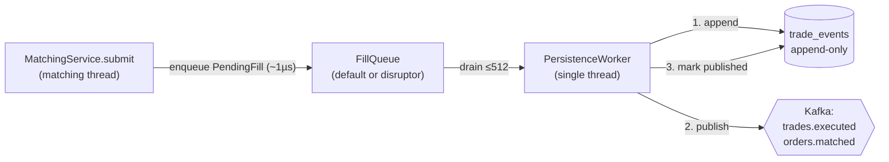
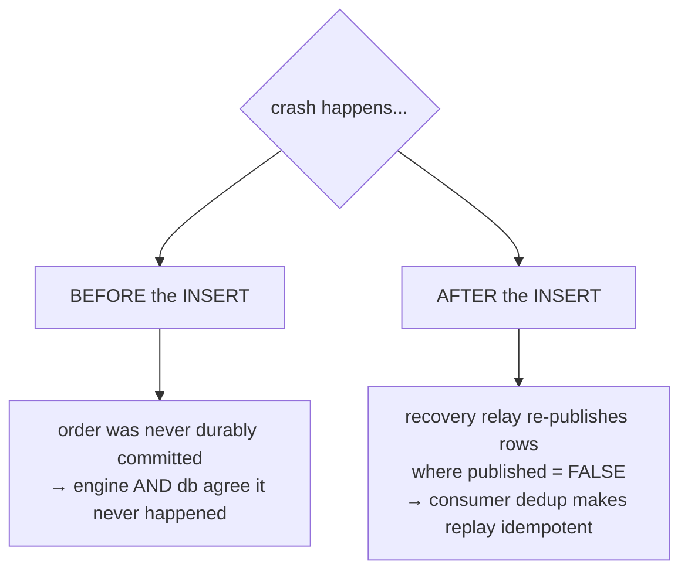
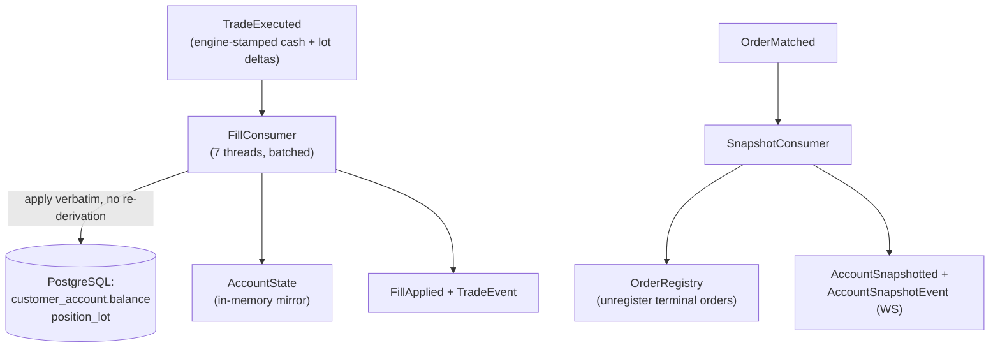
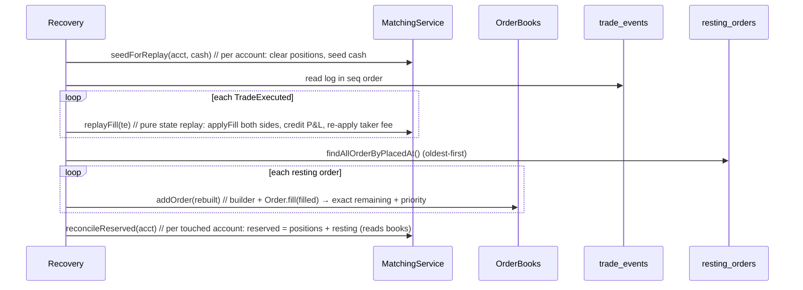
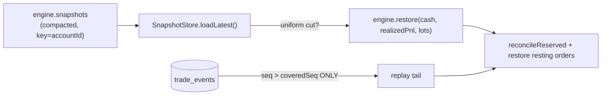

# 05 - Event sourcing & persistence

_Last updated: 2026-06-14 BST._

The engine is authoritative and in-memory. Durability and the read-model come from an **append-only
event log** plus Kafka projections. This doc traces a fill from the matching thread to PostgreSQL and
back through a warm restart.

All of this is gated on `kafka.enabled=true`. With it off, `OrderEventProducer`, `FillQueue`, and
`PersistenceWorker` beans don't exist and the engine runs as a pure in-memory system.

> **Speed mode has a second durability path.** When `fxoee.engine.mode=speed` runs with
> `fxoee.wal.aeron.enabled=true` (ADR 0007), the Kafka / `FillQueue` projection below is bypassed
> entirely: the engine is balance-authoritative in the JVM and records fills to an **Aeron Archive
> WAL** that an `AeronWalProjector` turns into the trade-history tape. That path, its deterministic
> trade ids, and bounded snapshot restart are documented in [speed-engine.md](speed-engine.md).

## The hot path doesn't block on Kafka

When the engine finishes a fill it has the authoritative effects in hand. Instead of publishing to
Kafka inline (a network round-trip on the matching thread), it packages them into a
[PendingFill](../src/main/java/com/fxoee/engine/PendingFill.java) and offers it to the
[FillQueue](../src/main/java/com/fxoee/engine/FillQueue.java) in ~1µs.



### Two FillQueue implementations

[FillQueue](../src/main/java/com/fxoee/engine/FillQueue.java) is an interface with two beans, selected
by `fxoee.queue.type` (both `@ConditionalOnProperty kafka.enabled=true`):

| `fxoee.queue.type` | Bean | Backing | Bound |
|--------------------|------|---------|-------|
| `default` (or absent) | [DefaultFillQueue](../src/main/java/com/fxoee/engine/DefaultFillQueue.java) | `ConcurrentLinkedQueue` + `AtomicInteger` depth counter | unbounded |
| `disruptor` | [DisruptorFillQueue](../src/main/java/com/fxoee/engine/DisruptorFillQueue.java) | LMAX Disruptor ring buffer, pre-allocated slots, `YieldingWaitStrategy` | bounded (ring size) |

**This branch runs `disruptor`** (`performance.properties`): a pre-allocated, multi-producer
single-consumer ring buffer of `fxoee.disruptor.ring-buffer-size` slots (default 131072 in code,
**overridden to 1048576** here - must be a power of two). Pre-allocation means no per-enqueue
allocation and lower GC pressure than the `default` queue at high throughput. The single consumer
(`PersistenceWorker`) drains via an `EventPoller` (pull-based, no registered handler thread).

### Backpressure / load shedding

Both queues report `isOverloaded()` true at a `HIGH_WATER` mark of **50,000** pending fills.
`MatchingService.submit` checks this **before mutating any engine state** and, if the worker is
falling behind, rejects the order with reason `OVERLOADED`: no book lock, no fill, no reservation.

- `default` is unbounded, so the mark is the only thing capping heap; shedding stops the queue from
  growing until OOM.
- `disruptor` is bounded by the ring; the mark fires far below ring capacity (50k vs ~1M) so
  load-shedding kicks in long before a producer would ever spin on `ringBuffer.next()`. Spinning
  would block the matching thread, so it must never happen on the hot path.

Worker re-enqueues (after a failed batch) go through `enqueue` directly and are exempt from shedding;
the mark sits low enough that those ≤512 slots are always available even while shedding.

### PersistenceWorker ordering guarantee

The worker ([PersistenceWorker.java](../src/main/java/com/fxoee/engine/PersistenceWorker.java)) drains
batches of up to 512 and, per item: **(1)** appends each `TradeExecuted` to `trade_events`, **(2)**
publishes to Kafka, **(3)** marks the row published, **(4)** then publishes the terminal
`OrderMatched`. Append happens **before** publish, so the log is the single committed source both
projections derive from. Failed batches are re-enqueued, never dropped.

## The durable log: `trade_events`

[V9__create_trade_events.sql](../src/main/resources/db/migration/V9__create_trade_events.sql):

```sql
CREATE TABLE trade_events (
    seq         BIGSERIAL  PRIMARY KEY,   -- replay order
    event_id    UUID       NOT NULL UNIQUE,
    pair        VARCHAR(10) NOT NULL,
    payload     JSONB      NOT NULL,      -- the serialized TradeExecuted
    published   BOOLEAN    NOT NULL DEFAULT FALSE,
    occurred_at TIMESTAMPTZ NOT NULL DEFAULT now()
);
```

This is the crux of the no-divergence guarantee:



Both the **engine** (rebuilt by replaying the log) and the **DB projection** (written by `FillConsumer`
off the Kafka stream the log feeds) derive from the same committed rows, so they cannot diverge.

## Kafka topics

[KafkaTopicConfig](../src/main/java/com/fxoee/config/KafkaTopicConfig.java) declares six topics, each
with `PAIR_PARTITIONS` (= 7, the currency-pair count) partitions and 1 replica. Pair-scoped topics are
keyed by `pair.name()` so all events for a pair land on one partition (per-pair ordering);
`account.snapshotted` is the exception, keyed by `accountId` instead.

| Topic (constant) | Event | Producer | In-app consumer |
|------------------|-------|----------|-----------------|
| `orders.placed` (`ORDERS_PLACED`) | `OrderPlaced` | submit (audit) | `OrderAuditConsumer` (writes the `orders` table) |
| `trades.executed` (`TRADES_EXECUTED`) | `TradeExecuted` | `PersistenceWorker` | `FillConsumer` |
| `orders.matched` (`ORDERS_MATCHED`) | `OrderMatched` | `PersistenceWorker` | `SnapshotConsumer` + `OrderAuditConsumer` (terminal status) |
| `fills.applied` (`FILLS_APPLIED`) | `FillApplied` | `FillConsumer` | **none** (produced only; for downstream / WS) |
| `account.snapshotted` (`ACCOUNT_SNAPSHOTS`) | `AccountSnapshotted` | `SnapshotConsumer`, `MatchingService` reset/forceFlat | **none** (produced only; for downstream / WS) |
| `trading.halted` (`TRADING_HALTED`) | `TradingHaltedEvent` | `CircuitBreaker` (on a tripped pair) | **none** (produced only; no internal listener) |

`FILLS_APPLIED`, `ACCOUNT_SNAPSHOTS`, and `TRADING_HALTED` have **no `@KafkaListener`** inside the app:
they exist for downstream / WebSocket consumers. `TRADING_HALTED` is the thinnest of the three - it is
produced only when the circuit breaker halts a pair (`CircuitBreaker.onTrade`, gated on
`circuit-breaker.enabled`) and nothing else reads it; the live WebSocket halt broadcast goes out
separately via `wsHandler.broadcastStatus`, so the topic is effectively a stub fan-out.

## Projections



### FillConsumer

[FillConsumer](../src/main/java/com/fxoee/events/kafka/FillConsumer.java) applies the engine-stamped
cash and lot effects to the DB and the `AccountState` mirror **without re-deriving** any open/close or
cash math. It replays exactly what the engine decided, keyed on engine lot ids. It batches DB writes
via `FillBatchRepository` and rolls back the in-memory batch on a DB failure. **Dedup** is in-memory,
keyed `tradeId:side` and `tradeId:FEE`, so a Kafka redelivery is idempotent.

### SnapshotConsumer

[SnapshotConsumer](../src/main/java/com/fxoee/events/kafka/SnapshotConsumer.java) consumes
`OrderMatched`: unregisters terminal orders from `OrderRegistry`, builds an account snapshot (throttled
to one per second), and publishes `AccountSnapshotted` + a Spring `AccountSnapshotEvent` for the
WebSocket layer. Snapshots may briefly lag fills (separate topic, no cross-topic ordering). Dedup by
`eventId`.

## Warm-restart recovery (engine replay)

On restart the books are empty and in-memory state is gone. The engine is rebuilt **1:1** from two
durable sources: `trade_events` (positions + cash) and `resting_orders` (the live order books).



`replayFill` does **no** validate/reserve/match. The trade already happened and is durably logged, so
it just applies each non-null side's fill to the `PositionBook`, credits realized P&L, and re-applies
the taker fee to taker/house. The resting orders are then rebuilt onto the books, so
`reconcileReserved` (which reads resting margin **from the books**) re-locks `reserved == Σ position
margin + Σ resting margin`. This round-trip is tested in `MatchingServiceCornerCasesTest.replayRoundTrip`
(positions/cash) and `…warmRestartRecoversRestingOrders` (resting orders).

#### Resting (open, unfilled) orders are recovered 1:1

`trade_events` records **fills only**, so it cannot rebuild a resting LIMIT order that never matched.
The dedicated **`resting_orders`** table is the authoritative mirror of the live books: a row exists
iff the order is currently resting. It is maintained incrementally by `PersistenceWorker` (the same
off-hot-path worker that persists fills), so it has the same durability as `trade_events` and adds
**no** cost to the matching/HTTP threads.

```mermaid
flowchart LR
    A["order rests<br/>(LIMIT, leftover qty)"] -->|upsert| T[("resting_orders")]
    B["resting order partially fills"] -->|upsert (lower remaining)| T
    C["fully fills / cancelled"] -->|delete| T
    T -->|warm restart: findAllOrderByPlacedAt| D["rebuild Order + addOrder"]
    D --> E["reconcile → margin re-locked"]
```

`MatchingService.submit` captures the deltas under the book lock it already holds (`findOrder` per
touched order: present means upsert with current remaining, absent means delete), packages them into
the `PendingFill` already handed to the `FillQueue`, and the worker applies them in the same durable
step as the trade-events append. Cancels enqueue a delete. Net effect of a restart:

| Pre-crash state | After warm restart |
|-----------------|--------------------|
| Filled position (`trade_events`) | restored; margin re-locked |
| Resting LIMIT order (`resting_orders`) | **restored**: same id, price, remaining qty, time priority |
| `reserved` | restored to `Σ position margin + Σ resting margin` (reconcile reads the rebuilt books) |

Scope: **all** resting orders are restored, including house/sim (null-account) liquidity. A
partially-filled order is reconstructed exactly via `Order.fill(originalQty − remaining)`. Covered by
`MatchingServiceCornerCasesTest.warmRestartRecoversRestingOrders` (engine) and
`WarmRestartIntegrationTest` (submit → persist → restart → back on the book).

> The recovery **relay** (re-publishing `published = FALSE` rows after a crash) is indexed by
> `idx_trade_events_unpublished`. A `processed_events` table exists for durable consumer dedup; the
> consumers currently use in-memory dedup.

## Enabling warm restart

Warm restart is gated by a single flag, `fxoee.recovery.replay-on-startup` (env
`FXOEE_RECOVERY_REPLAY_ON_STARTUP`), **default `false`**. When `false`, `AccountBootstrapper` performs a
fresh start: wipe transactional state, reset every account to the 10 M seed. When `true`, it replays
`trade_events` into the engine instead (the sequence above).

| Environment | Setting | Effect |
|-------------|---------|--------|
| **k8s** ([configmap.yaml](../k8s/base/backend/configmap.yaml)) | `FXOEE_RECOVERY_REPLAY_ON_STARTUP: "true"` | every pod restart (crash, rolling update, OOM kill) preserves open positions + trade history |
| **docker-compose** (`environment:`) | `FXOEE_RECOVERY_REPLAY_ON_STARTUP=true` | same, for a long-lived compose stack |
| **local dev** (default) | _unset, so `false`_ | fresh start on every `mvn spring-boot:run` / `deploy-all.sh` (which also wipes the Postgres PVC, so there would be nothing to replay anyway) |

Why it is safe to default-on for k8s: replay is **idempotent**. The relay's re-publish is de-duplicated
downstream by `FillConsumer` on `event_id`, and an empty log makes warm restart a graceful no-op. So a
first-ever deploy onto an empty database behaves exactly like a fresh start.

Operational verification on a live cluster (minikube / k3s): see the runbook
[testing-event-sourcing-minikube.md](testing-event-sourcing-minikube.md).

## Bounded warm restart (engine snapshots)

The replay above is **unbounded**: it folds the *whole* `trade_events` log, so cold-start time grows
with lifetime trade volume. [ADR 0006](adr/0006-engine-snapshots-bounded-restart.md) adds an optional
snapshot layer (flag `fxoee.recovery.snapshots.enabled`, env `FXOEE_RECOVERY_SNAPSHOTS_ENABLED`,
**default `false`**) that bounds it, while `trade_events` stays the durable WAL.

`EngineSnapshotter` periodically captures each account's `{cash, realizedPnl, open lots, coveredSeq}`
and publishes it to the **log-compacted** `engine.snapshots` topic (key = `accountId`, so only the
latest per account is retained). On restart `SnapshotStore` loads that latest-per-account set, the
engine is rebuilt with `TradingEngine.restore(...)` instead of from scratch, and only the WAL tail past
the snapshot is replayed:



`restore` rebuilds an account with **no** replay: it sets cash + realized P&L and re-opens each lot
**preserving its id** (the speed engine re-opens at the lot's original `seq` via `SpeedPositions.restoreLot`),
so a restored position closes against the same id in the log and the DB, with no `position_lot` drift.
Locked margin is not stored; `reconcileReserved` recomputes it after, as in the full-replay path.

**Consistency.** The engine matches *ahead* of the WAL (it matches, then `PersistenceWorker` assigns
the `seq` and appends). A snapshot must reflect exactly the fills with `seq <= coveredSeq` or bounded
replay double-counts or drops trades. So the snapshotter only commits a cut when the `FillQueue` is
drained and `maxSeq` is unchanged across the capture; recovery only uses the snapshots when they form a
**uniform cut** (every account present at one `coveredSeq`) and otherwise falls back to full replay. The
feature is therefore safe but opt-in: a stale, missing, or disabled snapshot only ever costs a longer
replay, never correctness. The remaining work to make this production-default (an engine-stamped
sequence to close a sub-millisecond capture window, plus real-Kafka load validation) is recorded in
[ADR 0006](adr/0006-engine-snapshots-bounded-restart.md).

## Test coverage

| Layer | Test | What it covers |
|-------|------|----------------|
| Engine unit | `MatchingServiceCornerCasesTest.replayRoundTrip` | seed → replay 2 fills → reconcile → assert positions / cash / margin (engine only, no DB) |
| Engine unit | `MatchingServiceCornerCasesTest.warmRestartRecoversRestingOrders` | filled position **and** resting LIMIT order both restored 1:1; `reserved == positions + resting` margin |
| Bootstrap unit | `AccountBootstrapperTest` (9, Mockito) | fresh vs warm boot branch, resting-order rebuild + reconcile, the Kafka relay of `published=false` rows, bad-JSON tolerance, fallback to fresh start when no `TradeEventRepository` bean; **bounded restart**: uniform snapshot cut restores + replays only the tail, non-uniform falls back to full replay |
| Engine unit | `MatchingServiceTest` / `SpeedMatchingServiceTest` `restore…` | `TradingEngine.restore` reproduces cash + lots + realized P&L + reconciled margin, lot ids round-trip (both engines) |
| Snapshot unit | `EngineSnapshotterTest` (3, Mockito) | the consistency guard: publishes one snapshot per account only on a stable cut; skips when the queue is non-empty or `maxSeq` moves mid-capture |
| Bootstrap IT | `WarmRestartIntegrationTest` (5, Testcontainers + EmbeddedKafka) | DB-to-engine glue: `trade_events` → `recoverFromLog` → `MatchingService.snapshot`; relay re-publish; **resting-order recovery** (incl. a partially-filled row); `RestingOrderRepository` upsert/update/delete; end-to-end submit → `PersistenceWorker` persist → restart → back on the book |

See [doc 08 - Testing](08-testing.md#bootstrap--recovery-warm-restart-three-layers) for the suite map.
