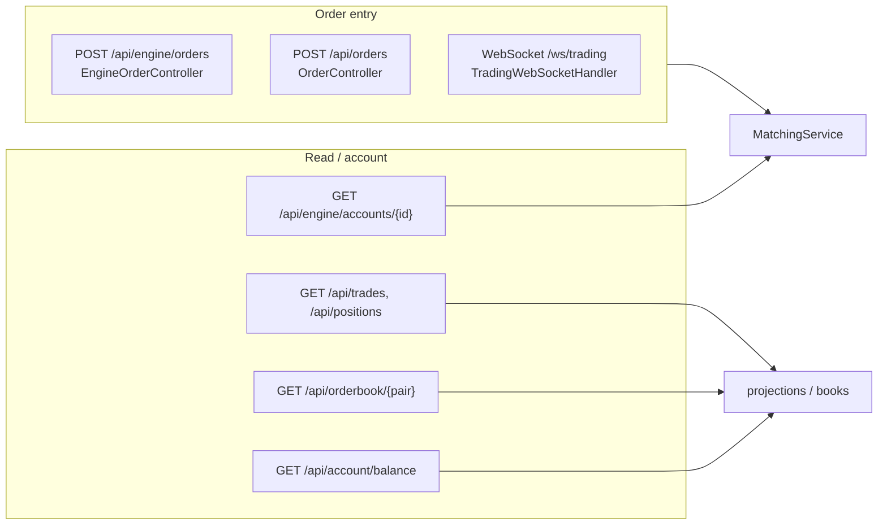
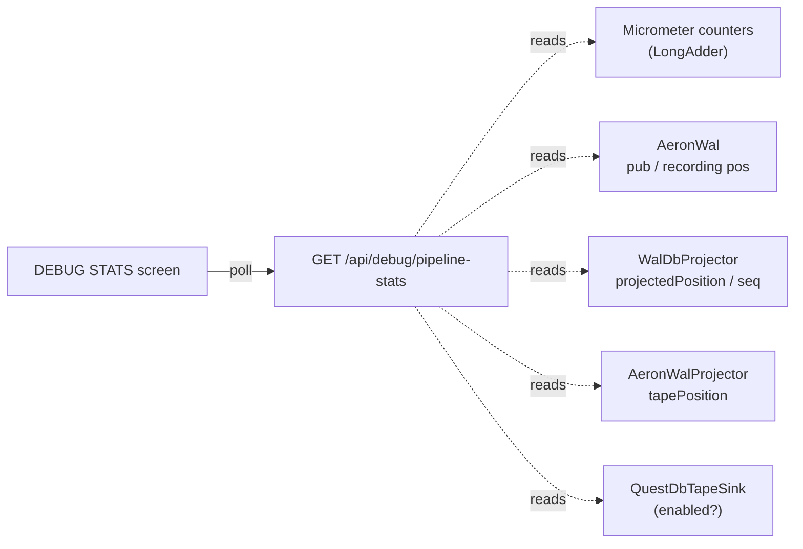

# 06 - API reference

_Last updated: 2026-06-21 BST._

The API layer (`com.fxoee.api`) is a thin adapter: it parses requests,
calls `MatchingService` (or reads a projection), and serializes the result. There are two order-entry
surfaces (a generic `/api` one and the engine-native `/api/engine` one) plus account, debug,
simulation, auth, and WebSocket endpoints. A FIX 4.4 acceptor offers a third order-entry surface when
enabled (see [fix-session.md](fix-session.md)).

Endpoints that live in other docs: [risk limits](11-risk-controls.md#rest-api) (`/api/risk`),
[trading status + circuit breaker](circuit-breaker.md#endpoints) (`/api/status`, `/api/circuit-breaker`),
and [mock-market controls](market-data.md#rest-api) (`/api/debug/mock-market`).

## Order entry

### Engine-native: `EngineOrderController` (`/api/engine`)

| Method | Path | Body / params | Returns |
|--------|------|---------------|---------|
| POST | `/accounts/{id}/deposit` | `amount` (request param); needs `Authorization` header, ADMIN role | `AccountView` (cash, reserved, free, positions) |
| POST | `/orders` | `SubmitOrderRequest`; needs `Authorization` header | `ExecutionReport` |
| GET | `/accounts/{id}` | none; needs `Authorization` header | `AccountView` |

Heads up on `/deposit`: it calls `ledger.seed(id, amount)`, which **sets** cash to that amount
(and zeroes reserved + realized P&L). It's a seeding tool, not an additive deposit; it is also
ADMIN-only at the security layer.

`SubmitOrderRequest = { pair, side, type, price, quantity }` (a record on `EngineOrderController`).
It has **no** `accountId` field and **no** `clientOrderId` field; the account is always the
authenticated principal (`@AuthenticationPrincipal UUID accountId`), never a client-supplied value.
`clientOrderId` lives only on the generic `/api/orders` body below. The controller builds an `Order`
and calls `MatchingService.submit`; the `ExecutionReport` carries status, fills, remaining qty, reject
reason, and taker fee. This surface requires an authenticated USER token; the order owner is always
the token principal, never a body field.

### Generic: `OrderController` (`/api`)

The order-entry and positions routes require an `Authorization: Bearer <jwt>` header; the account is
the JWT subject, not a body field. The read-only `/orderbook` and `/trades` routes take no header.

| Method | Path | Body / params | Returns |
|--------|------|---------------|---------|
| POST | `/orders` | `PlaceOrderRequest` (body); needs `Authorization` header | `ExecutionReport` (200) |
| DELETE | `/orders/{id}` | `?pair=` (required request param); needs `Authorization` header | the cancelled `Order` (200) or 404 |
| GET | `/orderbook/{pair}` | `?depth=` request param, default 20 | `OrderBook.OrderBookSnapshot` |
| GET | `/trades` | optional `?pair=`, `?page=` (0), `?size=` (50) | `List<Trade>` |
| GET | `/positions` | needs `Authorization` header | open positions for the JWT's account |

`PlaceOrderRequest = { pair, side, type, price, quantity, clientOrderId }` (all `String`; see
`OrderService`). `price` is null/omitted for
MARKET orders; `clientOrderId` is optional and echoed back on the report. The account is taken from
the JWT, not the body. `DELETE /orders/{id}` returns the cancelled `Order` (200) or `404` if no such
resting order is found.

The `fx.orderbook.snapshot-depth` key in `application.yml` is **not** read by this endpoint (or any
code); depth comes from the request param. See [doc 10](10-configuration.md#still-scaffolding).

## Account

| Method | Path | Returns | Source |
|--------|------|---------|--------|
| GET | `/api/account/balance` | `{ "balance": <decimal> }`; 401 if no/invalid `Authorization: Bearer`, 404 if account unknown | `AccountController` |

When `fxoee.engine.authoritative=true`, account reads reflect the in-JVM `MatchingService` state
(Kafka still projects fills to the DB asynchronously).

## Debug & simulation

### `DebugController` (`/api/account/debug`)

JWT-bound to the caller's own account (every endpoint takes the `Authorization` header; a bad token is `401`).

| Method | Path | Body / params | Purpose |
|--------|------|---------------|---------|
| GET | `` | none | account debug view: engine snapshot (cash, equity, realized/unrealized PnL, notional), open lots, active orders, per-pair mids |
| GET | `/closed-lots` | `?limit=` (100, max 500), `?offset=` (0) | realized/closed lots |
| GET | `/transactions` | `?limit=` (100, max 500), `?offset=` (0) | account transactions |
| POST | `/close-lot` | `{ "lotId": ... }` | close a specific lot; `202` on success, `404` if the lot isn't found in the engine |
| POST | `/cancel-order` | `{ "pair": ..., "orderId": ... }` | cancel a resting order (caller-owns check); `404` if not owned/found |

Heads up: `/closed-lots` and `/transactions` are **stubs** in the engine-authoritative build. They
validate the token and echo `{ rows: [], total: 0, limit, offset }` (the engine is the source of truth;
historical closed-lot/transaction reads are not wired to a store here). The `counts` block in the main
debug view reports `closedLots: 0, transactions: 0` for the same reason.

### `OrderBookDebugController` (`/api/debug`)

| Method | Path | Body / params | Purpose |
|--------|------|---------------|---------|
| POST | `/seed-orders` | `?count=` | seed `count` MARKET orders per pair from random accounts; returns submit timing |
| POST | `/seed-orders/` | `?count=`, `?side=BUY\|SELL` | same, but fixes the side |
| POST | `/close-all-positions` | none | force-flatten everything (cancel resting, opposing MARKET closes, force-flat residue) |
| POST | `/reset` | none | drop positions + reseed cash to 10M, wipe books / registry / trade tape |
| POST | `/hard-reset` | none | clean-deployment wipe (see below) |
| GET | `/orderbook` | none | full book depth per pair |
| GET | `/state` | none | per-account JVM-vs-DB cash/lots/equity drift + totals |
| GET | `/pending-orders` | none | resting orders per pair, bid/ask split |
| GET | `/engine-stats` | none | Micrometer counters: submitted / placed / cancelled / rejected / risk-rejected / volume + matching-latency percentiles |
| GET | `/pipeline-stats` | none | WAL durable-pipeline telemetry (see below) |
| POST | `/simulate/start` | `SimConfig` body (optional) | start `SimulatorService` |
| POST | `/simulate/stop` | none | stop the simulator |
| GET | `/simulate/status` | none | simulation status |

The simulator submits orders from many accounts across pairs on background threads. It's used for
throughput testing and to populate a lively book. A "bench" mode (`fxoee.sim.bench-mode`) routes through
the speed engine's allocation-free `RawOrderSink` fast lane so the engine is measured without the
producer/GC tail (see [doc 10](10-configuration.md#simulator--load-generator-fxoeesim)).

#### `POST /hard-reset` (clean-deployment wipe)

Goes further than `/reset`: it also empties the event-sourcing tables and the on-disk Aeron WAL so a
process restart can't replay any prior state. It stops the simulator first, then (with the Postgres WAL
projector paused to avoid a `TRUNCATE`-vs-`flushLegs` deadlock) resets the WAL cursor to the Archive end,
truncates `trade_events, account_transaction, position_lot, pending_lot_close, orders, resting_orders,
processed_events, fill_dedup` (`RESTART IDENTITY CASCADE`), resets balances to 10M, rebuilds JVM state,
truncates the QuestDB trade tape, and deletes the engine snapshot file (not the live archive dirs;
`prune-on-start` wipes those on next boot). Seeded accounts/users are kept. Micrometer counters are
monotonic and not reset. WAL/QuestDB steps no-op when those lanes are off.

Response fields: `status`, `accountsReset`, `initialBalance`, `tablesTruncated[]`,
`walProjectorCursorReset` (bool), `questDbTruncated` (bool), `snapshot { deletedPaths[], errors[] }`.

#### `GET /pipeline-stats` (WAL telemetry, this branch's feature)

Backs the DEBUG-panel **STATS** screen that visualizes the WAL → Postgres / QuestDB pipeline. Every
value is a lock-free counter / cached-atomic read on the request thread; nothing touches the engine
thread or the WAL poll thread, so polling it has zero effect on matching throughput. All lanes report
`enabled=false` / `0` when the speed+WAL lane is off (`OrderBookDebugController.java:657`).

| JSON path | Meaning |
|-----------|---------|
| `serverTimeMs` | server clock, so the UI can derive bytes/s and fills/s between two polls |
| `engineMode` / `engine.mode` | `default` or `speed` |
| `engine.{submittedTotal, placedTotal, rejectedTotal}` | summed order counters (`rejectedTotal` = order rejects + risk rejects) |
| `walEnabled` | whether the Aeron WAL bean is present |
| `wal.{recordingId, publicationPosition, recordingPosition, durabilityLagBytes}` | engine-published bytes vs durably-recorded bytes; lag = not-yet-fsynced gap |
| `postgres.enabled` | `WalDbProjector` present |
| `postgres.{projectedPosition, projectedSeq, lagBytes, idleMs, error?}` | archive bytes / highest fill-seq applied to Postgres; live lag vs current recording position; ms since last clean catch-up (`-1` = never); stall reason if any |
| `questdb.enabled` | `QuestDbTapeSink` present |
| `questdb.{tapePosition, lagBytes, droppedBroadcasts}` | archive bytes drained into the tape; recorded-but-not-yet-on-tape gap; dropped WS broadcasts (`wal.broadcast.dropped.total`) |

## Auth: `AuthController` (`/api/auth`)

| Method | Path | Body | Returns |
|--------|------|------|---------|
| POST | `/login` | `{ "username": "...", "password": "..." }` | `{ "token": <jwt>, "accountId": <uuid> }` (200) or 401 |

Tokens are HS256, signed with `jwt.secret`, valid for `jwt.expiry-days` (= 7). REST routes read the
JWT from the `Authorization: Bearer` header; WebSocket handshakes are authenticated by
`JwtHandshakeInterceptor` (see below).

## WebSocket: `TradingWebSocketHandler` (`/ws/trading`)

A thin handler that parses client messages, dispatches order actions to `MatchingService`, and streams
market data + account snapshots back. The handshake is authenticated by
`JwtHandshakeInterceptor`:
the JWT is passed as a `?token=<jwt>` query parameter (not a header), and a missing/invalid token gets
a 401 before the socket opens (`WebSocketConfig.java:27`).
Idle sessions time out after 30s. Supported chart timeframes: `1m, 5m, 15m, 30m, 1h, 4h, 1d`.
Live ticks come from either the live [Tiingo feed](market-data.md) or the
`MockMarketMaker`
when `fxoee.mock-market.enabled=true` (it injects matched LIMIT BUY/SELL depth for the house account
every 500ms and seeds OHLC candle history at startup).

### Client to server messages

| `type` | Fields | Action |
|--------|--------|--------|
| `SUBSCRIBE` / `UNSUBSCRIBE` | `pair` | start / stop receiving snapshots for a pair |
| `NEW_ORDER` | `pair`, `side`, `orderType`, `price?`, `quantity`, `clientOrderId?` | submit an order (a random `clientOrderId` is generated if omitted) |
| `CANCEL_ORDER` | `orderId` | cancel a resting order |
| `CLOSE_POSITION` | `pair`, `lotId?` | close one lot, or the whole pair if `lotId` is omitted |

### Server to client envelopes

Every broadcast is `{ "type": ..., "payload": ... }`. The full set is `ORDERBOOK`, `TRADE`,
`ORDER_UPDATE`, `ACCOUNT_UPDATE`, `HISTORY`, `MARKET_DATA`, `STATUS_UPDATE`, `STALE_ORDER`, and `ERROR`.
The notable ones:

| `type` | Payload | Sent when |
|--------|---------|-----------|
| `ORDERBOOK` | `{ pair, bids[], asks[] }` | a subscribed pair's book changes (throttled to ~20 Hz per pair) |
| `TRADE` | `{ pair, price, quantity, side }` | a trade prints on a subscribed pair |
| `ACCOUNT_UPDATE` | account snapshot (cash, equity, lots, ...) | the caller's positions or mids change |
| `MARKET_DATA` | `{ pair, mid }` (mid scaled to 5 dp) | each price tick |
| `STATUS_UPDATE` | `{ pair, status }` | a pair is HALTED / resumed by the circuit breaker |
| `STALE_ORDER` | `{ pair, side, bookPrice, marketMid, deviationPips }` | a resting level drifts past the stale-order pip threshold (needs `fxoee.market-data.enabled=true`; see [market-data.md](market-data.md#5--spread--stale-order-metrics)) |

## Errors

Domain rejections (`RejectReason`:
`INVALID_QUANTITY`, `UNSUPPORTED_PAIR`, `INSUFFICIENT_FUNDS`) are returned in the `ExecutionReport`.
Load shedding adds a non-enum reason string `OVERLOADED` (set directly on the report when the async
fill queue is saturated). The pre-trade risk gate adds its own reasons
(`RiskRejectReason`: `KILLSWITCH`,
`MARKET_HALTED`, `ORDER_NOTIONAL_LIMIT`, `POSITION_LIMIT`, `EXPOSURE_LIMIT`; see
[doc 11](11-risk-controls.md)). Transport-level mapping to HTTP statuses is handled by
`GlobalExceptionHandler`.

| HTTP | `code` | Trigger |
|------|--------|---------|
| 401 | `UNAUTHORIZED` | `UnauthorizedException` or missing `Authorization` header (`MissingRequestHeaderException`) |
| 400 | `BAD_REQUEST` | `IllegalArgumentException` |
| 409 | `CONFLICT` | `IllegalStateException` |
| 422 | `INSUFFICIENT_FUNDS` | `InsufficientFundsException` |
| 500 | `INTERNAL_ERROR` | Any unhandled `Exception` |
