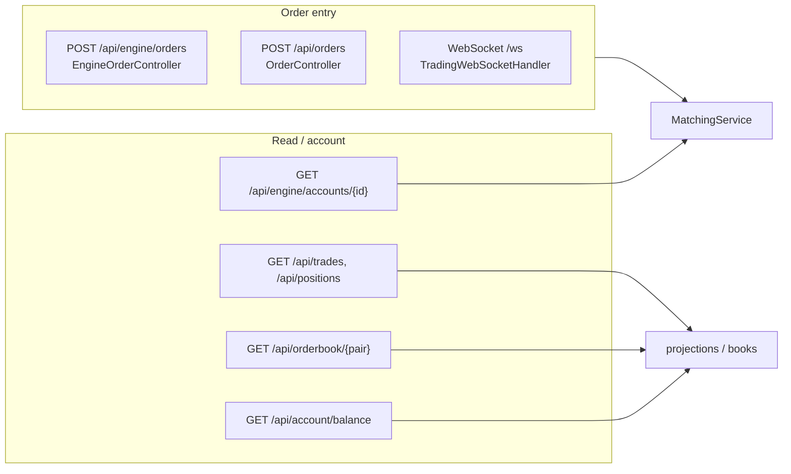

# 06 — API reference

_Last updated: 2026-06-04 21:57 BST._

The API layer ([com.fxoee.api](../src/main/java/com/fxoee/api)) is a thin adapter: it parses requests,
calls `MatchingService` (or reads a projection), and serializes the result. There are two order-entry
surfaces — a generic `/api` one and the engine-native `/api/engine` one — plus account, debug,
simulation, auth, and WebSocket endpoints.

## Order entry

### Engine-native — [EngineOrderController](../src/main/java/com/fxoee/api/controller/rest/EngineOrderController.java) (`/api/engine`)

| Method | Path | Body / params | Returns |
|--------|------|---------------|---------|
| POST | `/accounts/{id}/deposit` | amount | `AccountView` (cash, reserved, …) |
| POST | `/orders` | `SubmitOrderRequest` | `ExecutionReport` |
| GET | `/accounts/{id}` | — | `AccountView` |

`SubmitOrderRequest = { accountId, pair, side, type, price, quantity, clientOrderId }`. The controller
builds an `Order` and calls `MatchingService.submit`; the `ExecutionReport` carries status, fills,
remaining qty, reject reason, and taker fee.

### Generic — [OrderController](../src/main/java/com/fxoee/api/controller/rest/OrderController.java) (`/api`)

| Method | Path | Purpose |
|--------|------|---------|
| POST | `/orders` | submit an order |
| DELETE | `/orders/{id}` | cancel a resting order |
| GET | `/orderbook/{pair}` | order-book snapshot (depth from `fx.orderbook.snapshot-depth`, default 10) |
| GET | `/trades` | recent trades |
| GET | `/positions` | open positions |

## Account

| Method | Path | Source |
|--------|------|--------|
| GET | `/api/account/balance` | [AccountController](../src/main/java/com/fxoee/api/controller/rest/AccountController.java) |

When `fxoee.engine.authoritative=true`, account reads reflect the in-JVM `MatchingService` state
(Kafka still projects fills to the DB asynchronously).

## Debug & simulation

### [DebugController](../src/main/java/com/fxoee/api/controller/rest/DebugController.java) (`/api/account/debug`)

| Method | Path | Purpose |
|--------|------|---------|
| GET | `` | account debug view |
| GET | `/closed-lots` | realized/closed lots |
| GET | `/transactions` | account transactions |
| POST | `/close-lot` | close a specific lot |
| POST | `/cancel-order` | cancel a resting order |

### [OrderBookDebugController](../src/main/java/com/fxoee/api/controller/rest/OrderBookDebugController.java) (`/api/debug`)

| Method | Path | Purpose |
|--------|------|---------|
| POST | `/seed-orders` | seed resting liquidity |
| POST | `/close-all-positions` | force-flatten everything |
| POST | `/reset` | drop positions + reseed cash, wipe books |
| GET | `/orderbook`, `/state`, `/pending-orders` | inspect engine state |
| POST | `/simulate/start` \| `/simulate/stop` | drive [SimulatorService](../src/main/java/com/fxoee/application/SimulatorService.java) |
| GET | `/simulate/status` | simulation status |

The simulator submits orders from many accounts across pairs on background threads — used for
throughput testing and to populate a lively book. A "bench" mode skips per-slot book pruning so the
engine is measured without cancel overhead.

## Auth — [AuthController](../src/main/java/com/fxoee/infrastructure/auth/AuthController.java) (`/api/auth`)

| Method | Path | Purpose |
|--------|------|---------|
| POST | `/login` | issue a JWT (HS256, `jwt.secret`, `jwt.expiry-days` = 7) |

WebSocket handshakes are authenticated by `JwtHandshakeInterceptor`.

## WebSocket — [TradingWebSocketHandler](../src/main/java/com/fxoee/api/websocket/TradingWebSocketHandler.java) (`/ws`)

A thin handler that parses client messages, dispatches order actions to `MatchingService`, and streams
market data + account snapshots back. Supported chart timeframes: `1m, 5m, 15m, 30m, 1h, 4h, 1d`.
Live ticks come from the [MockMarketMaker](../src/main/java/com/fxoee/infrastructure/marketdata/MockMarketMaker.java)
when `fxoee.mock-market.enabled=true` (it injects matched LIMIT BUY/SELL depth for the house account
every 500ms and seeds OHLC candle history at startup).

## Errors

Domain rejections ([RejectReason](../src/main/java/com/fxoee/engine/validate/RejectReason.java):
`INVALID_QUANTITY`, `UNSUPPORTED_PAIR`, `INSUFFICIENT_FUNDS`, plus `OVERLOADED` for load shedding) are
returned in the `ExecutionReport`. Transport-level mapping to HTTP statuses is handled by
[GlobalExceptionHandler](../src/main/java/com/fxoee/api/controller/rest/GlobalExceptionHandler.java).

| HTTP | `code` | Trigger |
|------|--------|---------|
| 401  | `UNAUTHORIZED` | `UnauthorizedException` or missing `Authorization` header (`MissingRequestHeaderException`) |
| 400  | `BAD_REQUEST` | `IllegalArgumentException` |
| 409  | `CONFLICT` | `IllegalStateException` |
| 422  | `INSUFFICIENT_FUNDS` | `InsufficientFundsException` |
| 500  | `INTERNAL_ERROR` | Any unhandled `Exception` |
