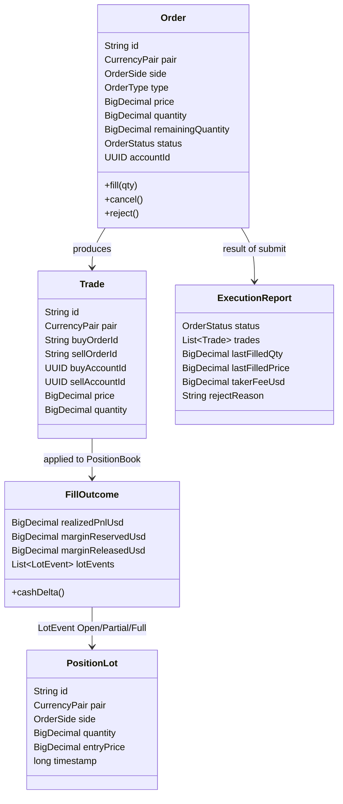
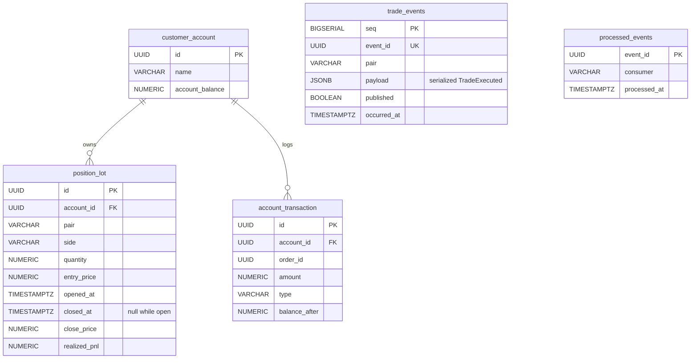

# 07 — Data model

_Last updated: 2026-06-04 21:57 BST._

Two data models coexist: the **in-memory domain** the engine operates on, and the **PostgreSQL
schema** the projection writes. They are deliberately separate — the DB is a read-model, not the
source of truth.

## In-memory domain ([com.fxoee.domain](../src/main/java/com/fxoee/domain))

`Order.price` is null for MARKET orders; `Order.accountId` is null for mock/internal orders (which
are exempt from funds tracking, fees, and self-trade prevention).

### Enums

| Enum | Values |
|------|--------|
| [CurrencyPair](../src/main/java/com/fxoee/domain/enums/CurrencyPair.java) | EUR_USD, GBP_USD, USD_JPY, USD_CHF, AUD_USD, USD_CAD, NZD_USD — each carries `marginRate`, `tickSize`, `minLotSize`, `isUsdBase()` |
| [OrderSide](../src/main/java/com/fxoee/domain/enums/OrderSide.java) | BUY, SELL |
| [OrderType](../src/main/java/com/fxoee/domain/enums/OrderType.java) | LIMIT, MARKET |
| [OrderStatus](../src/main/java/com/fxoee/domain/enums/OrderStatus.java) | NEW, PENDING, PARTIALLY_FILLED, FILLED, CANCELLED, REJECTED |

### LotEvent (sealed)

[LotEvent](../src/main/java/com/fxoee/domain/model/LotEvent.java) is the unit of position change
carried on `TradeExecuted` and applied verbatim by `FillConsumer`:

- `Open(PositionLot lot)` — a new lot added.
- `PartialClose(lotId, newQuantity, closePrice, realizedPnlUsd)` — lot reduced; `newQuantity` remains.
- `FullClose(lotId, closePrice, realizedPnlUsd)` — lot removed.

## Database schema (Flyway migrations)

[src/main/resources/db/migration](../src/main/resources/db/migration):

| Migration | Creates |
|-----------|---------|
| V1 | `customer_account` (id, name, `account_balance`) + `account_transaction` (audit ledger) |
| V2 | `users` (auth) |
| V3 | `position_lot` |
| V4 | `pending_lot_closes` |
| V5 | `processed_events` (consumer dedup) |
| V6 | seed sim accounts |
| V7 | seed trader accounts |
| V8 | seed house account (`HOUSE_UUID`) |
| V9 | `trade_events` (durable log) |

Notes on `position_lot`:

- Open lots have `closed_at IS NULL`; partial closes update `quantity` in place (entry price never
  changes — spec §11.2). A full close stamps `closed_at`, `close_price`, `realized_pnl`.
- Indexed for the two hot reads: open lots per account (`WHERE closed_at IS NULL`) and lots by
  `(account_id, pair)`.

Access is via **jOOQ** repositories ([com.fxoee.persistence](../src/main/java/com/fxoee/persistence))
— `CustomerAccountRepository`, `PositionLotRepository`, `FillBatchRepository` (batched fill writes),
`TradeEventRepository` (append-only log).

## Mapping: engine ↔ DB

| Engine (in-memory) | DB projection | Written by |
|--------------------|---------------|------------|
| `MarginLedger.cash` | `customer_account.account_balance` | `FillConsumer` (applies stamped cash delta) |
| `PositionBook` lots | `position_lot` rows | `FillConsumer` (Open→insert, Partial→qty update, Full→close) |
| `TradeExecuted` events | `trade_events.payload` | `PersistenceWorker` (before publish) |

The DB row keys (lot ids) are the **engine-assigned** ids carried on `LotEvent`, so the projection
indexes positions identically to the engine — that's what keeps them in lockstep.
