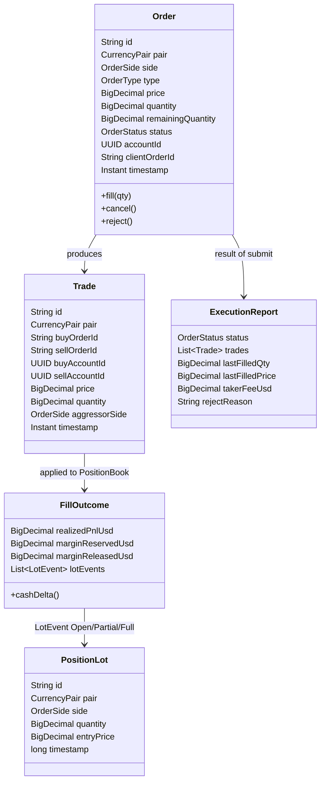
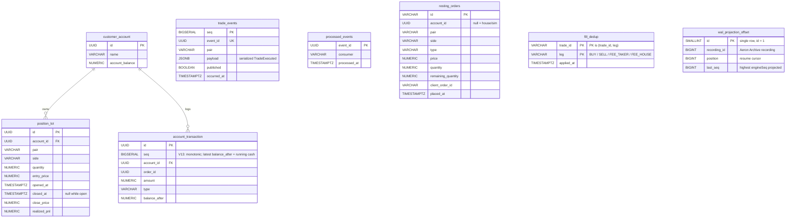

# 07 - Data model

_Last updated: 2026-06-21 BST._

Two data models coexist: the **in-memory domain** the engine operates on, and the **PostgreSQL
schema** the projection writes. They are deliberately separate; the DB is a read-model, not the
source of truth.

Two projection lanes feed that PostgreSQL schema, depending on `fxoee.engine.mode`:

- **Lane 1 (default engine, Kafka event-sourcing):** `FillQueue` → `PersistenceWorker` → `trade_events`
  WAL → Kafka → `FillConsumer`/`SnapshotConsumer` write `customer_account` + `position_lot`.
- **Lane 2 (speed engine, Aeron Archive WAL):** the engine records fills to an embedded Aeron Archive;
  `WalDbProjector` (ADR 0007 Phase B) periodically replays the Archive tail into `account_transaction`
  + `position_lot`, idempotent via `fill_dedup`, with its cursor pinned in `wal_projection_offset`.

Both lanes write the **same tables** with the **same idempotency primitives**, so the schema below
serves both. Both are off by default (Lane 2 enables behind `fxoee.wal.*` / the `--wal` dev flag).

## In-memory domain ([com.fxoee.domain](../src/main/java/com/fxoee/domain))

`Order.price` is null for MARKET orders; `Order.accountId` is null for mock/internal orders (which
are exempt from funds tracking, fees, and self-trade prevention).

### Enums

| Enum | Values |
|------|--------|
| [CurrencyPair](../src/main/java/com/fxoee/domain/enums/CurrencyPair.java) | EUR_USD, GBP_USD, USD_JPY, USD_CHF, AUD_USD, USD_CAD, NZD_USD; each carries `marginRate`, `tickSize`, `minLotSize`, `isUsdBase()` |
| [OrderSide](../src/main/java/com/fxoee/domain/enums/OrderSide.java) | BUY, SELL |
| [OrderType](../src/main/java/com/fxoee/domain/enums/OrderType.java) | LIMIT, MARKET |
| [OrderStatus](../src/main/java/com/fxoee/domain/enums/OrderStatus.java) | NEW, PENDING, PARTIALLY_FILLED, FILLED, CANCELLED, REJECTED |

### LotEvent (sealed)

[LotEvent](../src/main/java/com/fxoee/domain/model/LotEvent.java) is the unit of position change
carried on `TradeExecuted` and applied verbatim by `FillConsumer`:

- `Open(PositionLot lot)`: a new lot added.
- `PartialClose(lotId, newQuantity, closePrice, realizedPnlUsd)`: lot reduced; `newQuantity` remains.
- `FullClose(lotId, closePrice, realizedPnlUsd)`: lot removed.

## Database schema (Flyway migrations)

[src/main/resources/db/migration](../src/main/resources/db/migration):

| Migration | Creates |
|-----------|---------|
| V1 | `customer_account` (id, name, `account_balance`) + `account_transaction` (audit ledger) |
| V2 | `users` (auth) |
| V3 | `position_lot` |
| V4 | `pending_lot_closes` |
| V5 | `processed_events` (consumer dedup) |
| V6 | seed sim accounts |
| V7 | seed trader accounts |
| V8 | seed house account (`HOUSE_UUID`) |
| V9 | `trade_events` (durable fill log) |
| V10 | `orders` (async audit trail; written by `OrderAuditConsumer`) |
| V11 | `resting_orders` (authoritative live-book mirror for warm restart) |
| V12 | `fill_dedup` (durable per-`(trade_id, leg)` dedup for the account-keyed fill projection) |
| V13 | `account_transaction.seq BIGSERIAL` + `(account_id, seq DESC)` index (append-only cash projection) |
| V14 | `wal_projection_offset` (single-row durable cursor for the Lane-2 `WalDbProjector`) |
| V15 | widen `position_lot.quantity` to `NUMERIC(19,8)` (lot precision; matches order/engine quantity) |
| V16 | `users.role` (RBAC: `USER` / `ADMIN`, stamped into the JWT and enforced by `SecurityConfig`) |

Notes on `resting_orders`:

- Authoritative mirror of the live order books: a row exists **iff** the order is currently resting.
  Maintained incrementally by `PersistenceWorker` (upsert on rest / partial fill, delete on full fill /
  cancel), in the same durable step as `trade_events`. On warm restart the books are rebuilt 1:1 from it
  (oldest-first by `placed_at` to preserve price-time priority). See
  [doc 05](05-event-sourcing-persistence.md#resting-open-unfilled-orders-are-recovered-11).
- Distinct from `orders` (V10), which is an **async audit trail** written off Kafka and only updated on
  terminal status. Not a reliable recovery source.

Notes on `position_lot`:

- Open lots have `closed_at IS NULL`; partial closes update `quantity` in place (entry price never
  changes; spec §11.2). A full close stamps `closed_at`, `close_price`, `realized_pnl`.
- Indexed for the two hot reads: open lots per account (`WHERE closed_at IS NULL`) and lots by
  `(account_id, pair)`.

Notes on the projection-idempotency tables (V12-V14):

- `fill_dedup` (V12) holds one row per `(trade_id, leg)`, where `leg ∈ {BUY, SELL, FEE_TAKER,
  FEE_HOUSE}` is the per-account effect of one trade. The leg is claimed (`ON CONFLICT DO NOTHING …
  RETURNING`) **inside the same transaction** as the projection write, so a Kafka redelivery or the
  warm-restart relay re-publishing the unconfirmed `trade_events` tail (Lane 1), or a re-replayed
  Archive batch (Lane 2), is a no-op. It replaced `FillConsumer`'s in-memory LRU dedup (see
  `FillBatchRepository.flushLegs`, [persistence/FillBatchRepository.java](../src/main/java/com/fxoee/persistence/FillBatchRepository.java)).
- `account_transaction.seq` (V13) makes the cash projection **append-only**: `customer_account
  .account_balance` is frozen at the initial deposit, and the running cash balance is the latest
  `account_transaction.balance_after` for the account (ordered by `seq DESC`, since a batched INSERT
  shares one `created_at`). The `(account_id, seq DESC)` index makes the per-batch "latest" lookup O(1)
  on the fill hot path.
- `wal_projection_offset` (V14) is a **single row** (`id = 1`) pinning how far the Lane-2
  `WalDbProjector` has consumed the Aeron Archive: `recording_id + position` is the exact cursor to
  resume `replayForRecovery()` from, and `last_seq` is the skip-guard at the snapshot seed boundary.
  The projector advances this row only **after** a batch commits, so a crash re-replays at most one
  batch and `fill_dedup` absorbs the overlap.

Access is via **jOOQ** repositories ([com.fxoee.persistence](../src/main/java/com/fxoee/persistence)):
`CustomerAccountRepository`, `PositionLotRepository`, `FillBatchRepository` (batched fill writes +
`flushLegs` account-keyed projection + `fill_dedup`), `TradeEventRepository` (append-only log),
`RestingOrderRepository` (live-book mirror), `OrderRepository` (audit trail), and
`WalProjectionOffsetRepository` (Lane-2 cursor; plain-SQL jOOQ, since `wal_projection_offset` is added
in V14 **after** jOOQ codegen and so has no generated class).

## Mapping: engine ↔ DB

| Engine (in-memory) | DB projection | Written by |
|--------------------|---------------|------------|
| `MarginLedger.cash` | latest `account_transaction.balance_after` (`account_balance` frozen at deposit, V13) | `FillBatchRepository.flushLegs` (Lane 1 via `FillConsumer`; Lane 2 via `WalDbProjector`) |
| `PositionBook` lots | `position_lot` rows | `flushLegs` (Open→insert, Partial→qty update, Full→close) |
| `TradeExecuted` events | `trade_events.payload` | `PersistenceWorker`, before Kafka publish (Lane 1 only) |
| Aeron WAL fill stream | `account_transaction` + `position_lot` + `fill_dedup` + `wal_projection_offset` | `WalDbProjector`, off-engine catch-up (Lane 2 only, ADR 0007 Phase B) |

The DB row keys (lot ids) are the **engine-assigned** ids carried on `LotEvent`, so the projection
indexes positions identically to the engine. That's what keeps them in lockstep. Lane 2 reaches the
same tables by a different route: instead of consuming Kafka it decodes the Aeron Archive fill records
([wal/WalDbProjector.java](../src/main/java/com/fxoee/wal/WalDbProjector.java)) and shares the same
`flushLegs` writer, so its idempotency and lot indexing are identical to Lane 1.
