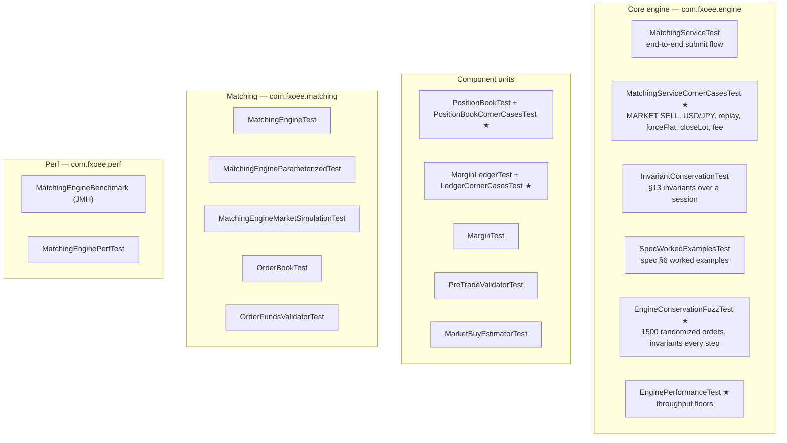

# 08 — Testing

The engine is tested as a **pure unit** — `EngineTestSupport.newService(mode)` wires a fully in-memory
`MatchingService` (all 7 pairs, no Spring/Kafka/DB) so tests run in milliseconds. Maven is the build
tool (`mvn test`).

## Suite map



★ = added in the comprehensive-tests pass (34 tests). The rest predate it.

## What the invariant/fuzz tests assert

`EngineConservationFuzzTest` drives 1500 random orders across 6 accounts × 4 pairs (USD-quote and
USD-base) with a seeded RNG, and after **every** order checks:

| # | Invariant | Meaning |
|---|-----------|---------|
| 1 | `cash == deposit + Σ realized P&L` | cash moves only by P&L ([doc 04](04-funding-pnl-conservation.md#the-conservation-invariant)) |
| 2 | `free ≥ 0` | reserved never exceeds cash (solvency) |
| 3 | no-hedge | an (account, pair) never holds LONG + SHORT at once |
| 4 | `netQty == Σ signed lot qty` | netting integrity |
| 5 | `reserved == held margin` (when no resting orders) | reconcile is exact |

Determinism: the seed is fixed, so any failure reproduces exactly.

## Corner cases covered by the ★ suites

- **USD-base P&L conversion** — LONG/SHORT close and flip on USD/JPY (÷ close price), exact to 10 dp.
- **Ledger guards** — null/zero/negative no-ops, flooring at zero, account isolation, `reserveNet`
  atomic swap, exact funding boundary, concurrent no-overdraw.
- **`Margin`** — HALF_UP rounding, zero quantity, USD-base vs USD-quote notional, `MARGIN ==
  marginRate × FULL_NOTIONAL`.
- **PositionBook** — `cashDelta` identity, cross-pair held margin, close→flat→reopen, FIFO depth,
  `clear` isolation, and **concurrency** (parallel same-account fills serialize correctly; distinct
  accounts never interfere).
- **MatchingService** — MARKET SELL open, USD/JPY round-trip conservation, warm-restart replay
  round-trip, `forceFlat`, `closeLot`, USD-base taker fee, snapshot view.

## Performance floors

`EnginePerformanceTest` (`@Tag("perf")`) measures hot-path throughput with **generous floors** — it
exists to trip a red test on a gross regression (an accidental O(n²) or a reintroduced global lock),
not to micro-benchmark. Representative measurements on the dev machine:

| Path | Floor | Measured |
|------|-------|----------|
| `PositionBook.applyFill` | > 100k ops/sec | ~4.4M ops/sec |
| `MatchingService.submit` | > 5k orders/sec | ~218k orders/sec |

For real micro-benchmarks use the JMH harness in `com.fxoee.perf.MatchingEngineBenchmark`.

## Running

```bash
mvn test                                   # full suite
mvn -o test -Dtest='EngineConservationFuzzTest,EnginePerformanceTest'   # just these
mvn -o test -Dtest='*CornerCasesTest'      # all corner-case suites
```

### Docker-dependent tests

`CustomerAccountRepositoryTest` and `PositionLotRepositoryTest` use **Testcontainers** and require a
running Docker daemon (they spin up a real PostgreSQL). Without Docker they error with *"Could not
find a valid Docker environment"* — this is environmental, not a code failure. Every other test
(including all engine, matching, and the ★ suites) runs with no external dependencies.
