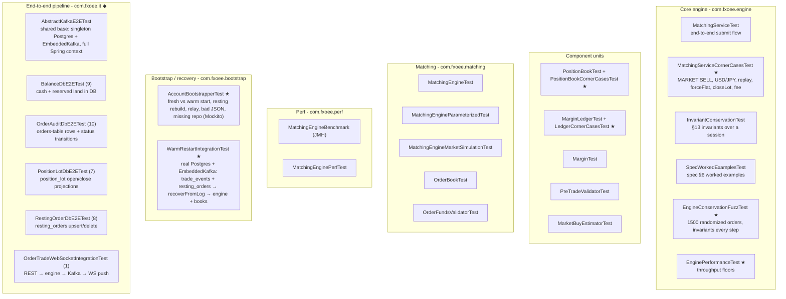
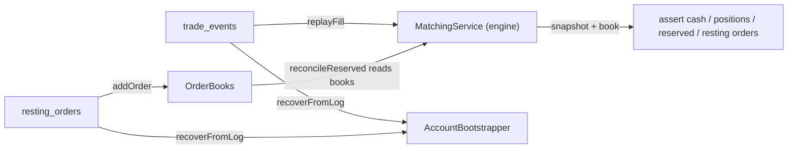

# 08 - Testing

_Last updated: 2026-06-09 BST._

The engine is tested as a **pure unit**: `EngineTestSupport.newService(mode)` wires a fully in-memory
`MatchingService` (all 7 pairs, no Spring/Kafka/DB) so tests run in milliseconds. Maven is the build
tool (`mvn test`).

## Suite map



★ = added in the comprehensive-tests pass (34 tests). The rest predate it.
◆ = the `com.fxoee.it` end-to-end suite (see [End-to-end pipeline tests](#end-to-end-pipeline-tests)).

## What the invariant/fuzz tests assert

`EngineConservationFuzzTest` drives 1500 random orders across 6 accounts × 4 pairs (USD-quote and
USD-base) with a seeded RNG, and after **every** order checks:

| # | Invariant | Meaning |
|---|-----------|---------|
| 1 | `cash == deposit + Σ realized P&L` | cash moves only by P&L ([doc 04](04-funding-pnl-conservation.md#the-conservation-invariant)) |
| 2 | `free ≥ 0` | reserved never exceeds cash (solvency) |
| 3 | no-hedge | an (account, pair) never holds LONG + SHORT at once |
| 4 | `netQty == Σ signed lot qty` | netting integrity |
| 5 | `reserved == held margin` (when no resting orders) | reconcile is exact |

Determinism: the seed is fixed, so any failure reproduces exactly.

## Corner cases covered by the ★ suites

- **USD-base P&L conversion**: LONG/SHORT close and flip on USD/JPY (÷ close price), exact to 10 dp.
- **Ledger guards**: null/zero/negative no-ops, flooring at zero, account isolation, `reserveNet`
  atomic swap, exact funding boundary, concurrent no-overdraw.
- **`Margin`**: HALF_UP rounding, zero quantity, USD-base vs USD-quote notional, `MARGIN ==
  marginRate × FULL_NOTIONAL`.
- **PositionBook**: `cashDelta` identity, cross-pair held margin, close→flat→reopen, FIFO depth,
  `clear` isolation, and **concurrency** (parallel same-account fills serialize correctly; distinct
  accounts never interfere).
- **MatchingService**: MARKET SELL open, USD/JPY round-trip conservation, warm-restart replay
  round-trip, **warm-restart recovers resting orders 1:1** (filled position and resting LIMIT both
  restored, full margin re-locked), `forceFlat`, `closeLot`, USD-base taker fee, snapshot view.

## Bootstrap / recovery: warm restart, three layers

Warm restart (rebuilding the engine from the `trade_events` log instead of wiping to a fresh balance,
see [doc 05](05-event-sourcing-persistence.md#warm-restart-recovery-engine-replay)) is covered at three
layers, each cheaper and more granular than the last:

| Layer | Test | Infra | What it pins down |
|-------|------|-------|-------------------|
| Engine unit | `MatchingServiceCornerCasesTest.replayRoundTrip` + `…warmRestartRecoversRestingOrders` | none | `seedForReplay` → replay fills → `reconcileReserved` reproduces position + cash + margin; and that resting (unfilled) LIMIT orders are rebuilt 1:1 on restart with full margin re-locked (`positions + resting`) |
| Bootstrap unit | `AccountBootstrapperTest` (7) | Mockito only | both boot paths (fresh vs warm), **resting-order rebuild + reconcile**, the Kafka relay of `published=false` rows, bad-JSON tolerance, and fallback to fresh start when no `TradeEventRepository` bean exists |
| Bootstrap IT | `WarmRestartIntegrationTest` (5) | Testcontainers Postgres + EmbeddedKafka | the **DB-to-engine glue**: `trade_events` → `recoverFromLog` → `MatchingService.snapshot`; relay re-publish; **resting-order recovery** (incl. a partially-filled row); `RestingOrderRepository` upsert/update/delete; and end-to-end `submit → PersistenceWorker persist → restart → back on the book` |



The unit layer runs in milliseconds with no daemon; the IT needs Docker. End-to-end on a live cluster
is in the runbook [testing-event-sourcing-minikube.md](testing-event-sourcing-minikube.md).

## End-to-end pipeline tests

The `com.fxoee.it` suite proves the whole write path actually reaches Postgres, not just that the
engine computed the right numbers. A request goes in over REST and the test waits for the row to show
up in the database, exercising every hop in between:

```
REST → MatchingService (engine) → FillQueue → PersistenceWorker → Kafka → FillConsumer → Postgres
                                                                  └→ OrderAuditConsumer → orders
```

Everything hangs off one base class, `AbstractKafkaE2ETest`:

- **Real infrastructure, started once.** A singleton Testcontainers Postgres (`postgres:16-alpine`)
  boots once per JVM and is shared across every subclass, and an in-process `@EmbeddedKafka` broker
  stands in for real Kafka. Because `@DynamicPropertySource` hands every subclass the same datasource
  URL, they share one Spring context, so the heavy boot cost is paid a single time.
- **Full async stack live.** `PersistenceWorker`, `FillConsumer`, `OrderAuditConsumer`, and
  `RestingOrderRepository` are all wired and running, the same beans as production. The feeds and
  warm-restart replay are switched off (`market-data`, `mock-market`, `sample-data`,
  `recovery.replay-on-startup` all false) so each run starts from a known, quiet state.
- **Async writes are awaited, not slept on.** Since the DB write happens on a Kafka consumer thread,
  assertions poll through an `awaitTrue` helper rather than a fixed sleep, which keeps the tests both
  fast and non-flaky.
- **Clean slate per test.** `resetState()` runs before each test: it clears the order books, resets
  in-memory positions, ledger, and account mirrors, resets DB balances, and truncates the audit
  tables. Every test therefore starts flat, with no open positions and `INITIAL_BALANCE` cash.

| Test | Tests | What it pins down |
|------|-------|-------------------|
| `BalanceDbE2ETest` | 9 | cash and reserved funds reach `customer_account` correctly after fills, reserves, and releases |
| `OrderAuditDbE2ETest` | 10 | the `orders` table captures the full status trail (placed → filled / cancelled / rejected) |
| `PositionLotDbE2ETest` | 7 | `position_lot` rows open and close in step with the engine's FIFO netting |
| `RestingOrderDbE2ETest` | 8 | `resting_orders` is upserted on a resting LIMIT and deleted on fill or cancel |
| `OrderTradeWebSocketIntegrationTest` | 1 | a REST order produces the matching trade and pushes it out over the `/ws` WebSocket |

These need Docker for the Postgres container; the embedded Kafka runs in-process. They are the
slowest tests in the suite, so they sit behind the same Docker gate as the integration tests below.

## Performance floors

`EnginePerformanceTest` (`@Tag("perf")`) measures hot-path throughput with **generous floors**. It
exists to trip a red test on a gross regression (an accidental O(n²) or a reintroduced global lock),
not to micro-benchmark. Representative measurements on the dev machine:

| Path | Floor | Measured |
|------|-------|----------|
| `PositionBook.applyFill` | > 100k ops/sec | ~4.4M ops/sec |
| `MatchingService.submit` | > 5k orders/sec | ~218k orders/sec |

For real micro-benchmarks use the JMH harness in `com.fxoee.perf.MatchingEngineBenchmark`.

## Running

```bash
mvn test                                   # full suite
mvn -o test -Dtest='EngineConservationFuzzTest,EnginePerformanceTest'   # just these
mvn -o test -Dtest='*CornerCasesTest'      # all corner-case suites

# Warm-restart coverage:
mvn -o test -Dtest='AccountBootstrapperTest,MatchingServiceCornerCasesTest'  # offline, ~1s
mvn test -Dtest='WarmRestartIntegrationTest'                                 # needs Docker, ~30s

# End-to-end DB + WS pipeline (needs Docker):
mvn test -Dtest='com.fxoee.it.*E2ETest'                                      # all DB E2E suites
mvn test -Dtest='OrderTradeWebSocketIntegrationTest'                         # REST → WS round-trip
```

### Docker-dependent tests

`CustomerAccountRepositoryTest`, `PositionLotRepositoryTest`, the `*IntegrationTest` suites,
`WarmRestartIntegrationTest`, and the whole `com.fxoee.it` end-to-end suite use **Testcontainers** and
require a running Docker daemon (they spin up a real PostgreSQL; the `*E2ETest` classes and
`WarmRestartIntegrationTest` also start an in-process `@EmbeddedKafka` broker, so no container is
needed for the Kafka side). Without Docker they error with *"Could not find a valid Docker
environment"*, which is environmental, not a code failure. Every other test (including all engine,
matching, the bootstrap unit test `AccountBootstrapperTest`, and the ★ suites) runs with no external
dependencies.
