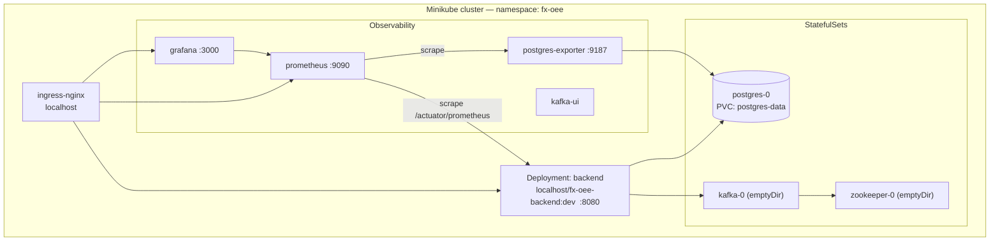
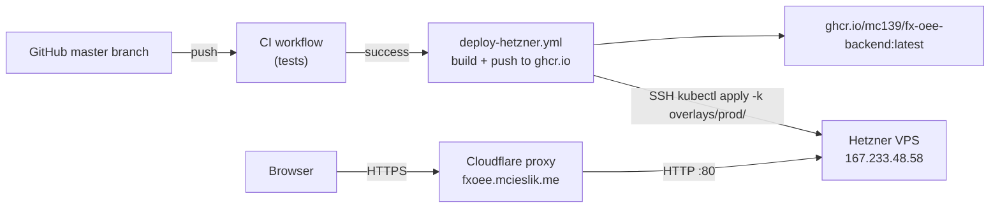

# 09 — Deployment & operations

_Last updated: 2026-06-07._

The app ships as a single Docker image (`Dockerfile.backend`): Node build → Maven build → JRE. The
**frontend is compiled into the backend JAR** (Spring Boot static resources), so there is no separate
frontend deployment.

Two deployment targets are supported:

| Target | Entry point | Ingress class | Image |
|--------|-------------|---------------|-------|
| **Minikube** (local dev) | `./scripts/bootstrap-cluster.sh` | nginx (minikube addon) | `localhost/fx-oee-backend:dev` |
| **Hetzner k3s** (production) | GitHub Actions `deploy-hetzner.yml` | Traefik (k3s built-in) | `ghcr.io/mc139/fx-oee-backend:latest` |

---

## Kustomize overlay structure

Environment-specific settings live in `k8s/overlays/`:

```
k8s/
├── kustomization.yaml          ← base (prod values; do not apply directly)
├── ingress.yaml                ← Traefik, host: fxoee.mcieslik.me
├── backend/deployment.yaml     ← ghcr.io image, Always pull, imagePullSecrets
├── …
└── overlays/
    ├── local/                  ← Minikube patches
    │   ├── kustomization.yaml
    │   └── patches/
    │       ├── ingress.yaml    ← ingressClassName: nginx
    │       └── deployment.json ← localhost image, IfNotPresent, no imagePullSecrets
    └── prod/                   ← Hetzner k3s (references base; no patches)
        └── kustomization.yaml
```

**Always apply via an overlay**, never from `k8s/` directly:

```bash
# local
kubectl apply -k k8s/overlays/local/

# prod (CI does this automatically; manual override)
kubectl apply -k k8s/overlays/prod/
```

---

## Minikube (local development)



### Prerequisites

`minikube`, `kubectl`, `docker` or `podman` (auto-detected; podman preferred if both present).

### One-time bootstrap

```bash
minikube start
./scripts/bootstrap-cluster.sh
```

[bootstrap-cluster.sh](../scripts/bootstrap-cluster.sh) enables the `ingress` and `metrics-server`
addons, then runs `kubectl apply -k k8s/overlays/local/` (retrying until the nginx admission webhook
is serving). Idempotent — safe to re-run.

### Build & deploy the backend

```bash
# Full redeploy: resets Postgres, rebuilds image, rolls out backend + observability
./scripts/deploy-all.sh

# Add --wipe to also recycle Kafka/Zookeeper (all topics + offsets lost)
./scripts/deploy-all.sh --wipe

# Backend only: rebuild image + rollout, no DB or observability touch
./scripts/deploy-minikube.sh
```

[deploy-minikube.sh](../scripts/deploy-minikube.sh) builds `localhost/fx-oee-backend:dev` directly
into Minikube's container runtime (`eval $(minikube docker-env)` for docker; podman builds locally
then `minikube image load`). After applying the base backend manifests it patches `imagePullPolicy`
to `IfNotPresent` and removes `imagePullSecrets` so no registry auth is attempted.

> **Data lifecycle.** `deploy-all.sh` **deletes the Postgres PVC** on every run (fresh DB).
> `--wipe` additionally scales Kafka/Zookeeper to zero (emptyDir destroyed — all topics lost).

### Accessing services (port-forward)

`deploy-all.sh` sets up port-forwards automatically at the end. To do it manually:

```bash
kubectl port-forward -n fx-oee svc/backend    8080:8080 &
kubectl port-forward -n fx-oee svc/grafana    3000:3000 &
kubectl port-forward -n fx-oee svc/prometheus 9091:9090 &
kubectl port-forward -n fx-oee svc/kafka-ui   9090:9090 &
```

Or use the ingress (requires `/etc/hosts` entry):

```bash
echo "$(minikube ip) fx-oee.local grafana.fx-oee.local prometheus.fx-oee.local" | sudo tee -a /etc/hosts
```

| URL | Serves |
|-----|--------|
| `http://fx-oee.local` | app (frontend + REST + WebSocket) |
| `http://grafana.fx-oee.local` | Grafana (admin/admin) |
| `http://prometheus.fx-oee.local` | Prometheus |

The remote debugger (JDWP, `suspend=n`) listens on container port **5005**.

---

## Production — Hetzner k3s



### Infrastructure

| Component | Details |
|-----------|---------|
| VPS | Hetzner Ubuntu, 1 node, k3s |
| Ingress | Traefik (k3s built-in), port 80 |
| DNS / SSL | Cloudflare proxy ON, SSL mode **Flexible** |
| Domain | `fxoee.mcieslik.me` → `167.233.48.58` |
| Image registry | `ghcr.io/mc139/fx-oee-backend` (private) |
| Manifests on server | `/opt/fx-oee/` (git clone of this repo) |

### CI/CD pipeline

Push to `master` → CI passes → `deploy-hetzner.yml` runs:

1. **Build & push** — multi-stage Docker build, pushes `:latest` to ghcr.io  
2. **SSH deploy** — connects to Hetzner, runs:
   ```bash
   git pull --ff-only                              # sync manifests
   kubectl apply -f k8s/namespace.yaml             # ensure namespace
   kubectl create secret docker-registry ghcr-secret ...   # registry auth
   kubectl apply -k k8s/overlays/prod/             # all resources (Kustomize)
   kubectl rollout restart deployment/backend      # force new image
   kubectl rollout status deployment/backend --timeout=300s
   ```

### Required GitHub secrets

| Secret | Value |
|--------|-------|
| `HETZNER_HOST` | `167.233.48.58` |
| `HETZNER_SSH_KEY` | Private key for `root@<server>` (ed25519, generated by `hetzner-init.sh`) |
| `GHCR_TOKEN` | GitHub PAT with `read:packages` scope (server pulls private image) |

### One-time server setup

```bash
# On a fresh Hetzner Ubuntu server (as root):
bash <(curl -fsSL https://raw.githubusercontent.com/mc139/fx-oee/master/scripts/hetzner-init.sh)
```

[hetzner-init.sh](../scripts/hetzner-init.sh) installs k3s, generates SSH keys, and prints the
values to paste into GitHub secrets. Then clone the repo:

```bash
GIT_SSH_COMMAND='ssh -i /root/.ssh/fx-oee-deploy' \
  git clone git@github.com:mc139/fx-oee.git /opt/fx-oee
```

Bootstrap the cluster manually once (CI handles all subsequent deploys):

```bash
cd /opt/fx-oee
kubectl apply -f k8s/namespace.yaml
kubectl apply -k k8s/overlays/prod/
```

---

## Pod resources & probes

[deployment.yaml](../k8s/backend/deployment.yaml) requests `500m` CPU / `1Gi`, limits `2` CPU /
`1.5Gi`. JVM flags: `-Xms512m -Xmx1200m -XX:+UseG1GC -XX:MaxGCPauseMillis=100`.

| Probe | Config |
|-------|--------|
| startupProbe | `/actuator/health`, 60 × 10s (up to 10 min — cold boot is slow) |
| readinessProbe | `/actuator/health`, every 10s |
| livenessProbe | `/actuator/health`, every 15s, 4 failures → restart |

---

## Observability

Prometheus scrapes `/actuator/prometheus` (Micrometer) every 15s. Two Grafana dashboards are
provisioned automatically by `deploy-all.sh` — no manual import needed:

| Dashboard | Source |
|-----------|--------|
| **FX-OEE Trading Engine** (home) | `docker/grafana/dashboards/fxoee.json` (in repo) |
| **PostgreSQL Database** (ID 9628) | fetched from grafana.com at deploy time |

Custom metrics:

| Metric | Type | Tags |
|--------|------|------|
| `orders.placed.total` | Counter | `pair`, `side` |
| `matching.latency` | Timer + histogram | `pair` |
| `orderbook.depth` | Gauge | `pair` |
| `trades.volume.total` | Counter | `pair` |

`matching.latency` publishes Prometheus histogram buckets, enabling `histogram_quantile` for
p50/p99/p999 in Grafana. `postgres-exporter` (`:9187`) feeds the PG dashboard. Kafka UI is
deployed for topic inspection.

---

## docker-compose (lightweight local alternative)

```bash
docker compose up --build
```

[docker-compose.yml](../docker-compose.yml) starts backend, postgres, zookeeper, kafka,
postgres-exporter, prometheus, and grafana with health-gated ordering.

| Service | Host port |
|---------|-----------|
| backend (app) | 8080 |
| postgres | 5432 |
| kafka | 9092 |
| prometheus | 9090 |
| grafana | 3000 |

---

## Configuration reference

All runtime knobs are environment variables consumed by
[application.yml](../src/main/resources/application.yml). See
[Configuration reference](10-configuration.md) for the full list.
