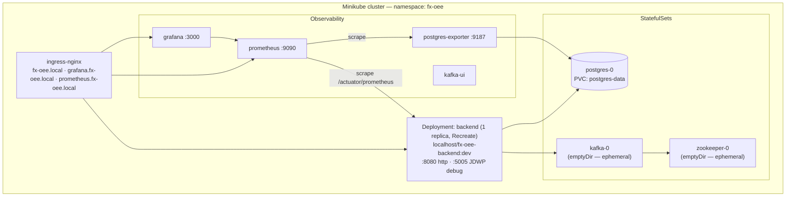

# 09 — Deployment & operations

The reference deployment target is **Minikube** (single-node Kubernetes). A `docker-compose` stack is
provided as a lighter local alternative. In both, the **frontend is compiled into the backend image**
(multi-stage [Dockerfile.backend](../Dockerfile.backend): Node build → Maven build → JRE), so there is
no separate frontend deployment.

## Minikube (reference target)



### Prerequisites

`minikube`, `kubectl`, and `docker` **or** `podman` (the deploy script auto-detects; podman preferred).
The scripts enable the `ingress` and `metrics-server` addons for you.

### One-time bootstrap

```bash
minikube start
./scripts/bootstrap-cluster.sh     # enables addons, applies manifests in dependency order,
                                    # waits for zookeeper → kafka → postgres StatefulSets, then ingress
```

[bootstrap-cluster.sh](../scripts/bootstrap-cluster.sh) is idempotent. It applies everything except
`ingress.yaml` first (the nginx admission webhook isn't serving the instant the addon is enabled),
then retries the ingress with backoff.

### Build & deploy the backend

```bash
./scripts/deploy-all.sh             # resets Postgres, rebuilds image, rolls out, wires observability
./scripts/deploy-all.sh --wipe      # ALSO recycles Kafka/Zookeeper (all topics + offsets lost)
./scripts/deploy-minikube.sh        # backend image only (build + rollout, no DB/observability touch)
```

[deploy-minikube.sh](../scripts/deploy-minikube.sh) builds `localhost/fx-oee-backend:dev` **into
Minikube's container runtime** (docker: `minikube docker-env`; podman: build + `minikube image load`),
applies the manifest directory, then `rollout restart` to force pods onto the freshly-built image. The
tag is pinned to `dev`, so `set image` alone wouldn't trigger a new ReplicaSet — the explicit restart
does. Image pull policy is `IfNotPresent` (never pulls from a registry).

> **Data lifecycle gotcha.** [deploy-all.sh](../scripts/deploy-all.sh) **deletes the Postgres PVC on
> every run** (fresh DB each deploy). `--wipe` additionally scales Kafka/Zookeeper to zero — their
> `emptyDir` volumes are destroyed, losing all topic data and consumer offsets. This is by design for
> a dev loop; do not run it against anything you want to keep.

### Accessing the cluster

Point the ingress hosts at the cluster IP:

```bash
echo "$(minikube ip) fx-oee.local grafana.fx-oee.local prometheus.fx-oee.local" | sudo tee -a /etc/hosts
```

| URL | Serves |
|-----|--------|
| `http://fx-oee.local` | app (frontend + REST + WebSocket, port 8080) |
| `http://grafana.fx-oee.local` | Grafana (admin/admin by default) |
| `http://prometheus.fx-oee.local` | Prometheus |

Or bypass ingress with `kubectl -n fx-oee port-forward svc/backend 8080:8080` (and similarly for
grafana/prometheus). The remote debugger attaches on container port **5005** (JDWP, `suspend=n`).

### Pod resources & probes

The backend deployment ([deployment.yaml](../k8s/backend/deployment.yaml)) requests `500m` CPU /
`1Gi`, limits `2` CPU / `1.5Gi`, and runs the JVM with `-Xms512m -Xmx1200m -XX:+UseG1GC
-XX:MaxGCPauseMillis=100`. Health is `/actuator/health`:

- **startupProbe** — up to 10 min (60 × 10s) before liveness engages (cold first boot is slow);
- **readinessProbe** — every 10s;
- **livenessProbe** — every 15s, 4 failures → restart.

### Observability

Prometheus auto-discovers the backend pod via `prometheus.io/scrape` annotations and scrapes
`/actuator/prometheus` (Micrometer). `deploy-all.sh` provisions Grafana dashboard **9628**
("PostgreSQL Database") fed by `postgres-exporter` (`:9187`). Kafka UI is deployed for topic
inspection.

## docker-compose (local alternative)

```bash
docker compose up --build
```

[docker-compose.yml](../docker-compose.yml) brings up backend, postgres, zookeeper, kafka,
postgres-exporter, prometheus, and grafana with health-gated startup ordering.

| Service | Host port |
|---------|-----------|
| backend (app) | 8080 |
| postgres | 5432 |
| kafka | 9092 |
| prometheus | 9090 |
| grafana | 3000 |
| postgres-exporter | 9187 |

## Configuration

All runtime knobs are environment variables consumed by [application.yml](../src/main/resources/application.yml)
— the k8s `ConfigMap`/`Secret` and the compose `environment:` blocks set them. See
[Configuration reference](10-configuration.md) for every key, its default, and whether it is wired.
