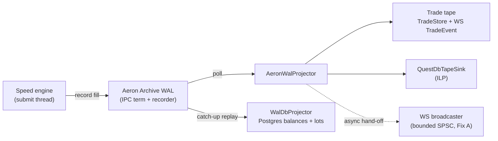

# 10 - Configuration reference

_Last updated: 2026-06-27 BST._

Every runtime knob is resolved by [application.yml](../src/main/resources/application.yml) or
[performance.properties](../src/main/resources/performance.properties) (imported `optional:` by
application.yml), either from an environment variable or from a default baked into the file (or, for a
few keys, a `@Value` default in the code). In Minikube they're set by
[k8s/base/backend/configmap.yaml](../k8s/base/backend/configmap.yaml) +
[secret.yaml](../k8s/base/backend/secret.yaml); in compose by the `environment:` blocks.

> **Where defaults differ:** several keys carry one default in the YAML / properties file and a
> different one in the code's `@Value` fallback (used only when the key is deleted entirely). Both are
> noted below where they diverge. The k8s configmap also overrides many of these; those overrides are
> called out per row.

**Status legend:** ✅ wired and enforced · ⚠️ defined but **not read by any code** (scaffolding) ·
🔜 planned (see ADRs).

## Database

| Key (YAML) | Env var | Default | Status |
|------------|---------|---------|--------|
| `spring.datasource.url` host | `DB_HOST` | `localhost` | ✅ |
| (same key) port | `DB_PORT` | `5432` | ✅ |
| (same key) db | `DB_NAME` | `fxoee` | ✅ |
| `spring.datasource.username` | `DB_USER` | `fxoee` | ✅ |
| `spring.datasource.password` | `DB_PASSWORD` | `fxoee` | ✅ |
| `…hikari.maximum-pool-size` | `DB_POOL_MAX` | `30` | ✅ sized for FillConsumer (7 threads) + worker + bootstrap + REST |
| `…hikari.minimum-idle` | `DB_POOL_MIN_IDLE` | `5` | ✅ |

Flyway runs migrations on boot (`spring.flyway.enabled=true`, `classpath:db/migration`).

## Kafka

| Key | Env var | Default | Status |
|-----|---------|---------|--------|
| `spring.kafka.bootstrap-servers` | `KAFKA_BOOTSTRAP_SERVERS` | `localhost:9093` (local-run targets the minikube broker's external listener via port-forward) | ✅ |
| `spring.kafka.consumer.group-id` | `KAFKA_CONSUMER_GROUP_ID` | `fx-oee-group` | ✅ |
| `spring.kafka.consumer.auto-offset-reset` | none | `latest` | ✅ |
| `kafka.enabled` | `KAFKA_ENABLED` | `true` (top-level producer flag) | ✅ gates producer, `FillQueue`, `PersistenceWorker` ([doc 05](05-event-sourcing-persistence.md)) |
| `spring.kafka.consumer.enabled` | `KAFKA_ENABLED` | `false` | ✅ gates the consumer side (`FillConsumer` / `SnapshotConsumer`) separately from the producer |

The producer is tuned for the `PersistenceWorker`'s pipelined async sends ([application.yml:26-45](../src/main/resources/application.yml)):
`acks=all`, `enable.idempotence=true`, `retries=5`, `request.timeout.ms=5000`, `delivery.timeout.ms=30000`,
`max.in.flight.requests.per.connection=5`, `batch-size=262144`, `compression-type=zstd`,
`buffer-memory=67108864` (64 MiB), `linger.ms=20`. The worker fires sends without blocking on acks
(durability comes from `acks=all` + idempotence, mark-published on the ack callback); the wide linger +
large batch + bigger buffer let records coalesce and pipeline at high throughput. zstd shrinks the
repetitive JSON harder than lz4 for a little extra CPU. That is the exactly-once-ish delivery contract
the projection relies on.

Note the two switches share the `KAFKA_ENABLED` env var but default differently: the producer side
(`kafka.enabled`) defaults **on**, the consumer side (`spring.kafka.consumer.enabled`) defaults **off**.
With `kafka.enabled=false` the engine runs **fully in-memory**: the producer / queue / worker beans are
absent and all publish calls are no-ops. The engine itself is unaffected.

## Engine & funding

`fxoee.engine.mode` picks which of the two co-equal matching cores boots (see [doc 03](03-engine-core.md)
and [speed-engine.md](speed-engine.md)). `performance.properties` (imported `optional:` at the top of
`application.yml`) sets `engine.mode=speed`. Note: the speed engine has its **own** single-writer
Disruptor command ring (sized by `fxoee.engine.speed.ring-size`), which is separate from the `FillQueue`
selected by `fxoee.queue.type`; `performance.properties` actually leaves `queue.type=agrona`
([performance.properties:10,31](../src/main/resources/performance.properties)).

| Key | Env var | Default | Status |
|-----|---------|---------|--------|
| `fxoee.engine.mode` | `FXOEE_ENGINE_MODE` | `default` (key not in base yml; selected by `@ConditionalOnProperty(..., matchIfMissing=true)`) | ✅ `default` (lock-based `MatchingService`) or `speed` (single-writer LMAX Disruptor ring over fixed-point longs); `performance.properties` sets `speed` ([ADR 0005](adr/0005-disruptor-adoption.md)) |
| `fxoee.queue.type` | `FXOEE_QUEUE_TYPE` | `agrona` (key not in base yml; `matchIfMissing`) | ✅ `FillQueue` impl between the engine and `PersistenceWorker`: `agrona` (unbounded Agrona MPSC, never rejects), `clq` (`ConcurrentLinkedQueue`, sheds at high-water), or `disruptor` ring (`DisruptorFillQueue`) |
| `fxoee.funding.mode` | none | `FULL_NOTIONAL` | ✅ `MARGIN` (leveraged) vs `FULL_NOTIONAL` ([doc 04](04-funding-pnl-conservation.md)) |
| `fxoee.engine.authoritative` | none | `true` | ✅ WebSocket + debug APIs read in-JVM `MatchingService` state |
| `fxoee.recovery.replay-on-startup` | `FXOEE_RECOVERY_REPLAY_ON_STARTUP` | `false` | ✅ when true, `AccountBootstrapper` rebuilds the engine from `trade_events` (warm restart) instead of wiping to a fresh 10M balance. Always `true` in k8s ([configmap](../k8s/base/backend/configmap.yaml)); `false` in local dev, where `deploy-all.sh` wipes the Postgres PVC each run anyway so an empty log makes warm restart a no-op. See [doc 05](05-event-sourcing-persistence.md#warm-restart-recovery-engine-replay). |
| `fxoee.recovery.snapshots.enabled` | `FXOEE_RECOVERY_SNAPSHOTS_ENABLED` | `false` | ✅ Phase 4 bounded warm restart (Kafka path): `EngineSnapshotter` publishes per-account state to the log-compacted `engine.snapshots` topic and replay loads the latest snapshot per account, then replays only the `trade_events` tail. Requires `kafka.enabled=true`; opportunistic, off by default ([ADR 0006](adr/0006-engine-snapshots-bounded-restart.md)) |
| `fxoee.recovery.snapshots.interval-ms` | `FXOEE_RECOVERY_SNAPSHOTS_INTERVAL_MS` | `30000` | ✅ how often the snapshotter attempts a consistent-cut capture |
| `fxoee.mock-market.enabled` | `MOCK_MARKET_ENABLED` | `false` | ✅ `MockMarketMaker` injects house bid/ask depth every 500 ms using an OU+GARCH price model |
| `fxoee.mock-market.min-price-ratio` | none | `0.5` | ✅ OU crash guard: mid cannot drop below `basePrice × ratio` (0.5 = floor at 50% of the pair's long-run mean; 0.0 disables) |
| `fxoee.mock-market.interval-ms` | none | `500` (code `@Value` default; key not in yml) | ✅ tick interval for mock quotes |
| `fxoee.mock-market.quantity` | none | `1000000` (code `@Value` default; key not in yml) | ✅ house order size per quote |

## Speed engine (`fxoee.engine.speed.*`)

Active only when `fxoee.engine.mode=speed`. These keys live in
[performance.properties](../src/main/resources/performance.properties) and bind via
[SpeedEngineConfig](../src/main/java/com/fxoee/engine/speed/SpeedEngineConfig.java). They are no-ops in
`default` mode. Note this command ring (the single-writer engine ring) is separate from the `FillQueue`
selected by `fxoee.queue.type` below.

| Key | Env var | Default | Status |
|-----|---------|---------|--------|
| `fxoee.engine.speed.ring-size` | `FXOEE_ENGINE_SPEED_RING_SIZE` | `65536` (code `@Value` + properties; auto-rounded UP to a power of 2, `<=0` → 65536) | ✅ multi-producer command ring capacity (REST + simulator + book views share it); bigger = more burst headroom, smaller = tighter L1/L2 locality ([SpeedEngineConfig.java:66](../src/main/java/com/fxoee/engine/speed/SpeedEngineConfig.java)) |
| `fxoee.engine.speed.book-map-capacity` | `FXOEE_ENGINE_SPEED_BOOK_MAP_CAPACITY` | `65536` (code `@Value` + properties) | ✅ Agrona open-addressing map capacity per book side; size to peak resting orders per pair so books stop resizing ([SpeedEngineConfig.java:64](../src/main/java/com/fxoee/engine/speed/SpeedEngineConfig.java)) |
| `fxoee.engine.speed.cpu` | `FXOEE_ENGINE_SPEED_CPU` | code `@Value` `-1` (= let the OS schedule); **`performance.properties` sets `2`** | ✅ pins the single-writer engine thread to this core (Linux/OpenHFT affinity only; no-op on macOS/unsupported) |
| `fxoee.engine.speed.wait-strategy` | `FXOEE_ENGINE_SPEED_WAIT_STRATEGY` | `busy-spin` | ✅ Disruptor command-ring wait strategy for the engine thread |

## Fill pipeline (FillQueue + persistence)

The async fill hand-off between the engine and the `PersistenceWorker` DB writer (Kafka lane). Only
wired when `kafka.enabled=true`; otherwise the engine runs fully in-memory and these are inert. Keys
live in [performance.properties](../src/main/resources/performance.properties).

| Key | Env var | Default | Status |
|-----|---------|---------|--------|
| `fxoee.disruptor.ring-buffer-size` | `FXOEE_DISRUPTOR_RING_BUFFER_SIZE` | code `@Value` `131072`; **`performance.properties` sets `1048576`**. Must be a power of 2 | ✅ ring capacity for the `disruptor` `FillQueue` path ([DisruptorFillQueue](../src/main/java/com/fxoee/engine/DisruptorFillQueue.java)); inert unless `fxoee.queue.type=disruptor` |
| `fxoee.persistence.batch-max` | `FXOEE_PERSISTENCE_BATCH_MAX` | `512` (code `@Value` + properties) | ✅ max `PendingFill`s drained per `PersistenceWorker` batch; higher = fewer DB round-trips, higher tail latency ([PersistenceWorker.java:68](../src/main/java/com/fxoee/engine/PersistenceWorker.java)) |

## Sample data (startup order ladder)

Seeds a resting EUR/USD limit-order ladder on startup so the UI isn't empty. Off by default.

| Key | Env var | Default | Status |
|-----|---------|---------|--------|
| `fxoee.sample-data.enabled` | `SAMPLE_DATA_ENABLED` | `false` | ✅ |
| `fxoee.sample-data.pair` | none | `EUR_USD` | ✅ pair the ladder is placed on |
| `fxoee.sample-data.levels` | none | `10` | ✅ price levels per side (2 × levels orders total) |
| `fxoee.sample-data.quantity-per-level` | none | `100000` | ✅ base-currency units per level |
| `fxoee.sample-data.mid-price` | none | `1.0850` | ✅ mid the ladder is centred on |
| `fxoee.sample-data.spread` | none | `0.0002` | ✅ best-bid-to-best-ask distance; per-level spacing is spread / 2 |
| `fxoee.sample-data.account-id` | `SAMPLE_DATA_ACCOUNT_ID` | `00000000-0000-0000-0000-000000000001` | ✅ owner of the sample orders (the seeded demo trader) |

## WAL pipeline (Aeron Archive, ADR 0007)

The `fxoee.wal.*` tree is the durable lane for the **speed engine** (ADR 0007). It is a separate
projection path from the Kafka event-sourcing lane (which serves the `default` engine):

- **Lane 1 (default engine):** Kafka event-sourcing, `trade_events` log + `FillConsumer` projections
  (the rest of this doc, and [doc 05](05-event-sourcing-persistence.md)).
- **Lane 2 (speed engine):** matching is JVM-only (no Kafka), the engine records each fill to an
  embedded **Aeron Archive WAL**, and three followers drain the archive: `AeronWalProjector` builds
  the trade tape (`TradeStore` + live WS `TradeEvent`), `WalDbProjector` catches Postgres account
  balances up, and `QuestDbTapeSink` writes the SQL trade history over ILP.

**Everything below is OFF by default** ([application.yml:108-171](../src/main/resources/application.yml)).
The lane is wired up by the `--wal` dev script; production keeps its durable state, the local profile
runs fresh-every-boot. The telemetry for this whole pipeline is `GET /api/debug/pipeline-stats`
(see [doc 06](06-api-reference.md#orderbookdebugcontroller-apidebug)).

### Aeron Archive WAL (`fxoee.wal.aeron.*`)

| Key | Env var | Default | Status |
|-----|---------|---------|--------|
| `fxoee.wal.aeron.enabled` | `FXOEE_WAL_AERON_ENABLED` | `false` | ✅ master switch for the speed+Aeron WAL lane (speed mode only) |
| `fxoee.wal.aeron.aeron-dir` | `FXOEE_WAL_AERON_DIR` | `${java.io.tmpdir}/fxoee-aeron` | ✅ embedded media-driver dir; use a stable (non-tmp) path when `persist-archive=true` |
| `fxoee.wal.aeron.archive-dir` | `FXOEE_WAL_ARCHIVE_DIR` | `${java.io.tmpdir}/fxoee-archive` | ✅ Archive recordings dir; stable path required for durable warm restart |
| `fxoee.wal.aeron.control-port` | `FXOEE_WAL_CONTROL_PORT` | `8010` | ✅ Archive control plane (loopback UDP); the recorded fill stream itself is shared-memory IPC |
| `fxoee.wal.aeron.lag-threshold-bytes` | `FXOEE_WAL_LAG_THRESHOLD_BYTES` | `50331648` (48 MiB) | ✅ ingress-shed trip point (**Fix B**): reject NEW orders `OVERLOADED` when WAL lag (publication minus Archive recording position, bytes) exceeds this. 48 MiB = 75% of the 64 MiB IPC term, leaving ~16 MiB burst headroom. Auto-capped to 90% of `term-buffer-length` |
| `fxoee.wal.aeron.broadcast-queue-capacity` | `FXOEE_WAL_BROADCAST_QUEUE_CAPACITY` | `8192` | ✅ async WS-broadcast hand-off queue (**Fix A**): bounded SPSC the projector poll thread offers each `TradeEvent` to; a dedicated broadcaster does the JSON write. On overflow the live broadcast is dropped (`wal.broadcast.dropped.total`), never blocking the drain. Power of two |
| `fxoee.wal.aeron.term-buffer-length` | `FXOEE_WAL_TERM_BUFFER_LENGTH` | `67108864` (64 MiB) | ✅ IPC term-buffer length (bytes, power of two): the in-flight WAL headroom the lag threshold sheds against. Larger term = more burst headroom |
| `fxoee.wal.aeron.dedicated-archive` | `FXOEE_WAL_DEDICATED_ARCHIVE` | `true` | ✅ `true` = DEDICATED recorder thread (records in parallel, needed for >300k fills/s or the IPC publication back-pressures and the engine spins in `offerWal`); `false` = SHARED (recorder shares the archive conductor thread; lighter, fine for low rates / tests) |
| `fxoee.wal.aeron.persist-archive` | `FXOEE_WAL_PERSIST_ARCHIVE` | `false` | ✅ `false` = wipe the archive each boot (fresh-every-run); `true` = keep recordings on disk so a real process restart can replay the durable tail into the engine (durable warm restart, no DB). Needs `snapshot.enabled` + stable `archive-dir`/`aeron-dir` + `snapshot.file` |
| `fxoee.wal.aeron.prune-on-start` | `FXOEE_WAL_PRUNE_ON_START` | `false` | ✅ wipe the archive + media-driver dir + engine snapshot BEFORE AeronWal opens them (runs before recover-on-boot) so a corrupt/stale snapshot can never be replayed. Prod keeps durable state (`false`); the local profile sets `true` |

For a **true DB-off durable lane**: `persist-archive=true`, `snapshot.enabled=true`,
`bootstrap.clear-on-start=false`, `recovery.replay-on-startup=false` (the WAL is the source of truth).

### QuestDB trade tape (`fxoee.wal.questdb.*`, Phase D)

| Key | Env var | Default | Status |
|-----|---------|---------|--------|
| `fxoee.wal.questdb.enabled` | `FXOEE_WAL_QUESTDB_ENABLED` | `false` | ✅ projector also writes each trade to QuestDB over ILP for SQL history/analytics. Needs a running QuestDB ([k8s/base/questdb/questdb.yaml](../k8s/base/questdb/questdb.yaml) or docker); connects lazily so boot order doesn't matter |
| `fxoee.wal.questdb.ilp` | `FXOEE_WAL_QUESTDB_ILP` | `http::addr=localhost:9000;` | ✅ QuestDB ILP client connection string |
| `fxoee.wal.questdb.ttl` | `FXOEE_WAL_QUESTDB_TTL` | `30d` | ✅ retention window for the `trades` tape (QuestDB duration, e.g. `30d`, `12h`, `4w`). QuestDB drops whole partitions older than this on its own (`PARTITION BY DAY`), so the tape stays bounded. Postgres + the Aeron WAL remain the durable source of truth. Set blank or `0` to keep everything (unbounded) |

### Postgres account-state projector (`fxoee.wal.postgres.*`, Phase B)

A periodic, off-engine catch-up that replays the Archive tail into per-account balances + position lots,
so `GET /api/debug/state` tracks the engine instead of a frozen initial deposit. Idempotent
(`fill_dedup`); seeds a bounded backfill from the latest snapshot when present. A downstream replica that
may lag under load and catch up.

| Key | Env var | Default | Status |
|-----|---------|---------|--------|
| `fxoee.wal.postgres.enabled` | `FXOEE_WAL_POSTGRES_ENABLED` | `false` | ✅ runs `WalDbProjector` (off-engine Postgres catch-up) |
| `fxoee.wal.postgres.batch-max` | `FXOEE_WAL_POSTGRES_BATCH_MAX` | `512` | ✅ max per-account legs flushed per DB transaction |
| `fxoee.wal.postgres.interval-ms` | `FXOEE_WAL_POSTGRES_INTERVAL_MS` | `200` | ✅ catch-up cycle period (how often the projector replays the new Archive tail) |

### Engine snapshots (`fxoee.wal.snapshot.*`, Phase E)

Bounded warm restart for the WAL lane: periodically (and on shutdown) pin engine state + the exact
Archive recording/position to a JSON file; recover-on-boot restores it and replays only the Archive tail
(`SpeedEngineConfig.walRecoverOnBoot`, before traffic). Survives a real process restart only with
`aeron.persist-archive=true` + a stable `snapshot.file`.

| Key | Env var | Default | Status |
|-----|---------|---------|--------|
| `fxoee.wal.snapshot.enabled` | `FXOEE_WAL_SNAPSHOT_ENABLED` | `false` | ✅ enable periodic engine snapshots + recover-on-boot for the WAL lane |
| `fxoee.wal.snapshot.file` | `FXOEE_WAL_SNAPSHOT_FILE` | `${java.io.tmpdir}/fxoee-engine.snapshot.json` | ✅ snapshot JSON path; deleted by `POST /api/debug/hard-reset` |
| `fxoee.wal.snapshot.interval-ms` | `FXOEE_WAL_SNAPSHOT_INTERVAL_MS` | `30000` | ✅ snapshot cadence |

## Simulator / load generator (`fxoee.sim.*`)

Drives `SimulatorService` to flood the engine for throughput testing. Autostart is off by default
(base / prod / test never auto-flood); the local profile sets the bench-friendly defaults. Can also be
driven at runtime via `POST /api/debug/simulate/start` (see [doc 06](06-api-reference.md#debug--simulation)).

| Key | Env var | Default | Status |
|-----|---------|---------|--------|
| `fxoee.sim.autostart` | `FXOEE_SIM_AUTOSTART` | `false` | ✅ start the simulator on boot (`SimAutostartRunner`) instead of waiting for the REST call |
| `fxoee.sim.bench-mode` | `FXOEE_SIM_BENCH_MODE` | `false` | ✅ speed-engine allocation-free fast lane (`RawOrderSink#submitRaw`): no producer BigDecimal, no per-order GC tail (the biggest throughput lever). Requires `engine.mode=speed`; ignored on the lock engine |
| `fxoee.sim.threads` | `FXOEE_SIM_THREADS` | `0` (→ SimConfig default 1) | ✅ submitter threads, capped at `trader-count` |
| `fxoee.sim.trader-count` | `FXOEE_SIM_TRADER_COUNT` | `0` (→ all real DB accounts) | ✅ virtual trader accounts, funded 10M in-engine at start. Set `>=` threads |
| `fxoee.sim.interval-ms` | `FXOEE_SIM_INTERVAL_MS` | `0` (busy-loop = max throughput) | ✅ ms between ticks per thread |
| `fxoee.sim.pending-order-pct` | `FXOEE_SIM_PENDING_ORDER_PCT` | `0.10` | ✅ fraction of orders priced off-market (rest in book); 0 = pure crossing flow |

## Tiingo live feed

Real FX data via Tiingo REST (OHLC history) + WebSocket (live quotes). See [market-data.md](market-data.md) for full details.

| Key | Env var | Default | Status |
|-----|---------|---------|--------|
| `fxoee.tiingo.enabled` | `TIINGO_ENABLED` | `false` | ✅ activates `TiingoMarketDataService` |
| `fxoee.tiingo.api-key` | `TIINGO_API_KEY` | _(required when enabled)_ | ✅ **secret**, goes in `backend-secret`, never in the configmap |
| `fxoee.tiingo.history-days` | `TIINGO_HISTORY_DAYS` | `7` (k8s configmap sets `30`) | ✅ days of OHLC history loaded per timeframe on startup |
| `fxoee.tiingo.threshold-level` | `TIINGO_THRESHOLD_LEVEL` | `5` | ✅ WebSocket throttle (ms between price updates; 0 = every tick) |
| `fxoee.tiingo.quantity` | `TIINGO_QUANTITY` | `1000000` | ✅ house order size injected per live quote |

Both `tiingo` and `mock-market` can run at the same time, and they coordinate on their own: the mock
maker stands down while Tiingo is streaming and resumes within 30 seconds of the live feed going
quiet. Typical production setup is `TIINGO_ENABLED=true` + `MOCK_MARKET_ENABLED=true`, which gives
real prices in the week and synthetic depth over the weekend with no manual switch. See
[market-data.md](market-data.md#market-closed-behaviour).

## Market-data broadcaster (spread & stale metrics)

A separate poller from the two feeds above. It reads whatever depth is resting and publishes
book-health metrics; it does not generate prices. See [market-data.md](market-data.md#5--spread--stale-order-metrics).

| Key | Env var | Default | Status |
|-----|---------|---------|--------|
| `fxoee.market-data.enabled` | `MARKET_DATA_ENABLED` | `false` | ✅ runs `MarketDataBroadcaster`; emits `fxoee.market.spread.bps`, `*.bid/ask.deviation.pips`, `fxoee.market.stale.orders` |
| `fxoee.market-data.polling-interval-ms` | `MARKET_DATA_POLL_MS` | `1000` | ✅ how often the book is sampled and metrics refreshed |
| `fxoee.market-data.provider` | none | `orderbook` | ✅ `MarketDataService` impl; only `orderbook` is built in |
| `fxoee.market-data.stale-order-pip-threshold` | none | `50` (code default; key not in yml) | ✅ a resting level this many pips off the external mid trips the stale counter and a `STALE_ORDER` WebSocket event (1 pip = 0.01 for USD/JPY, 0.0001 otherwise) |

## Server, auth, metrics

| Key | Env var | Default | Status |
|-----|---------|---------|--------|
| `server.port` | `SERVER_PORT` | `8080` | ✅ |
| `jwt.secret` | `JWT_SECRET` | dev placeholder | ✅ **override in any real deployment** (min 32 chars, HS256) |
| `jwt.expiry-days` | none | `7` | ✅ |
| `management.endpoints…exposure` | none | `health, info, prometheus, metrics` | ✅ Actuator + Micrometer Prometheus |

> 🔐 The default `jwt.secret` is a known dev string in `application.yml`. It **must** be supplied via
> the `backend-secret` Secret (k8s) or env (compose) in any non-local environment.

## Pre-trade risk & circuit breaker (enforced)

The `fx.risk.*` and `fx.circuit-breaker.*` keys **are** read and enforced. This was scaffolding in
earlier revisions but is now live. See [11 - Pre-trade risk controls](11-risk-controls.md) for the
full gate; the circuit breaker is in [circuit-breaker.md](circuit-breaker.md).

| Key | Env var | Default | Status |
|-----|---------|---------|--------|
| `fx.risk.killswitch` | `RISK_KILLSWITCH` | `false` | ✅ enforced; when true, no new orders are admitted |
| `fx.risk.max-position` | `RISK_MAX_POSITION` | `10000000` | ✅ enforced; per-account \|net qty\| per pair (0 disables) |
| `fx.risk.max-order-notional` | `RISK_MAX_ORDER_NOTIONAL` | `5000000` | ✅ enforced; per-order USD notional cap (0 disables) |
| `fx.risk.max-gross-exposure` | `RISK_MAX_GROSS_EXPOSURE` | `0` | ✅ enforced; per-account gross margin USD (0 = disabled) |
| `fx.circuit-breaker.enabled` | `CIRCUIT_BREAKER_ENABLED` | `true` (yml + code `@Value`); **`performance.properties` and the k8s configmap set `false`** | ✅ master on/off for the circuit breaker; when false no pair is ever auto-halted (advisory-only in speed mode, so the max-throughput profile turns it off) |
| `fx.circuit-breaker.price-deviation-threshold` | `CIRCUIT_BREAKER_PRICE_DEVIATION_THRESHOLD` | `0.5` locally (yml); code `@Value` fallback `0.005`; k8s configmap sets `0.005` | ✅ enforced; halts a pair on a price jump beyond this, and the risk gate then refuses orders on HALTED pairs |

Watch out for the circuit-breaker default: it differs per environment. `application.yml` ships `0.5`
(a 50% jump, deliberately loose so synthetic mock-market volatility doesn't trip halts in local dev),
the k8s configmap tightens it to `0.005` (0.5%), and the `@Value` fallback in `CircuitBreaker.java`
(used only when the yml key is removed entirely) is `0.005`.

All `fx.risk.*` values are **runtime-mutable** via `PUT /api/risk/limits` / the DEBUG panel RISK tab.
The `application.yml` values are only the startup seed.

## FIX gateway

| Key | Env var | Default | Status |
|-----|---------|---------|--------|
| `fx.fix.enabled` | `FIX_ENABLED` | `false` | ✅ when true, `FixGatewayConfig` boots a QuickFIX/J 4.4 `SocketAcceptor` on port 9876 (from `fix-acceptor.cfg`). v1 handles `NewOrderSingle (35=D)` + `OrderCancelRequest (35=F)` through the same `OrderService` path as REST. Off by default so test/CI don't bind the port. See [fix-session.md](fix-session.md) |

### Still scaffolding

| Key | Env var | Default | Status |
|-----|---------|---------|--------|
| `fx.orderbook.snapshot-depth` | none | `10` | ⚠️ not read; `GET /api/orderbook/{pair}` takes a `?depth=` request param instead (default 20) |

The funds/structural gate is `PreTradeValidator` + margin reservation in the
[submit pipeline](03-engine-core.md#the-submit-pipeline): quantity/lot/tick checks and the
whole-order funds check. The risk gate (above) runs just before it, pre-lock.

## Now implemented (previously listed as scaffolding)

Capabilities this section used to list as planned are now in the code:

| Capability | State | Reference |
|------------|-------|-----------|
| LMAX Disruptor | ✅ implemented: the `speed` engine is a single-writer Disruptor command ring, and `fxoee.queue.type=disruptor` selects the Disruptor `FillQueue` hand-off (the two rings are independent). ADR 0004 was the interim `FillQueue`; ADR 0005 superseded it | [ADR 0004](adr/0004-async-fill-queue-over-disruptor.md), [ADR 0005](adr/0005-disruptor-adoption.md) |
| FIX 4.4 gateway | ✅ implemented v1: `com.fxoee.infrastructure.fix` (QuickFIX/J acceptor, `NewOrderSingle` + `OrderCancelRequest`), gated on `fx.fix.enabled` | [fix-session.md](fix-session.md) |
| Aeron Archive WAL + QuestDB tape | ✅ implemented: speed-engine durable lane (see the [WAL pipeline](#wal-pipeline-aeron-archive-adr-0007) section above) | [ADR 0007](adr/0007-aeron-archive-wal-questdb-tape.md) |
| Speed engine (long fixed-point single-writer) | ✅ implemented: selected by `fxoee.engine.mode=speed` (the `performance.properties` default) | [speed-engine.md](speed-engine.md) |
| Pre-trade risk gate | ✅ enforced: `com.fxoee.risk` runs pre-lock | [doc 11](11-risk-controls.md) |
| Circuit breaker | ✅ enforced (advisory-only in speed mode) | [circuit-breaker.md](circuit-breaker.md) |

The only genuine never-read scaffolding key left is `fx.orderbook.snapshot-depth` (above).
