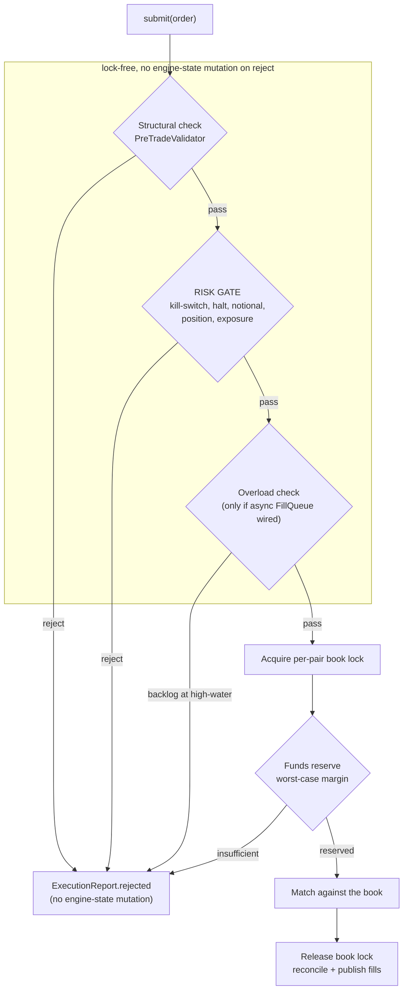
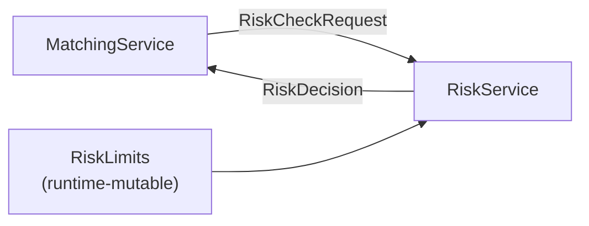

# Pre-Trade Risk Controls

_Last updated: 2026-06-21 BST._

A pre-trade risk gate that runs on every order before it touches the book. It enforces a global
kill-switch, refuses orders on HALTED pairs, and caps per-order notional, per-account position, and
per-account gross exposure. All limits are tunable at runtime, no restart needed.

Lives in its own package, [`com.fxoee.risk`](../src/main/java/com/fxoee/risk), deliberately decoupled
from the matching engine so it could later be lifted into a standalone service.

> **Both engines enforce the same limits.** This doc describes the `default` (lock-based) engine,
> where the gate is the `RiskService.check` call below. The `speed` engine enforces the identical
> checks against the same shared [`RiskLimits`](../src/main/java/com/fxoee/risk/RiskLimits.java), but
> inline on its engine thread in fixed-point longs (`SpeedEngine.setRiskGate`,
> [SpeedMatchingService.java:133](../src/main/java/com/fxoee/engine/speed/SpeedMatchingService.java)),
> so the hot path stays zero-alloc. Runtime edits via the REST API / DEBUG panel reach both, because
> both read the same `RiskLimits` bean.

## Where it runs

Inside [`MatchingService.submitInternal`](../src/main/java/com/fxoee/engine/MatchingService.java),
immediately after the structural check and **before the per-pair book lock**. The full submit
pipeline, with the risk gate highlighted:

The structural check, risk gate, and overload check all run lock-free and before any book mutation,
so a rejection at any of those stages touches no engine state. The book lock is taken only once the
order is admitted, and the funds reservation + match happen inside it.

Running pre-lock matters for two reasons:

1. **Correctness.** A rejection never mutates engine state and never extends a per-pair critical
   section, so it cannot interfere with the matching hot path or the reconcile/ABBA-deadlock logic.
2. **Latency.** The gate is pure in-memory arithmetic over a value object; it adds no measurable
   cost (see [Performance](#performance)).

The earlier [`PreTradeValidator`](../src/main/java/com/fxoee/engine/validate/PreTradeValidator.java)
(structural + margin/funds reservation) is unchanged and still runs under the book lock. The risk
gate is an **additional** layer above it, not a replacement.

## The checks

Evaluated cheapest-first; the first breach wins and short-circuits the rest.

| # | Check | Rejection reason | Input |
|---|-------|------------------|-------|
| 1 | Global kill-switch engaged | `KILLSWITCH` | none |
| 2 | Pair is `HALTED` | `MARKET_HALTED` | `TradingStatusService.getStatus(pair)` |
| 3 | Order USD notional > limit | `ORDER_NOTIONAL_LIMIT` | `qty × refPrice` (USD-base pairs: `qty`) |
| 4 | \|projected net position\| > limit | `POSITION_LIMIT` | `netQty(pair) + signedQty` |
| 5 | Projected gross exposure > limit | `EXPOSURE_LIMIT` | `heldMarginUsd + incrementalMargin` |

Notes:

- **Reference price.** For LIMIT orders the order price is used; for MARKET orders the best
  opposite-side resting price (best ask for BUY, best bid for SELL). If no price is available (e.g. a
  MARKET order against an empty book), the price-dependent checks (notional, exposure) are skipped;
  the price-independent ones (kill-switch, halt, position) still apply.
- **Position uses `|net|`.** A large SHORT breaches the position limit just like a large LONG. Pure
  reduce/close orders shrink the projection and never breach.
- **Exposure is margin-based** (`heldMarginUsd` + this order's incremental margin), which needs no
  extra price lookup beyond the reference price.
- A limit `<= 0` (or absent) means **unlimited**; that check is skipped. The kill-switch is a
  separate boolean.

## Clean module boundary

The `risk` package imports nothing from `engine`, `matching`, or the persistence layer. The caller
(`MatchingService`) assembles a plain [`RiskCheckRequest`](../src/main/java/com/fxoee/risk/RiskCheckRequest.java)
(pair, account, halt flag, notional, projected net, projected exposure: all serializable types).
[`RiskService`](../src/main/java/com/fxoee/risk/RiskService.java) is an interface with a single
in-process implementation,
[`InProcessRiskService`](../src/main/java/com/fxoee/risk/InProcessRiskService.java).

This one-way, DTO-only dependency is what makes the gate extractable: swap `InProcessRiskService`
for a REST/gRPC client and no caller changes.

> **Why keep it in-process, then?** Pre-trade risk sits on the order hot path. A network round trip
> per order would dominate matching latency (µs → ms). Real systems co-locate pre-trade risk for
> exactly this reason. The boundary exists for testability and optional later scaling, but
> co-location is the deliberate default, not an accident.

## Runtime tuning

Limits seed from `fx.risk.*` on startup and are held in
[`RiskLimits`](../src/main/java/com/fxoee/risk/RiskLimits.java) as `volatile` fields. Because each
field is read independently (no cross-field invariant), every read and write is atomic on its own:
no lock needed, and a change is visible to the very next order without tearing.

### REST API

| Method & path | Body / param | Effect |
|---------------|--------------|--------|
| `GET /api/risk/limits` | none | Current limits + kill-switch |
| `PUT /api/risk/limits` | `{killSwitch?, maxOrderNotionalUsd?, maxPositionQty?, maxGrossExposureUsd?}` | Partial update; only non-null fields applied; returns the new state |
| `POST /api/risk/killswitch/{on}` | `on` = `true`/`false` | Flip the kill-switch |

Served by [`RiskController`](../src/main/java/com/fxoee/api/controller/rest/RiskController.java).

### DEBUG panel

The trading UI's DEBUG panel has a **RISK** tab
([`frontend/src/debugpanel.jsx`](../frontend/src/debugpanel.jsx)): the kill-switch toggles instantly
(it's the safety control); the three numeric limits are edited then **APPLY**'d. Changes are live for
the next order.

### Configuration

| Key | Env var | Default |
|-----|---------|---------|
| `fx.risk.killswitch` | `RISK_KILLSWITCH` | `false` |
| `fx.risk.max-order-notional` | `RISK_MAX_ORDER_NOTIONAL` | `5000000` |
| `fx.risk.max-position` | `RISK_MAX_POSITION` | `10000000` |
| `fx.risk.max-gross-exposure` | `RISK_MAX_GROSS_EXPOSURE` | `0` (disabled) |

## Metrics

| Metric | Type | Tags | Meaning |
|--------|------|------|---------|
| `risk.rejected.total` | counter | `reason`, `pair` | Orders rejected by the gate |
| `risk.killswitch` | gauge | none | `1` engaged, `0` released |
| `risk.limit.order_notional_usd` | gauge | none | Live order-notional limit (`0` = disabled) |
| `risk.limit.position_qty` | gauge | none | Live position limit |
| `risk.limit.gross_exposure_usd` | gauge | none | Live gross-exposure limit |

Counters are pre-registered for every `(pair × reason)` so the hot path never allocates a tag
string; cardinality is bounded (`pairs × 5 reasons`) and is **deliberately not** tagged per account.
The Grafana dashboard ([`docker/grafana/dashboards/fxoee.json`](../docker/grafana/dashboards/fxoee.json))
carries a **Pre-Trade Risk** row: rejection rate by reason, all-time rejections per reason, and a
kill-switch state stat. In Prometheus these are `risk_rejected_total{reason,pair}` and
`risk_killswitch`.

## Performance

The gate is monomorphic (single implementation, so the JIT devirtualizes and inlines) and does only
`BigDecimal` comparisons plus a `ConcurrentHashMap.get` for the halt status. The per-request
`RiskCheckRequest` is a short-lived record (young-gen, escape-analysis friendly). At maximum
throughput the dominant cost remains matching itself, not the gate. No part of the gate holds a lock.

## Tests

| Suite | Layer |
|-------|-------|
| [`RiskLimitsTest`](../src/test/java/com/fxoee/risk/RiskLimitsTest.java) | Holder: seed, enable/disable, atomic setters, view |
| [`InProcessRiskServiceTest`](../src/test/java/com/fxoee/risk/InProcessRiskServiceTest.java) | Decision logic: each reason, boundaries (`==` accepted, `>` rejected), `\|net\|`, null-skip, precedence, metrics |
| [`RiskControllerTest`](../src/test/java/com/fxoee/api/controller/rest/RiskControllerTest.java) | REST: GET / partial PUT / kill-switch |
| [`MatchingServiceRiskGateTest`](../src/test/java/com/fxoee/engine/MatchingServiceRiskGateTest.java) | End-to-end through `submit`, proving rejects happen before any reservation |
