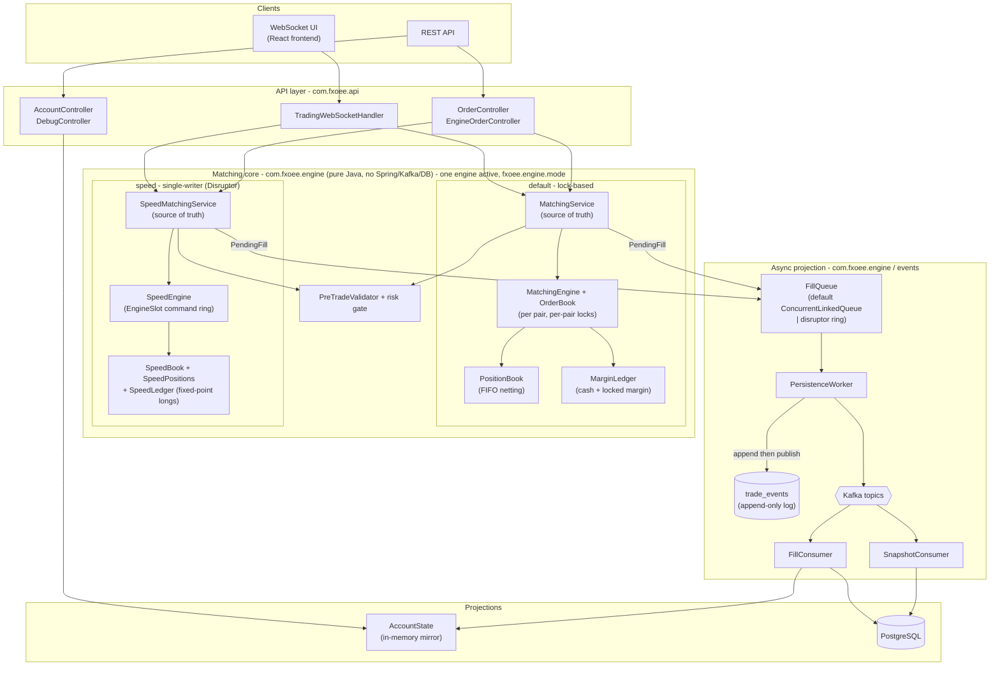

# fx-oee Documentation

_Last updated: 2026-06-13._

`fx-oee` is an **FX order-execution engine**: a Spring Boot monolith that runs a price-time-priority
matching engine entirely in the JVM, tracks margin and positions in memory, and projects every fill
to PostgreSQL through a durable, replayable event log over Kafka.

This documentation is written **from the code**: every claim below maps to a class, method, or
config key you can open. File references are clickable (`path:line`).

## How the system is layered

The **matching core** is authoritative, and there are two co-equal implementations of it selected at
boot by `fxoee.engine.mode`: the **default** lock-based engine (`com.fxoee.matching` +
`MatchingService`) and the **speed** single-writer engine (`com.fxoee.engine.speed`, an LMAX
Disruptor command ring over fixed-point longs). Whichever is active, everything downstream (the DB
rows, the in-memory mirror, the WebSocket snapshots) is a **projection** that applies effects the
engine already computed and stamped on each event. Projections never re-derive open/close or cash
math, so they cannot drift from the engine. The fill hand-off (`FillQueue`) is itself selectable
(`fxoee.queue.type`: `default` `ConcurrentLinkedQueue` or `disruptor` ring). See
[Event sourcing & persistence](05-event-sourcing-persistence.md), [Speed engine](speed-engine.md),
and [ADR 0005](adr/0005-disruptor-adoption.md).

## Documentation map

| Doc | Contents |
|-----|----------|
| [01 - Architecture](01-architecture.md) | Process layout, threading & locking model, deadlock avoidance, configuration |
| [02 - Matching engine](02-matching-engine.md) | `OrderBook` structure, price-time priority, partial fills, MARKET IOC, self-trade prevention |
| [03 - Engine core](03-engine-core.md) | `MatchingService.submit` pipeline, `PositionBook` FIFO netting, `MarginLedger`, reconcile |
| [04 - Funding, P&L & conservation](04-funding-pnl-conservation.md) | Margin model, funding modes, USD P&L conversion, taker fee, the conservation invariant |
| [05 - Event sourcing & persistence](05-event-sourcing-persistence.md) | `FillQueue` → `PersistenceWorker` → `trade_events` → Kafka → consumers, warm-restart replay |
| [06 - API reference](06-api-reference.md) | REST endpoints, WebSocket protocol, auth, debug/simulation endpoints |
| [07 - Data model](07-data-model.md) | Domain records, enums, database schema (Flyway migrations) |
| [08 - Testing](08-testing.md) | Test-suite map, invariants under test, performance floors, how to run |
| [09 - Deployment & operations](09-deployment.md) | Minikube (reference target), docker-compose, scripts, observability, data lifecycle |
| [10 - Configuration reference](10-configuration.md) | Every env var / property, default, and whether it's wired |
| [11 - Pre-trade risk controls](11-risk-controls.md) | `com.fxoee.risk` gate: kill-switch, notional/position/exposure limits, HALTED enforcement, runtime tuning, metrics |
| [Speed engine](speed-engine.md) | `fxoee.engine.mode=speed`: single-writer Disruptor engine, fixed-point longs (JPY price scale 3), zero-allocation hot path, OrderBook views |
| [Speed engine: threads & architecture](speed-engine-architecture.md) | Visual thread map, Disruptor flow, command types, state ownership, sequence diagrams |
| [Circuit breaker](circuit-breaker.md) | Price-deviation halts, status/reset endpoints, enforcement via the risk gate |
| [Market data feed](market-data.md) | Tiingo live feed, MockMarketMaker (OU+GARCH), automatic weekend fallback, spread / stale-order metrics, DEBUG controls |
| [FIX session](fix-session.md) | quickfix-j 4.4 acceptor gateway (`FixGatewayConfig`, `FixApplication`), enabled with `fx.fix.enabled=true` (env `FIX_ENABLED`, off by default) |
| [ADRs](adr/README.md) | Architecture Decision Records: monolith, in-memory engine, jOOQ, async fill queue (0004, superseded), LMAX Disruptor adoption (0005) |

## The seven currency pairs

Defined in [CurrencyPair.java](../src/main/java/com/fxoee/domain/enums/CurrencyPair.java). All share
margin rate `0.05` (20:1) and min lot size `1`.

| Pair | Base | Quote | USD-base? | Tick |
|------|------|-------|-----------|------|
| EUR/USD | EUR | USD | no  | 0.0001 |
| GBP/USD | GBP | USD | no  | 0.0001 |
| AUD/USD | AUD | USD | no  | 0.0001 |
| NZD/USD | NZD | USD | no  | 0.0001 |
| USD/JPY | USD | JPY | yes | 0.01 |
| USD/CHF | USD | CHF | yes | 0.0001 |
| USD/CAD | USD | CAD | yes | 0.0001 |

"USD-base" (`isUsdBase()`: the quote currency is not USD) changes both notional and P&L conversion;
this distinction recurs throughout the engine. See [Funding, P&L & conservation](04-funding-pnl-conservation.md).

## Quick orientation for a new reader

1. Start with [Engine core](03-engine-core.md): `MatchingService.submit` is the spine of the system.
2. Read [Funding, P&L & conservation](04-funding-pnl-conservation.md) for the money math.
3. Read [Event sourcing & persistence](05-event-sourcing-persistence.md) for how state survives a restart.
