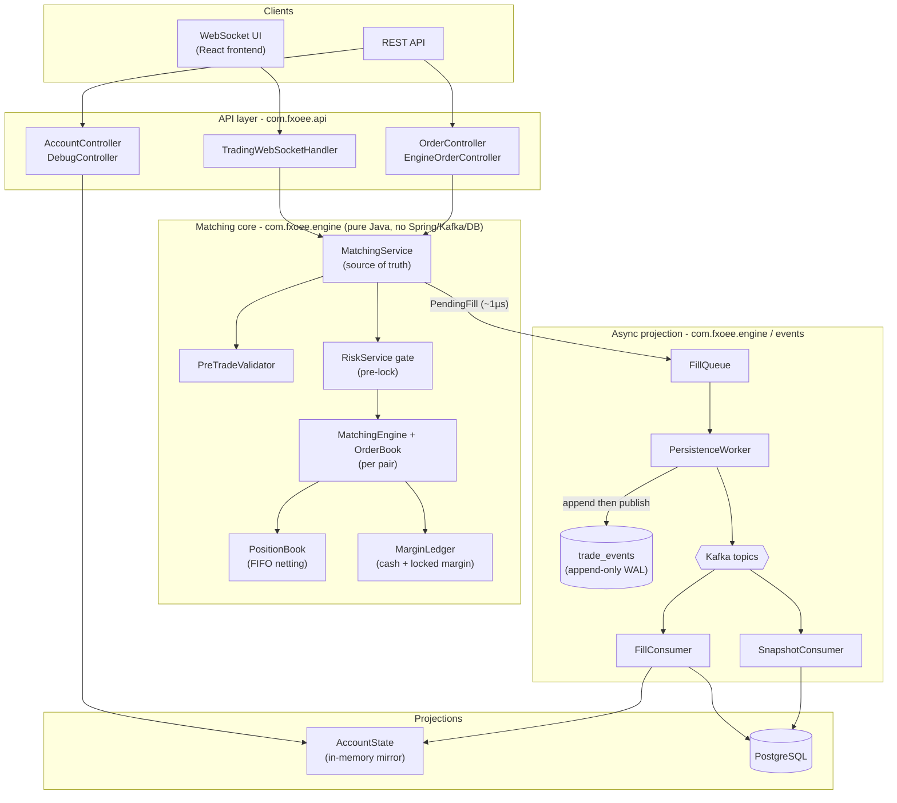
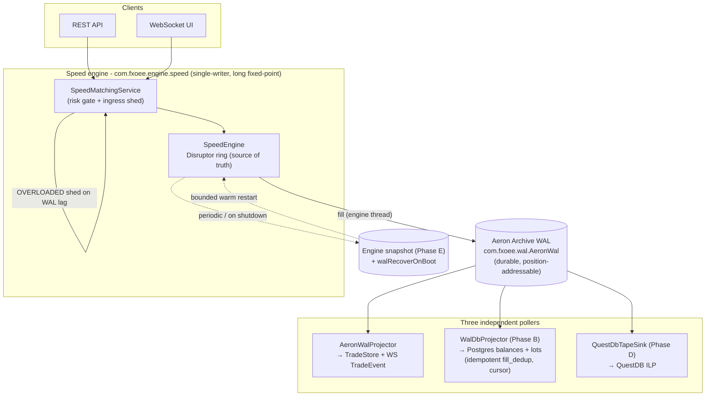

# fx-oee Documentation

> **Live demo:** **[fxoee.mcieslik.me](https://fxoee.mcieslik.me)** — a running instance (trader terminal + admin console).
> **Source:** private, available on request. This repository is the architecture and design documentation.

_Last updated: 2026-07-06 BST._

`fx-oee` is an **FX order-execution engine**: a Spring Boot monolith that runs a price-time-priority
matching engine entirely in the JVM, tracks margin and positions in memory, and projects every fill
to durable storage through a replayable log. It ships **two matching engines** and **two durability
lanes**, picked at boot.

This documentation is written **from the code**: every claim below maps to a class, method, or
config key you can open. File references are clickable (`path:line`).

## Two engine modes, two durability lanes

The boot-time switch is `fxoee.engine.mode` ([EngineConfig.java:71](../src/main/java/com/fxoee/engine/EngineConfig.java)
defaults to `default` via `matchIfMissing=true`; `performance.properties:31` and the local profile set `speed`):

| Mode | Matching core | Durability lane |
|------|---------------|-----------------|
| `default` (the default) | lock-based `MatchingService` + `OrderBook`×7 + per-pair `MatchingEngine` locks + `PositionBook` (FIFO) + `MarginLedger`, in `BigDecimal` | **Lane 1 (Kafka):** `FillQueue` → `PersistenceWorker` → append `trade_events` (Postgres WAL) → publish Kafka → `FillConsumer`/`SnapshotConsumer` write Postgres + mirror |
| `speed` | single-writer LMAX **Disruptor** ring over fixed-point **longs**, zero-alloc hot path, optional core pinning (`com.fxoee.engine.speed`) | **Lane 2 (Aeron WAL, ADR 0007):** JVM-only, no Kafka; engine records fills to an embedded **Aeron Archive** WAL; three pollers project from it |

Both engines share the same API, WebSocket snapshots, risk gate, and circuit breaker. The whole
Aeron lane (`fxoee.wal.*`) is **off by default** in `application.yml`; the local dev profile turns it
on (run with `--wal`). See [Speed engine](speed-engine.md) and [ADR 0007](adr/0007-aeron-archive-wal-questdb-tape.md).

### Lane 1: default engine → Kafka → Postgres

### Lane 2: speed engine → Aeron Archive WAL → tape / Postgres / QuestDB

In **both** lanes the **matching core is authoritative**. Everything downstream (the DB rows, the
in-memory mirror, the WebSocket snapshots, the QuestDB tape) is a **projection** that applies effects
the engine already computed and stamped on each fill. Projections never re-derive open/close or cash
math, so they cannot drift from the engine. See [Event sourcing & persistence](05-event-sourcing-persistence.md).

## Documentation map

| Doc | Contents |
|-----|----------|
| [01 - Architecture](01-architecture.md) | Process layout, threading & locking model, deadlock avoidance, configuration |
| [02 - Matching engine](02-matching-engine.md) | `OrderBook` structure, price-time priority, partial fills, MARKET IOC, self-trade prevention |
| [03 - Engine core](03-engine-core.md) | `MatchingService.submit` pipeline, `PositionBook` FIFO netting, `MarginLedger`, reconcile |
| [04 - Funding, P&L & conservation](04-funding-pnl-conservation.md) | Margin model, funding modes, USD P&L conversion, taker fee, the conservation invariant |
| [05 - Event sourcing & persistence](05-event-sourcing-persistence.md) | Lane 1: `FillQueue` → `PersistenceWorker` → `trade_events` → Kafka → consumers, warm-restart replay |
| [06 - API reference](06-api-reference.md) | REST endpoints, WebSocket protocol, auth, debug/simulation endpoints |
| [07 - Data model](07-data-model.md) | Domain records, enums, database schema (Flyway migrations) |
| [08 - Testing](08-testing.md) | Test-suite map, invariants under test, performance floors, how to run |
| [09 - Deployment & operations](09-deployment.md) | Minikube (reference target), docker-compose, scripts, observability, data lifecycle |
| [10 - Configuration reference](10-configuration.md) | Every env var / property, default, and whether it's wired |
| [11 - Pre-trade risk controls](11-risk-controls.md) | `com.fxoee.risk` gate: kill-switch, notional/position/exposure limits, HALTED enforcement, runtime tuning, metrics |
| [Circuit breaker](circuit-breaker.md) | Price-deviation halts, status/reset endpoints, enforcement via the risk gate |
| [Speed engine](speed-engine.md) | `fxoee.engine.mode=speed`: Disruptor ring, fixed-point longs, zero-alloc hot path, core pinning |
| [Aeron Archive WAL plan](aeron-archive-plan.md) | Lane 2 design notes: Aeron Archive WAL, SBE, QuestDB tape, the >1M/s roadmap |
| [Market data feed](market-data.md) | Tiingo live feed, MockMarketMaker (OU+GARCH), automatic weekend fallback, spread / stale-order metrics, DEBUG controls |
| [FIX session](fix-session.md) | FIX 4.4 acceptor (v1): `NewOrderSingle` + cancel on port 9876, opt-in via `fx.fix.enabled` (off by default) |
| [ADRs](adr/README.md) | Architecture Decision Records: monolith (0001), in-memory engine (0002), jOOQ (0003), async fill queue (0004), Disruptor adoption (0005), engine snapshots (0006), Aeron WAL + QuestDB (0007) |

## The seven currency pairs

Defined in [CurrencyPair.java](../src/main/java/com/fxoee/domain/enums/CurrencyPair.java). All share
margin rate `0.05` (20:1) and min lot size `1`.

| Pair | Base | Quote | USD-base? | Tick |
|------|------|-------|-----------|------|
| EUR/USD | EUR | USD | no  | 0.0001 |
| GBP/USD | GBP | USD | no  | 0.0001 |
| AUD/USD | AUD | USD | no  | 0.0001 |
| NZD/USD | NZD | USD | no  | 0.0001 |
| USD/JPY | USD | JPY | yes | 0.01 |
| USD/CHF | USD | CHF | yes | 0.0001 |
| USD/CAD | USD | CAD | yes | 0.0001 |

"USD-base" (`isUsdBase()`: the quote currency is not USD) changes both notional and P&L conversion;
this distinction recurs throughout the engine. See [Funding, P&L & conservation](04-funding-pnl-conservation.md).

## Quick orientation for a new reader

1. Start with [Engine core](03-engine-core.md): `MatchingService.submit` is the spine of the
   `default` engine. For the long-native `speed` engine, read [Speed engine](speed-engine.md).
2. Read [Funding, P&L & conservation](04-funding-pnl-conservation.md) for the money math (shared by both engines).
3. Read [Event sourcing & persistence](05-event-sourcing-persistence.md) for Lane 1 (Kafka) and
   [ADR 0007](adr/0007-aeron-archive-wal-questdb-tape.md) for Lane 2 (Aeron WAL) restart behaviour.
