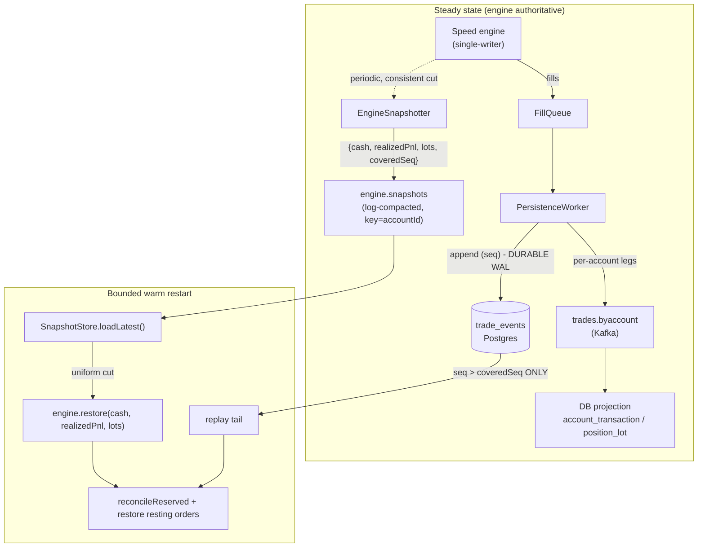
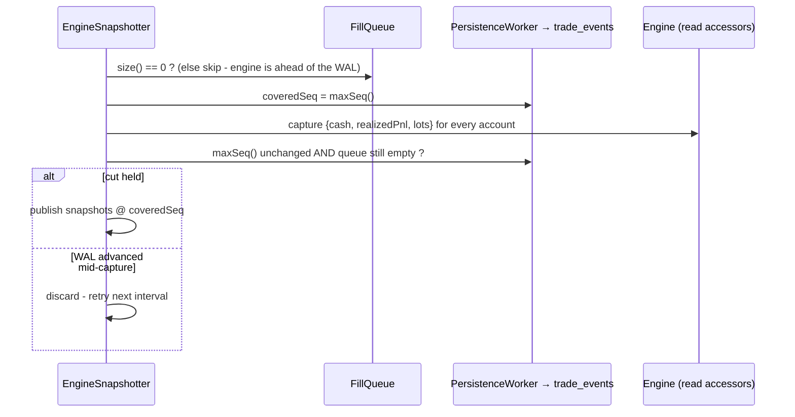

# ADR 0006 - Engine snapshots and bounded warm restart (Kafka-as-WAL, phase 1)

_Last updated: 2026-06-14 BST._

**Status:** Accepted · refines [ADR 0002](0002-in-memory-authoritative-engine.md) · builds on [ADR 0005](0005-disruptor-adoption.md)

## Context

[ADR 0002](0002-in-memory-authoritative-engine.md) fixed the system's shape: the in-memory matching
engine is the source of truth, and Postgres + Kafka are projections rebuilt from a durable log. The
throughput redesign (`docs/throughput-redesign-plan.md`, phases 0-3) then made the persistence tail
keep up with the [speed engine](0005-disruptor-adoption.md):

- **Phase 1** pipelined the `PersistenceWorker` publish (no per-batch broker join).
- **Phase 2** re-keyed the durable fill stream by account (`trades.byaccount`), making each account
  single-writer so the DB projector dropped `SELECT … FOR UPDATE`, lock ordering, and its global dedup.
- **Phase 3** made the cash projection append-only (`account_balance` frozen at the initial deposit;
  the running balance is the latest `account_transaction.balance_after`).

One scaling wall remained: **warm restart is unbounded.** `AccountBootstrapper.recoverFromLog` seeds
every account to the initial balance and then replays the **entire** `trade_events` log fill-by-fill
to rebuild positions and cash. Restart time grows linearly with lifetime trade volume - at engine rate
that log is effectively unbounded, so a cold start could take minutes to hours.

The throughput plan's phase 4 also aimed higher: move durability fully onto Kafka (the engine publishes
straight to a replicated WAL; no synchronous `trade_events` INSERT on the worker thread). That shift is
the highest-risk change in the plan - it rewrites the durability contract and the recovery path that is
currently correct and tested - and it needs validation under a **real** Kafka broker (replication,
retention, offsets), which `EmbeddedKafka` cannot exercise. Doing it in one step would put the proven
phases 0-3 at risk.

So this ADR takes the **foundational, independently-shippable** slice: make restart **bounded** via
periodic engine snapshots, while **keeping `trade_events` as the durable WAL**. The full Kafka-as-WAL
durability shift becomes a follow-up that this work de-risks (see _Deferred_).

## Decision

Adopt **engine state snapshots + bounded warm restart**, behind a default-off flag
(`fxoee.recovery.snapshots.enabled`), in four parts.

### 1. `TradingEngine.restore(account, cash, realizedPnl, lots)`

A new recovery primitive on the engine interface, implemented by **both** engines, that installs a
whole account's authoritative state from a snapshot **without replaying trades**: clear the account,
set cash + cumulative realized P&L, and re-open every `PositionLot` **preserving its id** (so lot ids
match the durable log and the DB projection). Locked margin is **not** passed in - the recovery driver
calls the existing `reconcileReserved` afterwards, which recomputes it authoritatively from the
restored positions + rebuilt resting books.

- **Default engine** (`MatchingService`): `positions.clear` → `positions.seed(lot)` per lot →
  `MarginLedger.restore(cash, realizedPnl)`. Lot ids are random UUIDs and round-trip naturally.
- **Speed engine** (`SpeedMatchingService`): the whole mutation runs inside one engine-thread command
  (single-writer, atomic w.r.t. matching). Lots are re-opened at their **original `seq`** via a new
  `SpeedPositions.restoreLot(…, seq)` primitive - the lot id is `new UUID(0, seq)`, so restoring at the
  same seq makes ids round-trip and keeps the `position_lot` projection from drifting when a restored
  position later closes. The lot-seq counter is advanced past every restored seq so later live opens
  never collide.

### 2. `EngineSnapshotter` → log-compacted `engine.snapshots`

A daemon (same pattern as `PersistenceWorker`; no `@EnableScheduling` dependency) that periodically
captures each account's `{cash, realizedPnl, open lots across all pairs, coveredSeq}` as an
`EngineSnapshot` and publishes it keyed by `accountId` to a **log-compacted** topic, so compaction
keeps only the latest snapshot per account - a restart loads `O(accounts)`, not `O(history)`.

### 3. Bounded `recoverFromLog`

`SnapshotStore` reads `engine.snapshots` end-to-end once at startup (manual `assign` + `seekToBeginning`
+ poll-until-caught-up) into a latest-per-account map. Recovery then:

1. loads the latest snapshot per account;
2. if the set is a **uniform cut** (every account present, all sharing one `coveredSeq`), calls
   `engine.restore(…)` per account and sets the replay floor to that `coveredSeq`;
3. otherwise falls back to the classic full reseed-to-initial + floor 0;
4. replays only `trade_events` rows with `seq > floor`;
5. restores resting orders from the `resting_orders` mirror and `reconcileReserved`s every touched
   account (unchanged);
6. relays the unpublished WAL tail (unchanged).

### 4. Keep `trade_events` as the durable WAL (for now)

Durability and the crash-recovery contract are **unchanged**: the worker still appends each
`TradeExecuted` to `trade_events` before publishing, and a snapshot is only ever an **optimization** of
where replay starts. A dropped snapshot, a stale snapshot, or the feature being off all degrade
gracefully to replaying more of the log - never to incorrect state. This is what lets the feature ship
behind a flag with the whole 917-test suite green.

### The consistent cut (the crux)

A snapshot must reflect **exactly** the fills with `seq ≤ coveredSeq`, or bounded replay corrupts state:
replaying a fill already folded into the snapshot **double-counts** (`replayFill` is not idempotent),
and skipping one **drops a trade**. The difficulty is that the engine runs **ahead** of the durable WAL
- it matches a fill, *then* the `FillQueue` → `PersistenceWorker` assigns it a `seq` and appends it.

The snapshotter therefore only commits a cut when it can prove consistency:

Because the snapshotter emits **all accounts at one `coveredSeq` per round**, the loaded set is normally
uniform, and recovery uses it; if it is not (a missing or skewed account snapshot), recovery safely
falls back to full replay.

## Consequences

**Positive**

- **Bounded restart.** With a recent uniform snapshot, recovery loads `O(accounts)` and replays only
  the WAL tail since the cut, instead of the whole log.
- **Lot identity round-trips.** Restoring lots at their original ids/seqs means a restored position
  closes against the same id in the log and the DB projection - no `position_lot` drift after restart.
- **No new drift surface.** The running balance still comes from the durable projection / engine; the
  snapshot does not introduce a second mutable source of truth. Reserved margin is always re-derived by
  `reconcileReserved`, so the snapshot's omission of locked margin cannot drift.
- **Safe to ship.** Off by default and additive: durability, the crash contract, and every existing
  test are unchanged. A bad/absent/stale snapshot only ever means a longer replay.

**Negative / accepted trade-offs**

- **Snapshots are opportunistic.** The consistency guard only commits a cut when the fill pipeline is
  drained, so under *sustained* max load snapshots are rare and the tail to replay grows. Acceptable:
  the system breathes between bursts, and correctness never depends on snapshot frequency.
- **The cut guard is not airtight (the main reason the feature is opt-in).** The `maxSeq`-stable +
  queue-empty guard narrows but does not close the window in which the engine has *applied* a fill but
  it has not yet reached the queue or the WAL. The speed engine applies a fill to state inside the match
  command, *then* the request thread calls `fillQueue.enqueue`, and the DB `seq` is assigned later still
  in `PersistenceWorker`; so between match and enqueue, `fillQueue.size()==0` and `maxSeq()` is unchanged
  even though engine state already reflects the fill. A snapshot published in that window has a
  `coveredSeq` that excludes a fill its state includes, and bounded replay then double-counts it. This
  **enqueue-lag** window is wider than the drained-but-not-yet-appended one; closing it needs the
  engine-stamped sequence (see _Deferred_).
- **The per-account capture is not one atomic cut**, and **lot-seq recovery can be under-restored**: a
  per-account snapshot carries only *open* lots, so restoring advances the engine-global
  `SpeedPositions.lotSeqCounter` only to the max open seq and could re-issue a seq a since-closed lot
  used. Both are facets of the same missing engine-stamped sequence. Until it lands and is validated
  under real Kafka load, `fxoee.recovery.snapshots.enabled` stays **false** by default. Note: the
  `TradingEngine.restore` primitive itself is independently correct and unit-tested in both engines; it
  is the snapshot *capture/cut* that is provisional.
- **WAL growth is not bounded.** Bounded *replay* does not bound WAL *size*; trimming `trade_events`
  rows below the minimum live `coveredSeq` is a separate follow-up.
- **Two recovery primitives.** `restore` joins `seedForReplay`/`replayFill`/`reconcileReserved` on the
  engine surface; both engines (incl. the delicate fixed-point speed engine) must keep parity.

## Deferred - full Kafka-as-WAL durability

This ADR deliberately stops short of the throughput plan's headline phase-4 goal (drop the synchronous
`trade_events` append; durability via Kafka replication). Reaching it from here needs, in order:

1. an **engine-stamped monotonic sequence** on each fill, so the snapshot cut is exact without the
   opportunistic guard (closes the enqueue-lag window above), plus a persisted global lot-seq
   high-water so a snapshot restore cannot re-issue a closed lot's id;
2. a **whole-event WAL topic** for replay - the per-account `trades.byaccount` legs cannot be cheaply
   reassembled into ordered trades, so Kafka-as-WAL needs a whole-`TradeExecuted` topic (or
   `trade_events` stays the WAL and only snapshotting + tail-replay move);
3. **real-Kafka load validation** of retention vs snapshot interval and the crash/replay cut.

Each step is independently shippable and testable, on top of the `restore` + snapshot + bounded-restart
foundation this ADR establishes. Back to the [ADR index](README.md).
