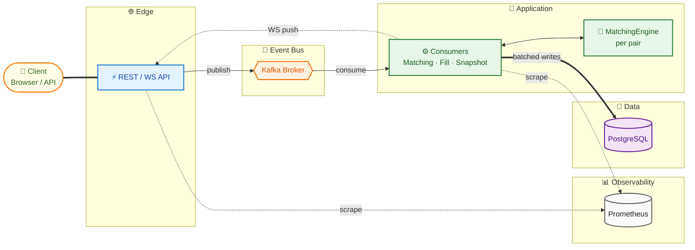

# High-level architecture

```mermaid
flowchart LR
    Client(["👤 Client<br/>Browser / API"])

    subgraph EdgeLayer ["🌐 Edge"]
        API["⚡ REST / WS API"]
    end

    subgraph EventBus ["📡 Event Bus"]
        Kafka{{"Kafka Broker"}}
    end

    subgraph AppLayer ["🧠 Application"]
        Engine["🔧 MatchingEngine<br/>per pair"]
        Consumers["⚙️ Consumers<br/>Matching · Fill · Snapshot"]
    end

    subgraph DataLayer ["💾 Data"]
        DB[("PostgreSQL")]
    end

    subgraph Obs ["📊 Observability"]
        Metrics[("Prometheus")]
    end

    Client === API
    API -- publish --> Kafka
    Kafka -- consume --> Consumers
    Consumers <--> Engine
    Consumers == batched writes ==> DB
    Consumers -. WS push .-> API
    API & Consumers -. scrape .-> Metrics

    classDef edge       fill:#e3f2fd,stroke:#1976d2,stroke-width:2px,color:#0d47a1
    classDef bus        fill:#fff3e0,stroke:#ef6c00,stroke-width:2px,color:#e65100
    classDef app        fill:#e8f5e9,stroke:#2e7d32,stroke-width:2px,color:#1b5e20
    classDef data       fill:#f3e5f5,stroke:#6a1b9a,stroke-width:2px,color:#4a148c
    classDef obs        fill:#fafafa,stroke:#616161,stroke-width:2px,color:#212121
    classDef actor      fill:#fffde7,stroke:#f57f17,stroke-width:2px,color:#33691e

    class Client actor
    class API edge
    class Kafka bus
    class Engine,Consumers app
    class DB data
    class Metrics obs
```
