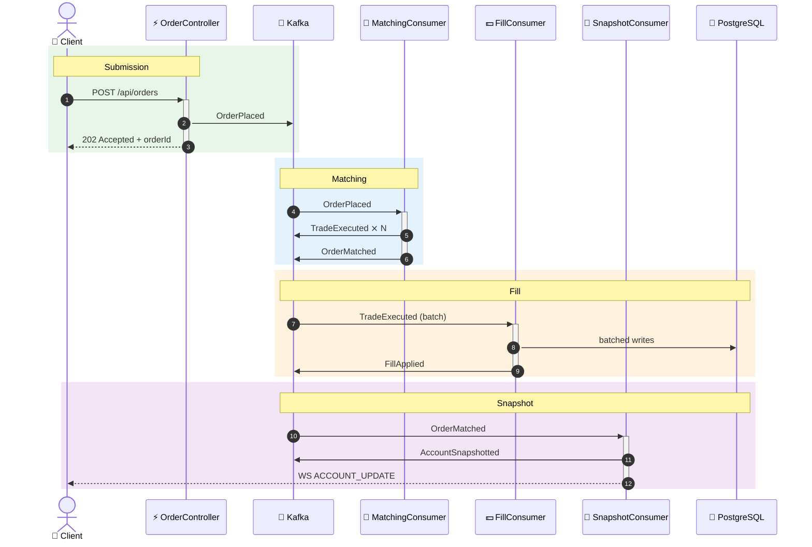

# Order flow — happy path

```mermaid
sequenceDiagram
    autonumber
    actor Client as 👤 Client
    participant API as ⚡ OrderController
    participant K as 📡 Kafka
    participant M as 🧮 MatchingConsumer
    participant F as 💵 FillConsumer
    participant S as 📸 SnapshotConsumer
    participant DB as 💾 PostgreSQL

    rect rgb(232, 245, 233)
        Note over Client,API: Submission
        Client->>+API: POST /api/orders
        API->>K: OrderPlaced
        API-->>-Client: 202 Accepted + orderId
    end

    rect rgb(227, 242, 253)
        Note over K,M: Matching
        K->>+M: OrderPlaced
        M->>K: TradeExecuted ⨯ N
        M->>K: OrderMatched
        deactivate M
    end

    rect rgb(255, 243, 224)
        Note over K,DB: Fill
        K->>+F: TradeExecuted (batch)
        F->>DB: batched writes
        F->>K: FillApplied
        deactivate F
    end

    rect rgb(243, 229, 245)
        Note over K,DB: Snapshot
        K->>+S: OrderMatched
        S->>K: AccountSnapshotted
        S-->>Client: WS ACCOUNT_UPDATE
        deactivate S
    end
```
