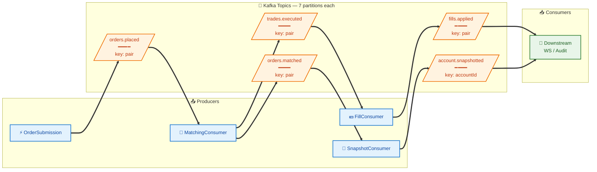

# Kafka topics

```mermaid
flowchart LR
    subgraph Producers ["📤 Producers"]
        direction TB
        OS["⚡ OrderSubmission"]
        MC["🧮 MatchingConsumer"]
        FC["💵 FillConsumer"]
        SC["📸 SnapshotConsumer"]
    end

    subgraph Topics ["📡 Kafka Topics — 7 partitions each"]
        direction TB
        T1[/"orders.placed<br/>━━━━<br/>key: pair"/]
        T2[/"trades.executed<br/>━━━━<br/>key: pair"/]
        T3[/"orders.matched<br/>━━━━<br/>key: pair"/]
        T4[/"fills.applied<br/>━━━━<br/>key: pair"/]
        T5[/"account.snapshotted<br/>━━━━<br/>key: accountId"/]
    end

    subgraph Consumers ["📥 Consumers"]
        DS["🔗 Downstream<br/>WS / Audit"]
    end

    OS ==> T1 ==> MC
    MC ==> T2 ==> FC
    MC ==> T3 ==> SC
    FC ==> T4 ==> DS
    SC ==> T5 ==> DS

    classDef prod   fill:#e3f2fd,stroke:#1976d2,stroke-width:2px,color:#0d47a1
    classDef topic  fill:#fff3e0,stroke:#ef6c00,stroke-width:2px,color:#bf360c
    classDef cons   fill:#e8f5e9,stroke:#2e7d32,stroke-width:2px,color:#1b5e20

    class OS,MC,FC,SC prod
    class T1,T2,T3,T4,T5 topic
    class DS cons
```
