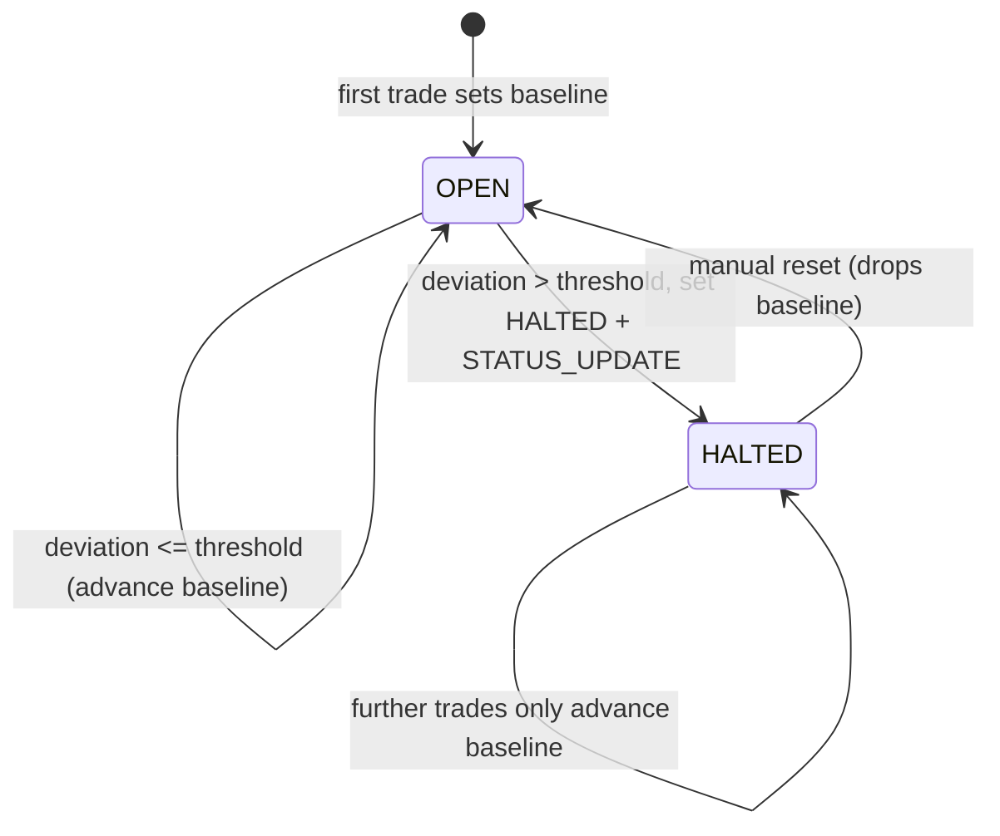

# Circuit Breaker

_Last updated: 2026-06-21 BST._

Price-deviation circuit breaker. Watches the relative jump between consecutive executed trade prices
per currency pair and halts a pair whose price moves too far in one step.

## How it works

1. After every `submit(order)` produces trades, the executed trade prices are fed to
   [`CircuitBreaker.onTrade`](../src/main/java/com/fxoee/service/CircuitBreaker.java), **outside the
   per-pair book lock** (a halt broadcasts over WebSocket, which must never run under the hot-path
   lock). The breaker is resolved lazily via an `ObjectProvider` to break the
   `MatchingService → TradingWebSocketHandler → CircuitBreaker` construction cycle. Both engines wire
   it: the lock engine in `MatchingService.notifyCircuitBreaker` and the speed engine in
   [SpeedMatchingService.java:457](../src/main/java/com/fxoee/engine/speed/SpeedMatchingService.java).
2. If the breaker is disabled (`fx.circuit-breaker.enabled=false`) or either argument is null,
   `onTrade` returns immediately and does nothing ([CircuitBreaker.java:59](../src/main/java/com/fxoee/service/CircuitBreaker.java)).
3. The first trade for a pair only records a baseline (`lastPrice`). Each subsequent trade computes
   `deviation = |price − lastPrice| / lastPrice` (10-dp `HALF_UP` division).
4. If `deviation > threshold` **and** the pair is currently `OPEN`, the breaker:
   - sets the pair to `HALTED` via [`TradingStatusService`](../src/main/java/com/fxoee/service/TradingStatusService.java);
   - broadcasts a `STATUS_UPDATE` WebSocket message (`broadcastStatus`);
   - logs a WARN line: `Circuit breaker triggered for {pair}` with the deviation;
   - if Kafka is enabled, publishes a `TradingHaltedEvent` (pair, deviation, threshold, timestamp)
     via the optionally-injected `OrderEventProducer` ([CircuitBreaker.java:73](../src/main/java/com/fxoee/service/CircuitBreaker.java)).
     The producer is null when `kafka.enabled=false`, so this step is skipped silently.
5. `lastPrice` is always advanced to the latest trade price, so an already-halted pair keeps tracking
   the baseline but cannot trip again until it is reset to `OPEN`.

State is per-pair and in a `ConcurrentHashMap`; `onTrade` runs on the matching thread.



The breaker only signals the halt. The pre-trade risk gate is what actually rejects orders on a
halted pair (see [Known limitations](#known-limitations)).

## Configuration

| Key | Env var | Default | Meaning |
| --- | --- | --- | --- |
| `fx.circuit-breaker.enabled` | `CIRCUIT_BREAKER_ENABLED` | `true` locally; `false` in k8s | Master switch. When `false`, `onTrade` returns immediately and no pair is ever halted by the breaker. |
| `fx.circuit-breaker.price-deviation-threshold` | `CIRCUIT_BREAKER_PRICE_DEVIATION_THRESHOLD` | `0.5` locally; `0.005` in k8s | Max allowed relative jump between consecutive trades. |

Both defaults depend on where you run it. `application.yml:240-241` ships `enabled=true` and threshold
`0.5` (50%, deliberately loose so mock-market volatility doesn't constantly halt pairs in local dev).
The k8s [configmap](../k8s/base/backend/configmap.yaml) ships `CIRCUIT_BREAKER_ENABLED=false` and
threshold `0.005` (0.5%), so the breaker is currently switched **off** in the k8s deploy (the lower
threshold is what would apply if it were re-enabled there). The constructor `@Value` fallbacks
([CircuitBreaker.java:48](../src/main/java/com/fxoee/service/CircuitBreaker.java)) are `enabled=true`
and threshold `0.005`; they only apply if the yml keys are removed entirely. On startup the breaker
logs `CircuitBreaker armed` (or `DISABLED`) with the active threshold.

## Endpoints

**Read status** ([`StatusController`](../src/main/java/com/fxoee/api/controller/rest/StatusController.java)):

```
GET /api/status            → { "EUR_USD": "OPEN", "GBP_USD": "HALTED", ... }
GET /api/status/EUR_USD    → { "pair": "EUR_USD", "status": "HALTED" }
```

**Resume halted pairs** ([`CircuitBreakerController`](../src/main/java/com/fxoee/api/controller/rest/CircuitBreakerController.java)):

```
POST /api/circuit-breaker/EUR_USD/reset   → 200 { "pair": "EUR_USD", "status": "OPEN" }
POST /api/circuit-breaker/reset-all       → 200 [ "EUR_USD", "GBP_USD", ... ]  (resumes every pair)
```

`reset` sets the pair back to `OPEN`, broadcasts `STATUS_UPDATE`, and drops the price baseline so the
next trade re-arms the breaker without comparing against a stale price. An unknown pair returns `400`.
`reset-all` does the same for every pair in one call, which is handy after a simulation run.

## WebSocket message

Same `type` / `payload` envelope as the other broadcasts (sent to sessions subscribed to the pair):

```json
{ "type": "STATUS_UPDATE", "payload": { "pair": "EUR_USD", "status": "HALTED" } }
```

## Known limitations

- **The breaker only signals; the pre-trade risk gate enforces the halt.** The breaker itself
  surfaces a halt via the status API, the `STATUS_UPDATE` broadcast, and the frontend badge. Hard
  enforcement lives in the risk gate ([doc 11](11-risk-controls.md)): it reads
  `TradingStatusService.getStatus(pair)` before the book lock and **rejects** new orders on a halted
  pair with `MARKET_HALTED`. So the breaker sets the halt and the risk gate makes it a trading stop.
- **In-memory, resets on restart.** `lastPrice` and pair status live only in the JVM; a restart clears
  them (every pair starts `OPEN`).
- **No automatic cool-down.** A halted pair stays halted until `reset` (or `reset-all`) is called;
  there is no timed auto-resume.
- **First trade is never a trigger.** It only establishes the baseline.
