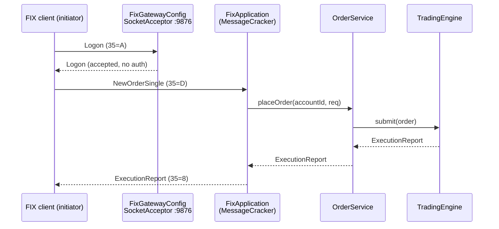

# FIX Session

_Last updated: 2026-06-21 BST._

FIX gateway built on **quickfix-j 2.3.2** (the FIX 4.4 message set), **v1 implemented**. Accepts
`NewOrderSingle (35=D)` and `OrderCancelRequest (35=F)` and replies with `ExecutionReport (35=8)` /
`OrderCancelReject (35=9)`. Orders run through the same `OrderService.placeOrder` / `cancelOrder` path
as the REST API, so matching, risk, and accounting behave identically.

The library comes from two Maven artifacts ([pom.xml](../pom.xml)): `org.quickfixj:quickfixj-core` and
`org.quickfixj:quickfixj-messages-fix44`, both at version `2.3.2`. QuickFIX/J owns the session layer
(Logon, Heartbeat, sequence numbers); the application logic lives in `FixApplication`.



## Enabling

Disabled by default so test/CI runs don't bind the port. Turn it on with:

```bash
FIX_ENABLED=true mvn -o spring-boot:run
```

Config property: `fx.fix.enabled` (`application.yml`). Listen port and CompIDs live in
`src/main/resources/fix-acceptor.cfg` (port `9876`).

## Connecting

This app is the **acceptor** (listener). Your client is the **initiator** and must use the mirror
CompIDs:

| Setting            | Client value         |
|--------------------|----------------------|
| BeginString        | `FIX.4.4`            |
| SenderCompID       | `CLIENT`             |
| TargetCompID       | `FXOEE`              |
| Socket host / port | `localhost` / `9876` |

No FIX-level auth in v1: any Logon is accepted.

## Components

| Component          | File                                       | Role                                                                      |
|--------------------|--------------------------------------------|---------------------------------------------------------------------------|
| `FixApplication`   | `infrastructure/fix/FixApplication.java`   | `quickfix.Application` + `MessageCracker`; handles `D`/`F`, sends `8`/`9` |
| `FixGatewayConfig` | `infrastructure/fix/FixGatewayConfig.java` | Boots the `SocketAcceptor` on startup, gated on `fx.fix.enabled`          |
| `fix-acceptor.cfg` | `resources/fix-acceptor.cfg`               | Session config: port, CompIDs, `FIX44.xml` data dictionary, memory store  |

## Supported messages and tags

### Inbound: NewOrderSingle (35=D)

| Tag | Field    | Required   | Notes                                                                            |
|-----|----------|------------|----------------------------------------------------------------------------------|
| 11  | ClOrdID  | yes        | Echoed back; stored as the order's `clientOrderId`                               |
| 1   | Account  | **yes**    | Trading account **UUID**. v1 routes purely on this tag; missing/invalid is rejected |
| 55  | Symbol   | yes        | FIX form `EUR/USD`; mapped to `CurrencyPair` (`EUR_USD`)                         |
| 54  | Side     | yes        | `1`=BUY, `2`=SELL                                                                |
| 40  | OrdType  | yes        | `1`=MARKET, `2`=LIMIT                                                            |
| 38  | OrderQty | yes        | Base-currency units                                                              |
| 44  | Price    | LIMIT only | Required when OrdType=`2`                                                        |

### Inbound: OrderCancelRequest (35=F)

| Tag | Field       | Required | Notes                                                                               |
|-----|-------------|----------|-------------------------------------------------------------------------------------|
| 41  | OrigClOrdID | yes      | Original client order id (echoed in replies)                                        |
| 11  | ClOrdID     | yes      | Id of this cancel request                                                           |
| 37  | OrderID     | **yes**  | Engine order id returned in the original ExecutionReport; cancellation keys on this |
| 1   | Account     | yes      | Account UUID owning the order                                                       |
| 55  | Symbol      | yes      | Order's pair                                                                        |

### Outbound: ExecutionReport (35=8)

Sent for new-order outcomes and cancel confirmations. Key tags: `37` OrderID, `17` ExecID,
`150` ExecType, `39` OrdStatus, `54` Side, `151` LeavesQty, `14` CumQty, `6` AvgPx, plus `32`/`31`
LastQty/LastPx on a fill and `58` Text on rejection.

Status mapping (`OrderStatus` → ExecType / OrdStatus):

| Domain status    | ExecType (150) | OrdStatus (39)       |
|------------------|----------------|----------------------|
| FILLED           | `F` Trade      | `2` Filled           |
| PARTIALLY_FILLED | `F` Trade      | `1` Partially filled |
| CANCELLED        | `4` Canceled   | `4` Canceled         |
| REJECTED         | `8` Rejected   | `8` Rejected         |
| NEW / PENDING    | `0` New        | `0` New              |

### Outbound: OrderCancelReject (35=9)

Sent when a cancel can't be honoured (unknown/terminal order, missing OrderID, bad account).
Carries `434` CxlRejResponseTo=`1`, `39` OrdStatus, and `58` Text reason.

## Known limitations (v1)

- **No FIX-level auth**: every Logon accepted (`FixApplication.fromAdmin`); account taken from tag `1`
  with no ownership check (`FixApplication.resolveAccount`).
- **One terminal report per order**: matching is synchronous, so a single `8` is sent. No separate
  `New` ack ahead of the fill, and resting-order fills are not streamed asynchronously later.
- **In-memory session store**: `MemoryStoreFactory` in `FixGatewayConfig`, and sequence numbers reset
  on each Logon (`ResetOnLogon=Y` in `fix-acceptor.cfg`); no replay.
- **No market data**: `MarketDataRequest (V)` / `MarketDataSnapshotFullRefresh (W)` not handled yet.

See [ADR-0004](adr/0004-async-fill-queue-over-disruptor.md) for the broader architectural context.
