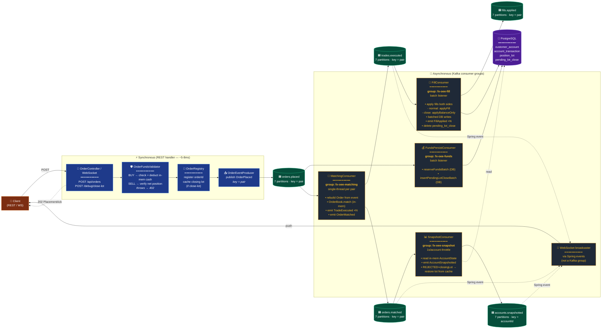

# FX Order Engine — Event Topology

**One picture, one principle.** The JVM in-memory state is the source of truth. Kafka is
the pipe through which the DB catches up. Every consumer's job is "make persistence reflect
the JVM, in batches, within ~1-2 seconds."

---

## The topology at a glance



---

## Who does what

### Synchronous side (REST handler)

| Component | Job |
|-----------|-----|
| **OrderController / WebSocket** | Accept order. For close-lot: look up `PositionLot`. Build `Order` (MARKET for close). |
| **OrderFundsValidator** | BUY → check in-memory cash, deduct, return `ReservationReceipt`. SELL → verify net position, no cash mutation. Throws `InsufficientFundsException` → REST returns **402**. |
| **OrderRegistry** | Track the order's `ReservationReceipt`, status, fill progress. For close-lot, also cache the pre-removed `PositionLot`. |
| **OrderEventProducer** | Publish `OrderPlaced` to `orders.placed`, keyed by `pair.name()`. Returns immediately. |

Return value: `PlacementAck{orderId, status, placedAt, statusUrl}`. HTTP **202 Accepted**.

### Asynchronous side (Kafka consumer groups)

| Consumer group | Listens on | Job |
|---|---|---|
| **fx-oee-funds** | `orders.placed` | Batch DB writes for funds reservation (`account_transaction` RESERVE rows + balance debits). For close-lot orders also writes `pending_lot_close` row for crash recovery. |
| **fx-oee-matching** | `orders.placed` | Per-pair single-threaded matcher. Mutates in-memory `OrderBook`. Emits one `TradeExecuted` per trade and one `OrderMatched` carrying terminal status. |
| **fx-oee-fill** | `trades.executed` | Batch listener. Two code paths: normal trades use `AccountState.applyFill` (FIFO close + lot lifecycle); close-lot trades use `applyBalanceOnly` + single `closeFull` on the targeted lot. All DB writes batched. Emits `FillApplied`. |
| **fx-oee-snapshot** | `orders.matched` | Read in-memory `AccountState`, emit `AccountSnapshotted`. On `REJECTED` with `closingLotId`, restore the cached lot back into `AccountState` and delete its `pending_lot_close` row. |

Plus **TradingWebSocketHandler** listens to Spring `ApplicationEvent`s fired by the
consumers above, so the client UI updates in real time without itself subscribing to Kafka.

---

## Two flows in one diagram

### Flow A — Normal order (open or FIFO close)

```
REST
 ├─ validator.reserve  (in-mem deduct)
 ├─ registry.register
 └─ produce OrderPlaced (closingLot = null)        → returns 202

→ fx-oee-funds:    persist RESERVE row to DB
→ fx-oee-matching: OrderBook.match → emit TradeExecuted, OrderMatched
→ fx-oee-fill:     applyFill (FIFO) → batched DB writes
→ fx-oee-snapshot: AccountSnapshotted
```

### Flow B — Lot-targeted close

```
REST
 ├─ lookup PositionLot
 ├─ build MARKET close order (opposite side)
 ├─ validator.reserve  (in-mem)
 ├─ state.removeLot    (in-mem pre-remove)
 ├─ registry.register + cacheClosingLot
 └─ produce OrderPlaced (closingLot = full lot)    → returns 202

→ fx-oee-funds:    persist RESERVE row + pending_lot_close row
→ fx-oee-matching: OrderBook.match → emit TradeExecuted(closingLotId), OrderMatched(closingLotId)
→ fx-oee-fill:     applyBalanceOnly (no FIFO walk) → closeFull on targeted lot →
                   delete pending_lot_close row
→ fx-oee-snapshot: AccountSnapshotted
                   (if REJECTED → restoreLot from cache + delete pending row)
```

---

## Why this shape

| Property | How it's achieved |
|---|---|
| **JVM = source of truth** | Validator mutates in-mem cash sync. All match/fill logic reads + writes in-mem first. |
| **DB lag ≤ ~1-2 s** | Consumers use `BATCH` ack mode, `max.poll.records=100`, one transactional flush per poll via `FillBatchRepository.batch(...)`. |
| **Per-pair ordering** | `orders.placed` and `trades.executed` keyed by `pair.name()`; partition count = pair count → 1:1 pair→partition mapping. |
| **Crash recovery** | `pending_lot_close` rows + `FundsPersistConsumer.rehydrateClosingLotCache()` `@PostConstruct` rebuild the in-mem closing-lot cache on JVM boot. |
| **Idempotent replay** | Each consumer keeps a bounded LRU `Set<eventId>` (50k-200k) → duplicate Kafka records become no-ops. |
| **Sync error UX** | Insufficient funds + unknown lot still surface as synchronous HTTP errors (`402`, `404`) because the validator + registry lookups happen before publish. |

---

## Topic reference

| Topic | Key | Partitions | Producer | Consumer groups |
|---|---|---|---|---|
| `orders.placed` | `pair.name()` | 7 | `OrderEventProducer` | `fx-oee-funds`, `fx-oee-matching` |
| `trades.executed` | `pair.name()` | 7 | `MatchingConsumer` | `fx-oee-fill` |
| `orders.matched` | `pair.name()` | 7 | `MatchingConsumer` | `fx-oee-snapshot`, WS |
| `fills.applied` | `pair.name()` | 7 | `FillConsumer` | downstream readers |
| `accounts.snapshotted` | `accountId` | 7 | `SnapshotConsumer` | WS, downstream |

No legacy `order-events` topic. No separate reservation event. One topic (`orders.placed`)
fans out to two consumer groups (`fx-oee-funds` persists the reservation, `fx-oee-matching`
runs the match) — single source of truth on the wire.

---

## DB schema touched

| Table | Written by | Purpose |
|---|---|---|
| `customer_account` | `FundsPersistConsumer`, `FillConsumer` | running cash balance |
| `account_transaction` | both above | append-only ledger (`RESERVE`, `RELEASE`, `FILL`, `CREDIT`) |
| `position_lot` | `FillConsumer` | open + closed lots |
| `pending_lot_close` | `FundsPersistConsumer` (insert), `FillConsumer` + `SnapshotConsumer` (delete) | in-flight close-lot recovery state |

---

## Files (current branch)

| Layer | File |
|---|---|
| REST | `src/main/java/com/fxoee/api/controller/rest/OrderController.java` |
| Submission orchestrator | `src/main/java/com/fxoee/service/OrderSubmissionService.java` |
| Validator | `src/main/java/com/fxoee/matching/OrderFundsValidator.java` |
| Producer | `src/main/java/com/fxoee/events/kafka/OrderEventProducer.java` |
| Topics | `src/main/java/com/fxoee/config/KafkaTopicConfig.java` |
| Consumer — funds | `src/main/java/com/fxoee/events/kafka/FundsPersistConsumer.java` |
| Consumer — matching | `src/main/java/com/fxoee/events/kafka/MatchingConsumer.java` |
| Consumer — fill | `src/main/java/com/fxoee/events/kafka/FillConsumer.java` |
| Consumer — snapshot | `src/main/java/com/fxoee/events/kafka/SnapshotConsumer.java` |
| Batched repo | `src/main/java/com/fxoee/persistence/FillBatchRepository.java` |
| Registry | `src/main/java/com/fxoee/application/OrderRegistry.java` |
| Migration | `src/main/resources/db/migration/V4__create_pending_lot_closes.sql` |
