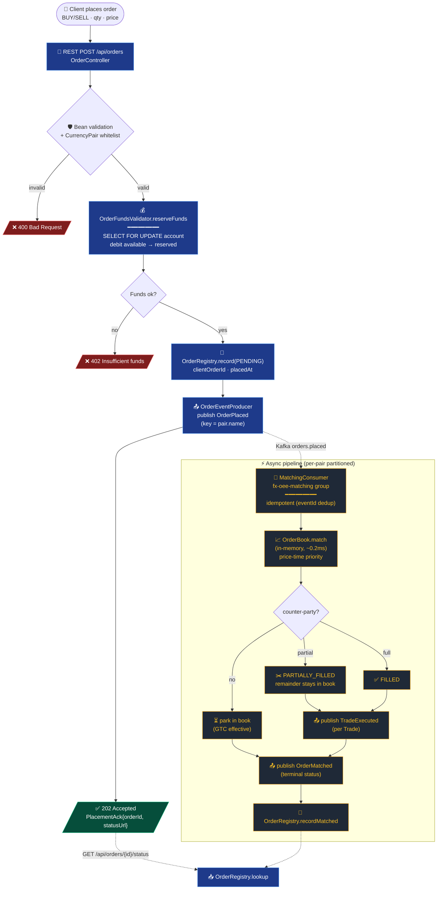

# FX Order Flow — Current (Event-Driven)

Placement → execution path on `feature/event-driven-orders`. Replaces the synchronous
spec in `fx_order_flow_english.svg`. The HTTP request now returns `202 Accepted`
after pre-trade funds reservation; matching happens asynchronously via Kafka.

## Key changes from `fx_order_flow_english.svg`

| Spec (SVG)                       | Current (event-driven)                                         |
|----------------------------------|----------------------------------------------------------------|
| Synchronous match, sync response | `202 Accepted` then async Kafka pipeline                       |
| Margin reserved post-fill        | **Pre-trade reservation** via `OrderFundsValidator`            |
| In-process callbacks             | Kafka topics `orders.placed` → `trades.executed` / `orders.matched` |
| Single-threaded match            | Per-pair single-writer via partition key = `pair.name()`       |
| ClOrdID generated, no audit      | `OrderRegistry` (in-mem) + `account_transaction` ledger (DB)   |

## Files

- `src/main/java/com/fxoee/api/controller/rest/OrderController.java`
- `src/main/java/com/fxoee/service/OrderSubmissionService.java`
- `src/main/java/com/fxoee/matching/OrderFundsValidator.java`
- `src/main/java/com/fxoee/events/kafka/OrderEventProducer.java`
- `src/main/java/com/fxoee/events/kafka/MatchingConsumer.java`
- `src/main/java/com/fxoee/application/OrderRegistry.java`
