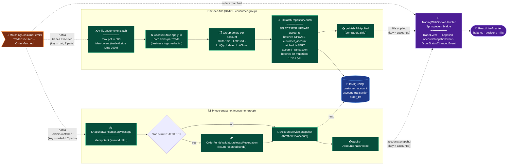

# FX Post-Fill Pipeline — Current (Event-Driven)

Post-fill fan-out on `feature/event-driven-orders`. Replaces in-process callbacks
shown in `fx_post_fill_english.svg`. Fills, account snapshots, and WS push now run
as independent Kafka consumer groups with batched DB writes.

## Key changes from `fx_post_fill_english.svg`

| Spec (SVG)                          | Current (event-driven)                                                |
|-------------------------------------|----------------------------------------------------------------------|
| Sequential in-process callbacks     | Independent Kafka consumer groups (`fx-oee-fills`, `fx-oee-snapshot`) |
| Per-fill DB writes (or none)        | **Batched JDBC** via `FillBatchRepository.batch(...)` — 1 txn / poll |
| In-memory account state             | PostgreSQL persistence with `SELECT FOR UPDATE` row locking          |
| Margin debited at fill              | Reservation released here only on `REJECTED`; debit was pre-trade    |
| WS push from match callback         | WS push from Spring events fired by `FillConsumer` / `SnapshotConsumer` |
| No replay safety                    | In-memory dedup (`tradeId:side`, `eventId`) — bounded LRU            |

## Ordering note

`FillConsumer` (writes state) and `SnapshotConsumer` (reads state) read different
topics → no happens-before guarantee between them. A snapshot consumed before its
fill is persisted will report stale balance. Mitigation: per-account 1s throttle
absorbs the gap in practice. See `docs/kafka-event-flow/ordering.md`.

## Files

- `src/main/java/com/fxoee/events/kafka/FillConsumer.java`
- `src/main/java/com/fxoee/events/kafka/SnapshotConsumer.java`
- `src/main/java/com/fxoee/persistence/FillBatchRepository.java`
- `src/main/java/com/fxoee/persistence/CustomerAccountRepository.java`
- `src/main/java/com/fxoee/api/websocket/TradingWebSocketHandler.java`
- `frontend/src/simulator.jsx` (LiveAdapter)
