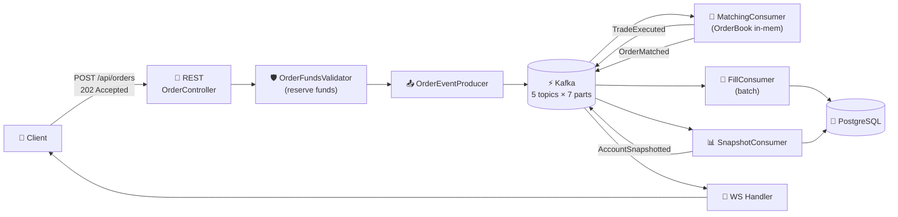

# FX Order Flow — Implementation Gap Analysis

Compare `fx_order_flow_english.svg` + `fx_post_fill_english.svg` against current codebase
on branch `feature/event-driven-orders`.
Each row: ✅ done · ⚠️ partial · ❌ missing.

> **Major update (2026-05):** Event-driven order pipeline shipped. Kafka fan-out,
> pre-trade funds reservation, batched DB persistence, and async REST `202 Accepted`
> are now live. See `docs/kafka-event-flow/README.md` for the architecture diagrams.

---

## Part 1 — Order Placement to Execution

| Step | Flow Spec | Status | Notes |
|------|-----------|--------|-------|
| Client places order | BUY/SELL · qty · price · TIF | ✅ | REST `POST /api/orders` (`OrderController`) + WS path retained |
| Order validation | format · lot size · symbol supported | ⚠️ | Bean validation + `CurrencyPair` enum whitelist; no explicit lot-size rule |
| Pre-trade risk check | margin · position limit · buying power | ✅ | `OrderFundsValidator.reserveFunds()` runs synchronously before publishing `OrderPlaced` |
| Persist order · status PENDING · generate ClOrdID · reserve margin | ✅ | `OrderRegistry` records PENDING + `placedAt`; reservation receipt held in DB row; `clientOrderId` propagated |
| Async ack to client | `202 Accepted` + `PlacementAck{orderId,statusUrl}` | ✅ | REST returns immediately; status pollable via `GET /api/orders/{id}/status` |
| Matching Engine | price-time priority · TreeMap bid/ask | ✅ | `MatchingEngine` + `OrderBook` — unchanged, now driven by `MatchingConsumer` |
| Per-pair single-writer | partition key = currency pair | ✅ | `orders.placed` keyed by `pair.name()`, 7 partitions = pair count |
| Lot-targeted close | async event-driven | ✅ | `submitClose` returns `PlacementAck`; sync reserve + pre-remove; `OrderPlaced.closingLot` drives close-branch in FillConsumer; SnapshotConsumer restores lot on REJECTED |
| Pending close crash recovery | persisted across restart | ✅ | `pending_lot_close` table written by `FundsPersistConsumer`; rehydrated into `OrderRegistry` on JVM boot |
| No counter-party | GTC waits / IOC·FOK cancel | ⚠️ | GTC works; IOC/FOK still not modeled |
| Partial fill path | remainder back to book | ✅ | `PARTIALLY_FILLED`, lot stays in `OrderBook` |
| Trade record · status FILLED | executedQty · price · timestamp | ✅ | `Trade` + `Order.fill()`; terminal status carried in `OrderMatched` event |
| Publish `OrderFilledEvent` to Kafka | per-trade fan-out | ✅ | `MatchingConsumer` publishes `TradeExecuted` per trade + one `OrderMatched` |

---

## Part 2 — Post-Fill Pipeline

| Step | Flow Spec | Status | Notes |
|------|-----------|--------|-------|
| Kafka fan-out to independent consumers | 3+ consumer groups | ✅ | `fx-oee-matching`, `fx-oee-fills` (batch), `fx-oee-snapshot`, plus WS broadcaster |
| **Account Service** | debit cost · release reservation | ✅ | `FillConsumer` applies both sides via `AccountState.applyFill`; `SnapshotConsumer` releases reservation on `REJECTED` |
| Account DB persistence | available balance · reserved | ✅ | `FillBatchRepository.applyFillDeltaBatch` — batched UPDATE + INSERT per Kafka poll, single txn |
| Concurrency protection | row-level locks | ✅ | `SELECT … FOR UPDATE` per affected account in batch flush |
| **Position Service** | exposure · long/short · avg entry | ✅ | Lot tracking preserved verbatim; `insertOpenBatch` / `updateQuantityBatch` / `closeFullBatch` persist lot lifecycle |
| Position DB | open position · realized P&L on close | ✅ | Lot rows persisted via `FillBatchRepository`; PnL computed on close |
| **Notification Service** | WebSocket push | ✅ | `TradingWebSocketHandler` consumes Spring events from `FillConsumer` + `SnapshotConsumer` |
| Account snapshot publish | `AccountSnapshotted` topic | ✅ | `SnapshotConsumer` publishes throttled snapshots; WS push to UI |
| Client UI update | balance + position refreshed | ✅ | React `LiveAdapter` handles snapshot/fill push messages |
| Order status → FILLED | audit log | ⚠️ | Status via `OrderRegistry.recordMatched`; `account_transaction` ledger acts as fill audit; no order-state audit table |
| Idempotency on replay | exactly-once-ish | ⚠️ | In-memory dedup set per consumer (`eventId` / `tradeId:side`), bounded LRU; lost on restart → replay window |

---

## Summary

**Score: 17 ✅ · 3 ⚠️ · 0 ❌**

**Newly shipped (was ❌/⚠️ → now ✅):**
- Kafka topology with 5 topics, 7 partitions each, partition key = pair / accountId
- Async REST flow with `202 Accepted` + status endpoint
- Pre-trade funds reservation (correct margin model)
- DB persistence layer (`customer_account`, `account_transaction`, lot rows)
- Batched JDBC writes via `FillBatchRepository.batch(...)` — one round-trip per poll
- Fan-out fill / snapshot consumers as independent groups
- Row-level locking on account updates

**Remaining partial (⚠️):**
- **Validation:** no lot-size rule (symbol whitelist via `CurrencyPair` enum is fine)
- **TIF:** still only effective-GTC; IOC / FOK not modeled in `Order`
- **Audit log:** `account_transaction` covers cash side; no dedicated `order_audit` table
  capturing state transitions
- **Idempotency durability:** dedup set is in-memory; replace with `processed_events`
  row or Kafka EOS for production

**Completed since previous revision:**
- `submitClose` now event-driven (returns `PlacementAck`, async match/fill/snapshot)
- Legacy `order-events` topic + `OrderEventConsumer` removed; reservation persistence
  now handled by `FundsPersistConsumer` consuming `orders.placed` in a separate group
- `pending_lot_close` table persists pre-removed lots for JVM-crash recovery

---

## Key Files (current branch)

| Area | File |
|------|------|
| REST entry | `src/main/java/com/fxoee/api/controller/rest/OrderController.java` |
| Submission orchestrator | `src/main/java/com/fxoee/service/OrderSubmissionService.java` |
| Pre-trade reservation | `src/main/java/com/fxoee/matching/OrderFundsValidator.java` |
| Kafka producer | `src/main/java/com/fxoee/events/kafka/OrderEventProducer.java` |
| Matching consumer | `src/main/java/com/fxoee/events/kafka/MatchingConsumer.java` |
| Fill consumer (batch) | `src/main/java/com/fxoee/events/kafka/FillConsumer.java` |
| Snapshot consumer | `src/main/java/com/fxoee/events/kafka/SnapshotConsumer.java` |
| Topic config | `src/main/java/com/fxoee/config/KafkaTopicConfig.java` |
| Batched persistence | `src/main/java/com/fxoee/persistence/FillBatchRepository.java` |
| Account repo | `src/main/java/com/fxoee/persistence/CustomerAccountRepository.java` |
| Status registry | `src/main/java/com/fxoee/application/OrderRegistry.java` |
| WS broadcaster | `src/main/java/com/fxoee/api/websocket/TradingWebSocketHandler.java` |
| Matching core | `src/main/java/com/fxoee/matching/MatchingEngine.java`, `OrderBook.java` |
| Order model | `src/main/java/com/fxoee/domain/model/Order.java` |
| Frontend WS | `frontend/src/simulator.jsx` (LiveAdapter) |

---

## Current Architecture (mermaid)

See `docs/kafka-event-flow/README.md` for the full diagrams (system architecture,
sequence, topology) and ordering / failure-mode docs.
