# Speed Engine: Thread & Architecture Guide

_Last updated: 2026-06-13._

This document is a **visual map** of how the speed engine runs: which threads exist, what each one owns, how commands flow through the Disruptor ring, and where work happens. It complements the deeper semantics guide in [speed-engine.md](speed-engine.md).

Enable speed mode with `fxoee.engine.mode=speed` (or env `FXOEE_ENGINE_MODE=speed`). On this branch `performance.properties` sets it, and the k8s backend configmap sets `FXOEE_ENGINE_MODE: "speed"`, so speed mode is the active engine. Spring wires everything in [SpeedEngineConfig.java](../src/main/java/com/fxoee/engine/speed/SpeedEngineConfig.java).

---

## At a glance

| Concept | What it means |
|---------|----------------|
| **Single writer** | One thread (`speed-engine`) owns all mutable trading state, no locks on the hot path |
| **Multi producer** | Any number of request threads can publish commands into the ring at once |
| **Synchronous submit** | Each caller blocks on its own `ResultBuffer` until the engine answers |
| **Edge conversion** | `BigDecimal` only on request threads; the engine thread uses fixed-point `long`s |
| **LMAX pattern** | Same Disruptor library (LMAX Disruptor 4.0.0) as the [fill queue](05-event-sourcing-persistence.md), but here it carries commands *into* the engine |

---

## Thread topology

This is the picture to keep in your head. **One dedicated engine thread** does all matching; **many request threads** publish work and wait for answers.

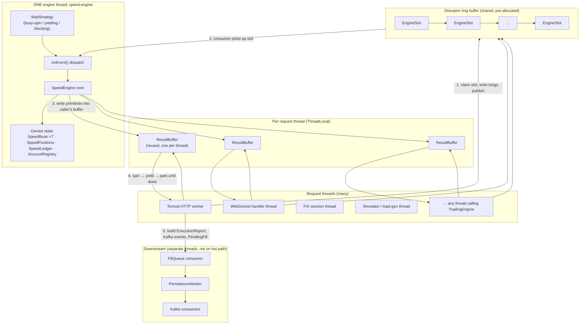

### Thread roles

| Thread | Name / source | Role | Allocates on hot path? |
|--------|---------------|------|------------------------|
| **Engine** | `speed-engine` (daemon) | Sole mutator of books, positions, ledger | **No** (steady state) |
| **Submitters** | Tomcat, WS, FIX, simulator, … | Convert `Order` → longs, publish, await, build reports/events | Yes (domain objects, events) |
| **Observers** | WS snapshot schedulers, debug endpoints | Read book via `SpeedOrderBookView` → `EXEC` on engine thread | Yes (BigDecimal copies) |
| **Projection** | `FillQueue` / `PersistenceWorker` / Kafka | Persist fills asynchronously | Yes (expected, off hot path) |

### CPU pinning (optional)

When `fxoee.engine.speed.cpu` is set (≥ 0), the engine thread is pinned to that core via OpenHFT Affinity (3.23.3). This keeps the single writer on one CPU and avoids cache-migration stalls. Pinning is Linux-only: on macOS dev hosts and other unsupported platforms `Affinity.setAffinity` is a no-op, and any failure is logged rather than allowed to kill the engine thread. `-1` disables it entirely. This branch sets `cpu=2` in `performance.properties`.

---

## Component map

Who talks to whom, useful when tracing a stack trace.

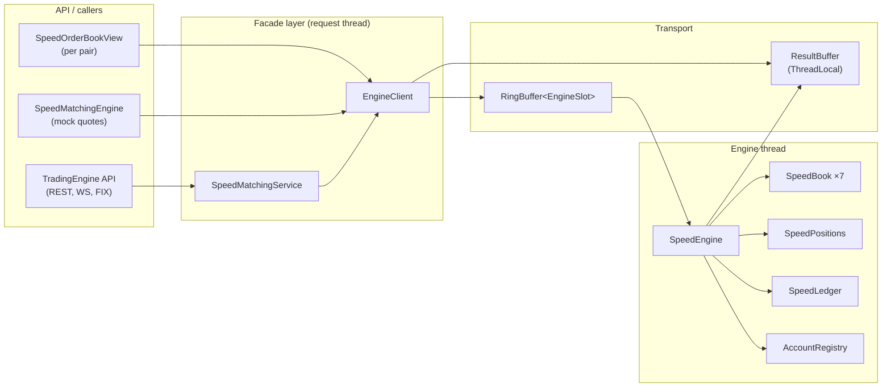

| Class | Package | Thread | Responsibility |
|-------|---------|--------|----------------|
| [SpeedMatchingService](../src/main/java/com/fxoee/engine/speed/SpeedMatchingService.java) | `engine.speed` | Request | `TradingEngine` facade: validation, convert, publish, materialise reports |
| [EngineClient](../src/main/java/com/fxoee/engine/speed/EngineClient.java) | `engine.speed` | Request | ThreadLocal `ResultBuffer`, `publishAndWait`, `exec` |
| [SpeedEngine](../src/main/java/com/fxoee/engine/speed/SpeedEngine.java) | `engine.speed` | **Engine** | Disruptor consumer, dispatch, match, funds, reconcile |
| [EngineSlot](../src/main/java/com/fxoee/engine/speed/EngineSlot.java) | `engine.speed` | Both | Ring event: command type + primitive inputs |
| [ResultBuffer](../src/main/java/com/fxoee/engine/speed/ResultBuffer.java) | `engine.speed` | Both | Caller-owned result arrays + done handshake |
| [SpeedBook](../src/main/java/com/fxoee/engine/speed/SpeedBook.java) | `engine.speed` | **Engine** | Long-native order book (pooled nodes) |
| [SpeedPositions](../src/main/java/com/fxoee/engine/speed/SpeedPositions.java) | `engine.speed` | **Engine** | FIFO lots, net qty, held margin |
| [SpeedLedger](../src/main/java/com/fxoee/engine/speed/SpeedLedger.java) | `engine.speed` | **Engine** | Cash, reserved, per-pair pending margin |
| [AccountRegistry](../src/main/java/com/fxoee/engine/speed/AccountRegistry.java) | `engine.speed` | **Engine** | `UUID` → dense `int` index |
| [Fixed](../src/main/java/com/fxoee/engine/speed/Fixed.java) | `engine.speed` | Both | Scale constants, `long` ↔ `BigDecimal` conversion |
| [SpeedOrderBookView](../src/main/java/com/fxoee/engine/speed/SpeedOrderBookView.java) | `engine.speed` | Request | `OrderBook` API over engine thread reads |
| [SpeedMatchingEngine](../src/main/java/com/fxoee/engine/speed/SpeedMatchingEngine.java) | `engine.speed` | Request | Book-only match for mock quote injection |

---

## Order submit: end-to-end sequence

Track one `submit(Order)` from HTTP to engine and back.

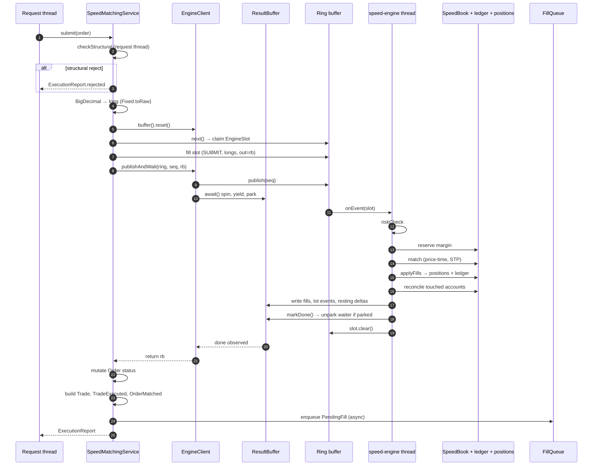

### Where time is spent

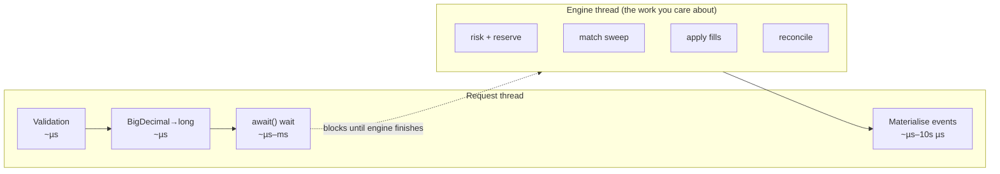

- **Clean rest** (LIMIT rests, no fills): reconcile is skipped → ~O(1), ~1.5 M orders/s in bench.
- **Matching** (fills occur): reconcile runs → ~1.5 µs/order service time, ~600 k/s ceiling on one core.

---

## Ring commands

Every interaction with mutable state goes through an `EngineSlot` command. The engine thread dispatches in `SpeedEngine.onEvent()`.

`EngineSlot.cmd` is one of five `byte` constants: `SUBMIT=0`, `BOOK_ADD=1`, `CANCEL=2`, `EXEC=3`, `MATCH_RAW=4`.

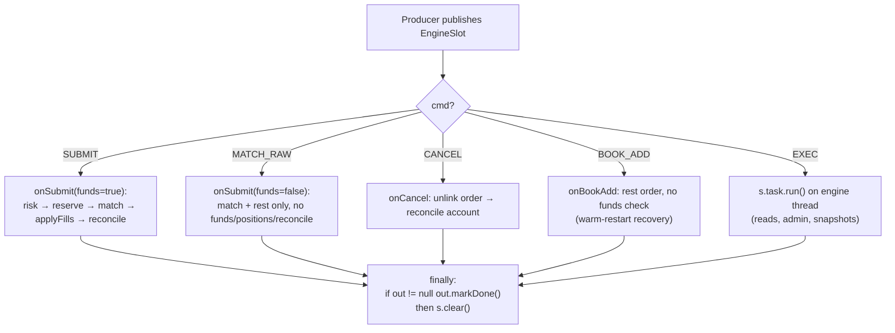

The `finally` block in `onEvent` is uniform: it calls `out.markDone()` whenever `slot.out != null`, then always runs `slot.clear()`. Whether a caller waits is therefore decided by whether it set `slot.out`, not by the command type.

| Command | `out` set? | Caller waits? | Typical caller |
|---------|------------|---------------|----------------|
| `SUBMIT` | Yes | Yes | `SpeedMatchingService.submit` |
| `CANCEL` | Yes | Yes | `SpeedMatchingService.cancel`, `SpeedOrderBookView.cancelOrder` |
| `MATCH_RAW` | Yes | Yes | `SpeedMatchingEngine.match` (mock quotes) |
| `BOOK_ADD` | Yes (via `command()`) | Yes | recovery, `SpeedOrderBookView.addOrder` (the handler ignores `out` but the caller still awaits `markDone`) |
| `EXEC` | Yes (via `command()`) | Yes | `EngineClient.exec`: snapshots, `cash()`, book depth, `reconcileReserved` |

Every caller goes through `EngineClient.command()` / `publishAndWait()`, both of which set `slot.out` to the thread-local `ResultBuffer` and `await()` it, so all five command types are synchronous round-trips. `BOOK_ADD` and `EXEC` simply leave the result arrays empty (or the `EXEC` task fills `slot.out` itself, e.g. `reconcileReserved` writes resting deletes).

**Critical rule:** an `EXEC` task must **never** publish back to the ring. The single consumer cannot drain behind itself, so a full ring deadlocks.

---

## Result handshake (request ↔ engine)

Each submitting thread owns one reusable [ResultBuffer](../src/main/java/com/fxoee/engine/speed/ResultBuffer.java). Results never travel in the ring slot, only primitives and refs written into the caller's buffer.

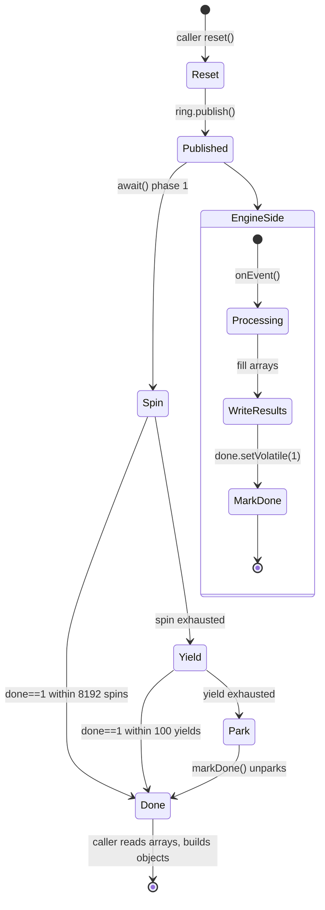

### Why waiters park (not spin forever)

| Who | Wait behaviour | Why |
|-----|----------------|-----|
| **Engine thread** | `BusySpinWaitStrategy` by default | Pick up new commands in sub-µs |
| **Submitting threads** | Spin briefly → yield → **park** | N busy-spinning waiters starve the engine off CPU |

Under many concurrent submitters, parked threads release cores so `speed-engine` stays scheduled. Throughput scales with submitter count instead of collapsing.

---

## State owned by the engine thread

All of this lives in [SpeedEngine](../src/main/java/com/fxoee/engine/speed/SpeedEngine.java). **No other thread may mutate it** (reads go through `EXEC` or volatile top-of-book mirrors).

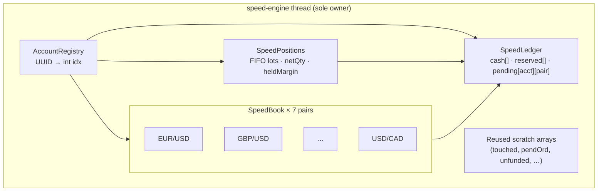

### Per-book structure (inside `SpeedBook`)

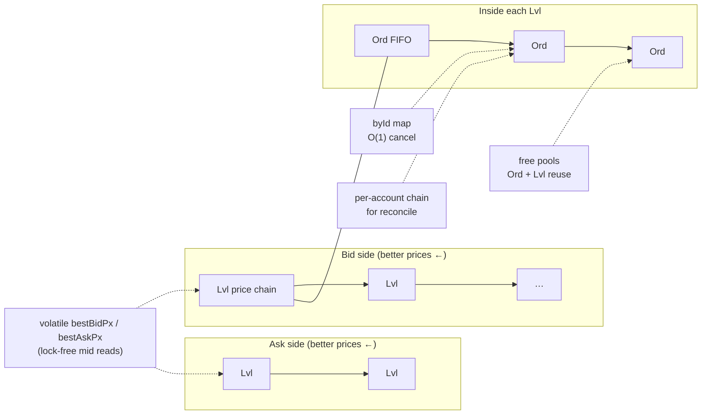

---

## SUBMIT pipeline (engine thread detail)

What `onSubmit()` does for a normal order, the inner loop of the architecture.

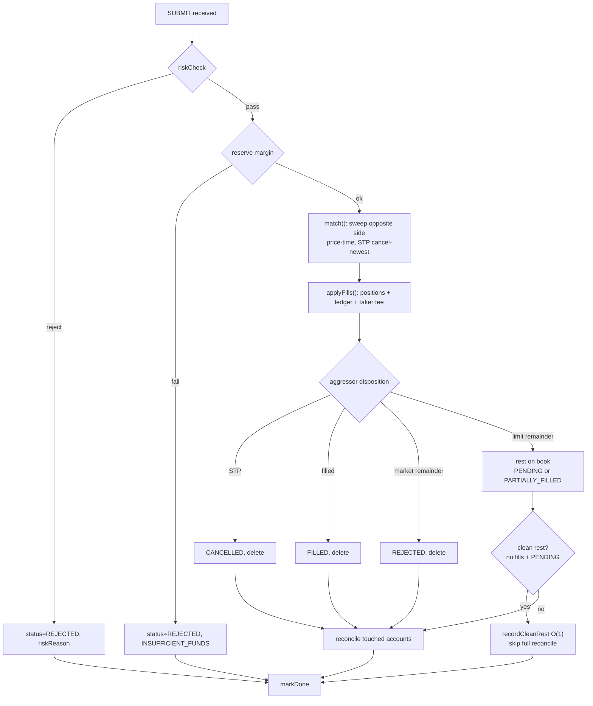

---

## Read paths (observers)

Anything that needs a consistent view of book state routes through the engine thread.

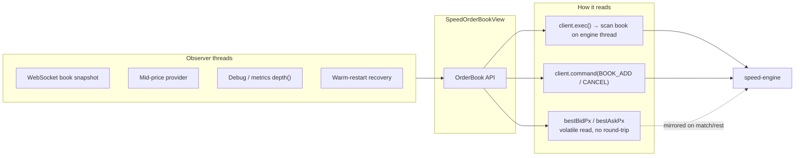

| Read | Mechanism | Blocks engine? |
|------|-----------|----------------|
| `bestBid()` / `bestAsk()` | Volatile mirror on `SpeedBook` | No |
| `depth()` gauge | `EXEC`: count levels | Briefly |
| `getSnapshot()` bids/asks | `EXEC`: walk book, convert to `BigDecimal` | Briefly |
| `cash()` / `netQty()` / `snapshot()` | `EXEC` on engine thread | Briefly |

Reads cost microseconds, fine for 200 ms WebSocket snapshots; they never need locks because they run on the only mutator thread (or read volatiles it maintains).

---

## Integration with the rest of the app

Speed mode swaps the engine implementation; the outer shell stays the same.

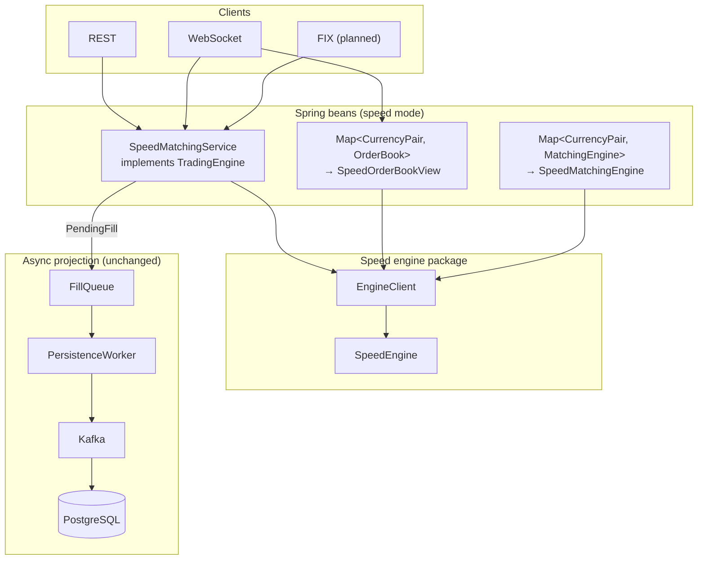

- **Trading rules** are identical to default mode (see [speed-engine.md](speed-engine.md)).
- **Metrics** keep the same names (`matching.latency`, `orders.placed.total`, …).
- **Risk gate** runs long-native inside the engine thread, mirroring `InProcessRiskService`'s checks against the shared `RiskLimits` bean. The facade's `setRiskGate(RiskService, TradingStatusService)` only forwards `TradingStatusService` (the halt source) into the engine; `RiskService` itself is never called per order, since it would allocate request/decision records.

---

## Configuration quick reference

| Property | Default (binding) | On this branch | Effect |
|----------|-------------------|----------------|--------|
| `fxoee.engine.mode` | `default` | `speed` | Set to `speed` to activate this architecture |
| `fxoee.engine.speed.wait-strategy` | `busy-spin` | (unset, so `busy-spin`) | How the **engine thread** waits for ring events: `busy-spin` / `yielding` / `blocking` |
| `fxoee.engine.speed.book-map-capacity` | `65536` | `65536` | Agrona open-addressing map capacity per `SpeedBook` (five maps per book) |
| `fxoee.engine.speed.cpu` | `-1` | `2` | CPU core to pin `speed-engine` via OpenHFT Affinity (`-1` = off; Linux only, no-op elsewhere) |

The defaults come from the `@Value` fallbacks in [SpeedEngineConfig](../src/main/java/com/fxoee/engine/speed/SpeedEngineConfig.java); `performance.properties` overrides them on this branch.

The **command** ring size is a compile-time constant `RING_SIZE = 1 << 16` (`65536` slots) in `SpeedEngineConfig`, ~0.4 s of burst headroom at 150k orders/s. It is not configurable, and it is a different ring from the persistence-side `fxoee.disruptor.ring-buffer-size` (`1048576`), which sizes the `FillQueue` Disruptor between the facade and `PersistenceWorker`, not the engine command ring.

---

## Mental model checklist

Use this when reading code or debugging:

1. **Is this thread `speed-engine`?** → It may mutate `SpeedBook`, `SpeedPositions`, `SpeedLedger`.
2. **Any other thread?** → Convert at the edge, publish a command, await `ResultBuffer`, build Java objects.
3. **Need consistent read?** → `EngineClient.exec()`; never read engine arrays directly from Tomcat.
4. **Inside `EXEC`?** → Never call `ring.publish()` (deadlock).
5. **Who spins hot?** → Engine thread (busy-spin). Submitters park under load.
6. **Where do results live?** → Caller's `ResultBuffer`, not the ring slot.
7. **One core ceiling?** → All pairs share one writer; shard per pair is the scale-out path (future).

---

## Related docs

| Doc | Contents |
|-----|----------|
| [speed-engine.md](speed-engine.md) | Fixed-point scales, performance numbers, parity with default engine |
| [03-engine-core.md](03-engine-core.md) | Default engine pipeline (semantic reference) |
| [05-event-sourcing-persistence.md](05-event-sourcing-persistence.md) | `FillQueue` → Kafka → DB |
| [11-risk-controls.md](11-risk-controls.md) | Risk limits and kill-switch |
| [01-architecture.md](01-architecture.md) | Whole-system layout (default + speed) |
