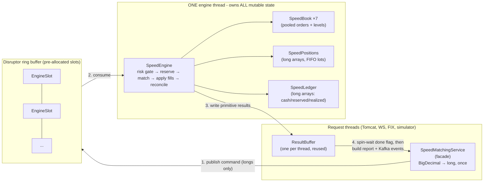
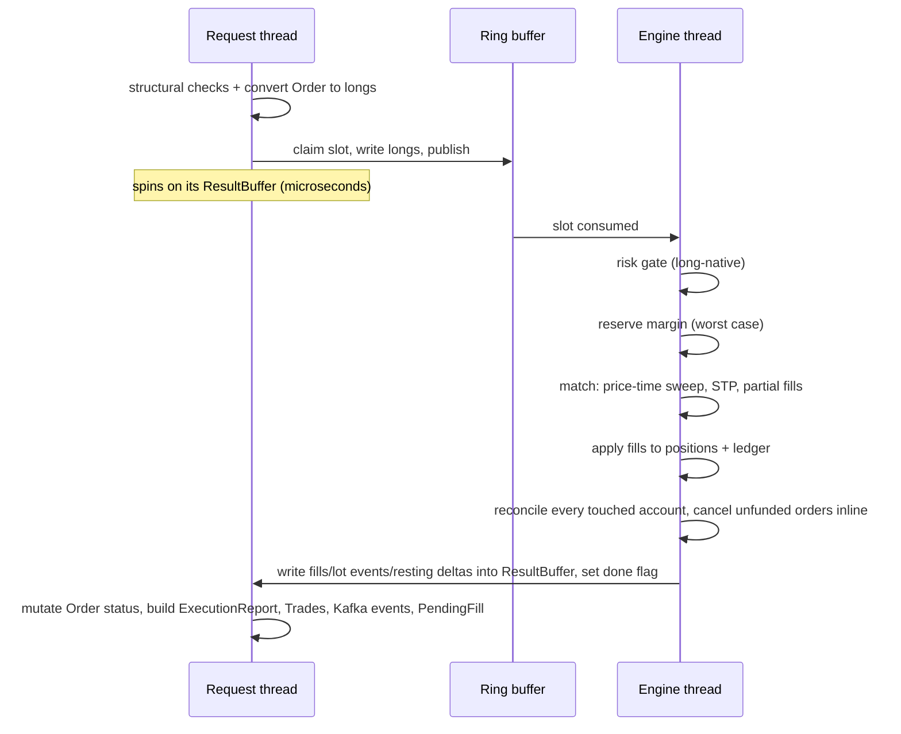
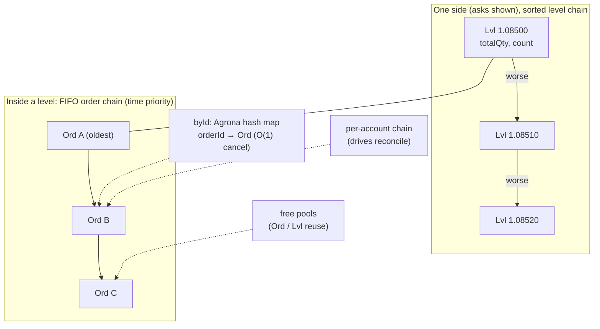
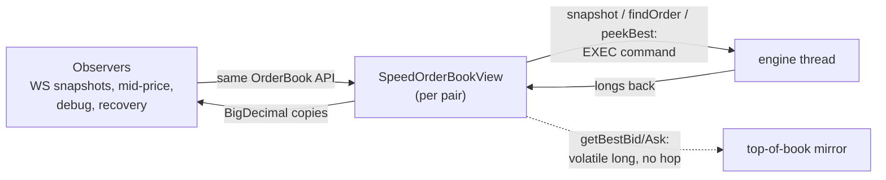
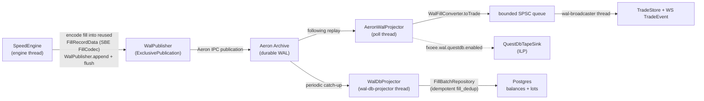

# Speed engine (fxoee.engine.mode=speed)

_Last updated: 2026-06-20 BST._

> **Thread & architecture diagrams:** see [speed-engine-architecture.md](speed-engine-architecture.md) for a visual map of threads, the Disruptor ring, and command flow.

The system ships **two interchangeable matching engines** behind one interface,
[TradingEngine.java](../src/main/java/com/fxoee/engine/TradingEngine.java). Which one runs is a
single property in [performance.properties](../src/main/resources/performance.properties):

```properties
# default = reference engine (BigDecimal, per-pair locks)
# speed   = single-writer engine (fixed-point longs, zero allocation on the hot path)
fxoee.engine.mode=default
```

Relaxed binding applies, so `FXOEE_ENGINE_MODE=speed` works as an env var. Both engines implement
the **same trading rules**: price-time priority, maker pricing, self-trade prevention
(cancel-newest), FIFO lot netting, margin-locked funding, the post-match reconcile, the taker fee,
and the same Kafka / `FillQueue` projection events. What changes is *how* the work is executed.

## The two engines at a glance

|                        | `default` ([MatchingService](../src/main/java/com/fxoee/engine/MatchingService.java)) | `speed` ([SpeedMatchingService](../src/main/java/com/fxoee/engine/speed/SpeedMatchingService.java)) |
|------------------------|---------------------------------------------------------------------------------------|-----------------------------------------------------------------------------------------------------|
| Arithmetic             | `BigDecimal` everywhere                                                               | fixed-point `long`s (see scales below)                                                              |
| Concurrency            | per-pair book locks + per-account locks                                               | **one engine thread owns all state**, no locks                                                      |
| Allocation per order   | many small objects (BigDecimals, lists, streams)                                      | **zero** in steady state on the engine thread                                                       |
| Cross-pair reconcile   | runs outside the book lock to avoid ABBA deadlock                                     | plain method call (single writer, nothing to deadlock)                                              |
| Where BigDecimal lives | everywhere                                                                            | only at the edges: convert once on submit, convert back when building reports/events                |

## Why this is faster, in plain words

The default engine pays three taxes on every order:

1. **BigDecimal**: every add/multiply allocates a new object and does slow arbitrary-precision math.
2. **Locks**: the book lock serializes a pair, and the lock/unlock itself costs time; reconcile has
   to dance around cross-pair deadlocks ([01 - Architecture](01-architecture.md)).
3. **Garbage**: thousands of short-lived objects per second make the GC steal CPU at random moments,
   which is exactly what produces latency spikes at the tail (p99).

The speed engine removes all three. Prices and amounts are plain `long`s ("price times 100000"),
all mutable state belongs to a single thread so no locks exist, and every working structure
(orders, price levels, result arrays) is pooled and reused so the GC has nothing to collect.
This is the LMAX architecture: the same Disruptor library (4.0.0) already used for the
[fill queue](05-event-sourcing-persistence.md) now also carries orders **into** the engine.

## Fixed-point numbers: long with a scale

A fixed-point number is just an integer plus an agreed position for the decimal point.
`EUR/USD 1.08500` is stored as the long `108500` with scale 5. Adding two prices is one CPU
instruction instead of a BigDecimal allocation. All conversions live in
[Fixed.java](../src/main/java/com/fxoee/engine/speed/Fixed.java). The per-pair price scale,
tick, min-lot and margin-rate-in-micros constants are precomputed once at class load, indexed by
`CurrencyPair.ordinal()`.

| Quantity                             | Scale | Example                           |
|--------------------------------------|-------|-----------------------------------|
| Money (USD): cash, margin, P&L, fees | 8     | `1.00 USD` → `100_000_000`        |
| Order quantity (base units)          | 2     | `1_000_000 units` → `100_000_000` |
| Price, non-JPY pairs                 | 5     | `1.08500` → `108_500`             |
| **Price, JPY-quote pairs (USD/JPY)** | **3** | `145.123` → `145_123`             |
| Margin rate                          | 6     | `0.05` → `50_000`                 |

**Why JPY is different**: one yen is worth roughly a cent, so JPY prices have large integer parts
(~150) and, by FX convention, fewer decimals. The JPY pip is `0.01` and the pipette (1/10 pip) is
`0.001`, versus `0.0001` / `0.00001` for other pairs. Scale 3 for JPY-quote pairs therefore carries
exactly the same market precision as scale 5 elsewhere.

Rounding is HALF_UP like the default engine, and margin is rounded to whole cents (scale 2) like
[Margin.java](../src/main/java/com/fxoee/engine/ledger/Margin.java). Products use
`Math.multiplyExact`, so an overflow fails loudly instead of corrupting a ledger; the general
`mulDivHalfUp` detects a 128-bit intermediate with `Math.multiplyHigh` and only then falls back to
BigInteger (a cold branch, effectively unreachable for realistic order sizes). The engines can
differ by at most 1 unit in the last place on double-rounded midpoints; they are independent
engines, not bit-for-bit replicas.

## The single-writer architecture



One order, step by step ([EngineSlot.java](../src/main/java/com/fxoee/engine/speed/EngineSlot.java),
[ResultBuffer.java](../src/main/java/com/fxoee/engine/speed/ResultBuffer.java)):



Key points, in easy terms:

- **The engine thread never allocates.** It reads longs from the slot, mutates pooled structures,
  and writes longs back into the caller's buffer. No `new` on the happy path.
- **The caller does the object work.** ExecutionReports, `Trade`s, Kafka events, and
  `PendingFill`s are built on the request thread *after* the engine answered, so that cost never
  blocks matching.
- **Results travel in a caller-owned buffer, not in the ring slot.** Each request thread keeps one
  reusable `ResultBuffer`; the engine fills it and flips a `done` flag (release/acquire via
  VarHandle), the caller spins with `Thread.onSpinWait()`. The ring slot is free for reuse the
  moment the handler returns.
- **No locks means no ABBA.** The default engine's reconcile must release the book lock first and
  serialize per account ([03 - Engine core](03-engine-core.md)). Here reconcile, and even the
  cancellation of orders the account can no longer fund, happen inline inside the same command.

## The long-native order book

[SpeedBook.java](../src/main/java/com/fxoee/engine/speed/SpeedBook.java) replaces `TreeMap` +
`LinkedList` with pooled, intrusively linked nodes (an "intrusive" list keeps the next/prev
pointers inside the node itself, so linking costs zero allocation):



- Filled or cancelled orders go back to a **pool** and are reused, so steady-state matching creates
  no garbage at all.
- Hash indexes are [Agrona](https://github.com/aeron-io/agrona) open-addressing maps: no per-entry
  node objects, no boxing of primitive keys.
- The per-account chain replaces the default book's `byAccount` map and feeds the reconcile pass
  in O(k).

Positions ([SpeedPositions.java](../src/main/java/com/fxoee/engine/speed/SpeedPositions.java)) and
the ledger ([SpeedLedger.java](../src/main/java/com/fxoee/engine/speed/SpeedLedger.java)) are plain
parallel `long` arrays indexed by a dense account number
([AccountRegistry.java](../src/main/java/com/fxoee/engine/speed/AccountRegistry.java) maps each
`UUID` to an `int` once, the first time the account is seen).

## How the rest of the system keeps working

Everything that watches the order book (WebSocket snapshots, mid-price providers, debug endpoints,
warm-restart recovery, the simulator) injects the `Map<CurrencyPair, OrderBook>` beans. In speed
mode those beans are [SpeedOrderBookView.java](../src/main/java/com/fxoee/engine/speed/SpeedOrderBookView.java),
a subclass of `OrderBook` that answers a **structural** read (snapshot, `findOrder`, `peekBest`) by
asking the engine thread (an `EXEC` command) and converting to BigDecimal on the observer's thread.
The hot **top-of-book** reads are the exception: `getBestBid`/`getBestAsk` read the book's volatile
best-price longs directly, with no engine hop
([SpeedOrderBookView.java:79](../src/main/java/com/fxoee/engine/speed/SpeedOrderBookView.java)):



Routing structural reads through the engine thread sounds slow but is the whole trick: reads are
*consistent without any lock*, because they run on the only thread that can mutate state. Such a read
costs a few microseconds, irrelevant for a snapshot every 200 ms, and it never blocks matching for
longer than the read itself. Top-of-book, queried far more often (every `mid()`), skips the hop
entirely via the volatile mirror.

Two special command types cover the remaining integration points
([SpeedEngine.java](../src/main/java/com/fxoee/engine/speed/SpeedEngine.java)):

- **`BOOK_ADD`**: rest an order on the book with no funds check, used by warm-restart recovery to
  rebuild the books 1:1 ([05 - Event sourcing](05-event-sourcing-persistence.md)).
- **`MATCH_RAW`**: book-level match with no funds, positions, or reconcile, used by mock quote
  injection, which in default mode calls `MatchingEngine.match()` directly
  ([SpeedMatchingEngine.java](../src/main/java/com/fxoee/engine/speed/SpeedMatchingEngine.java),
  [market-data.md](market-data.md)).

The pre-trade risk gate ([11 - Risk controls](11-risk-controls.md)) is re-implemented long-native
inside the engine thread. It reads the same runtime-tunable
[RiskLimits](../src/main/java/com/fxoee/risk/RiskLimits.java) bean, converting a limit to a long
only when the admin actually changes it, and the facade emits the same `risk.rejected.total`
metric. All other meters (`matching.latency`, `orders.placed.total`, `trades.volume.total`,
`orderbook.depth`) keep their names and tags, so the Grafana dashboards work unchanged in either
mode.

## Durable trade history: the Aeron Archive WAL (ADR 0007)

Speed mode has two mutually exclusive durability paths, chosen at boot by
`fxoee.wal.aeron.enabled` ([SpeedEngineConfig.java](../src/main/java/com/fxoee/engine/speed/SpeedEngineConfig.java)):

- **WAL off (default):** the engine answers, then the request thread defers to the Kafka /
  `FillQueue` projection described above (`OrderPlaced` / `TradeExecuted` / `OrderMatched`,
  `PendingFill` hand-off). This is the pre-ADR-0007 behaviour and still projects balances to Postgres.
- **WAL on:** the engine attaches an `AeronWal` publisher and the facade is wired with a `null` Kafka
  producer and a `null` `FillQueue` ([SpeedEngineConfig.java:132](../src/main/java/com/fxoee/engine/speed/SpeedEngineConfig.java)).
  The engine is now **authoritative for balances in the JVM**; the Aeron Archive is the durable record
  that downstream pollers replay (the UI trade tape always, Postgres balances and the QuestDB history
  tape when their own flags are on). No Kafka, no `FillQueue`. All `fxoee.wal.*` features are
  individually opt-in (see [Configuration](10-configuration.md)); the local lane is
  `./scripts/dev-local-backend.sh --wal`.

In WAL mode the durable record is written from the single engine thread, still zero allocation, then
**three independent pollers** read the Archive off that thread:



- **Engine-stamped fill sequence.** Every fill carries a monotonic `fillSeq` stamped on the engine
  thread ([SpeedEngine.java:364](../src/main/java/com/fxoee/engine/speed/SpeedEngine.java)). It is the
  WAL ordering key and the source of the **deterministic, replay-stable** trade id
  `WalIds.tradeId(seq) = UUID(0x54, seq)` (lot ids use `UUID(0, seq)`, a disjoint range; see
  [WalIds.java](../src/main/java/com/fxoee/engine/speed/wal/WalIds.java)). No random UUIDs are minted
  on the hot path.
- **The codec is shared, not duplicated.** Fills are encoded with
  [FillCodec](../src/main/java/com/fxoee/engine/speed/wal/FillCodec.java) over an SBE schema generated
  each build into `com.fxoee.engine.speed.wal.sbe` (not checked in). `FillRecordData` is reused per
  publish so the engine thread allocates nothing. The engine **batches** fills: it `append`s each
  record into a pending buffer and `flush`es the whole Disruptor batch as one Aeron message
  ([WalPublisher.java:59](../src/main/java/com/fxoee/wal/WalPublisher.java),
  [SpeedEngine.java:238](../src/main/java/com/fxoee/engine/speed/SpeedEngine.java)), so per-message
  recorder overhead is paid once per batch, not per fill.
- **The trade-tape projector owns the object work.** `AeronWalProjector`
  ([AeronWalProjector.java](../src/main/java/com/fxoee/wal/AeronWalProjector.java)) drains a *following
  replay* off the Archive (`subscribeFillsFollowing`, so a slow tape consumer can't gate the engine's
  live publication), converts each record to a `Trade`
  ([WalFillConverter.toTrade](../src/main/java/com/fxoee/engine/speed/WalFillConverter.java)), and adds
  it to `TradeStore`. The WebSocket broadcast is decoupled (**"Fix A"**): the poll thread hands each
  `TradeEvent` to a bounded SPSC queue and a dedicated `wal-broadcaster` thread does the expensive JSON
  publish; on overflow the broadcast is dropped (metric `wal.broadcast.dropped.total`), never blocking
  the drain. When `fxoee.wal.questdb.enabled`, the same poll thread also writes the QuestDB trade tape
  ([QuestDbTapeSink](../src/main/java/com/fxoee/wal/QuestDbTapeSink.java), ILP), flushing on the poll
  thread because the ILP `Sender` is not thread-safe.
- **A second projector lands Postgres balances** (Phase B,
  [WalDbProjector](../src/main/java/com/fxoee/wal/WalDbProjector.java), opt-in
  `fxoee.wal.postgres.enabled`). Its own `wal-db-projector` thread periodically (default 200ms) reads a
  durable cursor, replays the Archive tail, and applies per-account legs in batches through
  `FillBatchRepository`, idempotent via a `fill_dedup` guard. The cursor advances only after a batch
  commits, so a crash re-replays at most one batch (the dedup makes that a no-op). It is a downstream
  replica that may lag; the engine stays authoritative for balances in the JVM.

### Bounded restart over the Archive (ADR 0006 + 0007)

[Snapshotter.java](../src/main/java/com/fxoee/wal/Snapshotter.java) captures a consistent
whole-engine snapshot in **one engine-thread command**
(`SpeedMatchingService.captureSnapshot`, [SpeedMatchingService.java:742](../src/main/java/com/fxoee/engine/speed/SpeedMatchingService.java)):
the live WAL recording position **and** fill-sequence high-water, plus every account's cash, realized
P&L and open lots, written to `SnapshotStore`. The snapshot is pinned at the Archive recording
position (in bytes), and `walPosition()` flushes the pending WAL batch first so the cut covers every
already-applied fill. Recovery ([Snapshotter.recover](../src/main/java/com/fxoee/wal/Snapshotter.java))
loads the snapshot and replays only the **tail** of the Archive past that position, then raises
`fillSeq` to the max of snapshot and replayed tail so resumed trading never re-issues a deterministic
trade id. Restart cost is bounded by the trades since the last snapshot, not the whole history.
Snapshots are opt-in (`fxoee.wal.snapshot.enabled`); surviving a real process restart also needs
`persist-archive=true` and a stable snapshot path (`--wal-durable` in the dev script). Run the base
WAL path locally with `./scripts/dev-local-backend.sh --wal` (add `--questdb` for the QuestDB tape).

### Ingress shed under WAL lag ("Fix B")

Because a fill burst on an accepted order must always fit above the back-pressure trip point of the
IPC term buffer, a NEW order is rejected `OVERLOADED` **before any state mutation** when the WAL lag
(`aeronWal.walLagBytes()`) exceeds `fxoee.wal.aeron.lag-threshold-bytes` (default 48 MiB, capped to
90% of the term buffer at wiring time)
([SpeedMatchingService.java:177](../src/main/java/com/fxoee/engine/speed/SpeedMatchingService.java),
[SpeedEngineConfig.java:136](../src/main/java/com/fxoee/engine/speed/SpeedEngineConfig.java)). The lag
read is a lock-free counter load, so it is cheap from every request thread; the raw load-generator
lane gates on the same check.

## What is intentionally identical

- Whole-order funds rule, flip netting, pure-close detection, MARKET BUY depth-walk reservation.
- STP cancel-newest, maker pricing, FIFO time priority.
- The quirk that an unfilled MARKET remainder is `REJECTED` (even after partial fills).
- Reconcile semantics: held margin first, then resting orders oldest-first; orders that no longer
  fit `reserved ≤ cash` are auto-cancelled.
- Taker fee: 0.1% of notional, charged only between two real non-house accounts.
- The full projection pipeline: `OrderPlaced` / `TradeExecuted` / `OrderMatched` events,
  `PendingFill` hand-off, resting-order deltas, warm-restart replay
  (`seedForReplay` / `replayFill` / `reconcileReserved`).

## Known differences

| Difference                                                      | Why it is acceptable                                                                                                                                |
|-----------------------------------------------------------------|-----------------------------------------------------------------------------------------------------------------------------------------------------|
| Rounding can differ by 1 ulp on double-rounded margin midpoints | Documented in [Fixed.java](../src/main/java/com/fxoee/engine/speed/Fixed.java); engines are independent, each is internally conservation-consistent |
| Engine lot ids are UUIDs (new UUID(0, seq))                     | Projections only need uniqueness; ids are still UUID-compatible for the DB                                                                          |
| `InProcessRiskService.check()` is not called per order          | Same checks run long-native; the rejection metric is emitted by the facade under the same name                                                      |
| `pollBestBid/Ask` on the book view throws                       | Only the default `MatchingEngine` used them; speed mode matches inside the engine thread                                                            |

## Consumer wait strategy and the synchronous-submit cost

`submit()` is a **synchronous, one-in-flight request/response**: the caller publishes one command
and blocks on its `ResultBuffer` until the engine answers. So the single biggest cost is how fast
the engine thread *notices* a freshly published command, set by
`fxoee.engine.speed.wait-strategy`:

| Strategy | Idle behaviour | Pickup latency | When |
|----------|----------------|----------------|------|
| `busy-spin` (default) | never sleeps, one core at 100% | sub-µs | throughput, benchmarking, low latency |
| `yielding` | spins then `Thread.yield()` | the OS can deschedule the engine thread between orders (**≈250µs/order** on a single-threaded caller) | mostly idle, want the core back |
| `blocking` | parks, woken by a signal | highest | idle deployment that never benchmarks |

### Waiters park, they do not spin

There is a second, more important rule: a **submitting thread that is waiting for its result must
not busy-spin.** `submit()` blocks on its `ResultBuffer` until the engine answers; if that wait were
a busy-spin, then under N concurrent submitters you would have N cores burning on *nothing* plus the
one engine thread that actually does the work. The spinning waiters starve the engine off the CPU
and throughput **collapses** (measured: 2 threads → 25-50k orders/s, but many threads → 3-4k).

So `ResultBuffer.await()` is a **three-phase** wait
([ResultBuffer.java:168](../src/main/java/com/fxoee/engine/speed/ResultBuffer.java)): a brief busy-spin
(`SPIN_LIMIT = 8192`, to catch a result produced almost immediately under low contention), then a
yield phase (cheaper than parking when submitters outnumber cores), then **park** via
`LockSupport.park()` as the last resort under heavy overload. The engine `unpark()`s the waiter from
`markDone()` right after writing its result, and only when a thread actually parked (`waiter != null`),
so the common path is a plain volatile store. Parked threads release their cores, so the engine always
gets scheduled and throughput scales with the number of submitters instead of collapsing. The
handshake pairs a volatile done-store (release) with `await()`'s acquire reads and a volatile `waiter`
field, so there are no lost wakeups.

Net effect of the two rules: the **engine** thread stays hot (busy-spin, one core), the **waiters**
sleep when idle. One core is dedicated to matching; everything else is free.

## Measured throughput

Standalone harness ([SpeedEngineBench](../src/test/java/com/fxoee/engine/speed/SpeedEngineBench.java),
no Spring/DB/Kafka), 12-core machine, busy-spin engine + parking waiters:

| Workload | 1 thread | 32 threads | 64 threads | 96 threads |
|----------|----------|------------|------------|------------|
| **resting** (LIMITs that don't cross, books grow) | ~1.76 M/s | ~1.5 M/s | ~1.5 M/s | ~1.5 M/s |
| **matching** (orders cross and fill) | ~50 k/s | ~440 k/s | ~595 k/s | ~660 k/s |

Run it: `mvn -q test-compile` then
`java -cp "target/test-classes:target/classes:$(mvn -q dependency:build-classpath -Dmdep.outputFile=/dev/stdout)" com.fxoee.engine.speed.SpeedEngineBench <threads> <seconds> <rest|cross>`.

Two things to read off the table:

- **Resting orders run at ~1.5 M/s** because a LIMIT that rests without filling changes no position
  and `reserve()` already locked its exact margin, so the engine **skips the post-match reconcile
  entirely** (see below). The order is O(1).
- **Matching orders cap at ~660 k/s.** Each fill changes a position, so the reconcile must run; the
  engine's service time is then ~1.5 µs/order and it saturates around 600 k/s. A *single* `submit()`
  is a synchronous round-trip (~latency-bound), so you need **many concurrent submitters** (64+) to
  drive the engine to that ceiling: one thread alone is latency-bound, not throughput-bound.

### What makes it fast (the optimisations that matter)

1. **Skip reconcile on a clean rest.** A LIMIT that rests with no fills needs no reconcile:
   `reserve()` already set the authoritative reservation, and `recordCleanRest` bumps the per-pair
   margin cache in O(1). This alone took the resting workload from
   ~40 k/s to ~1.5 M/s. Reconcile only runs when a fill changed a position or the order didn't rest.
2. **Incremental position accounting.** `netQty` and `heldMargin` are O(1) counters updated on each
   fill ([SpeedPositions](../src/main/java/com/fxoee/engine/speed/SpeedPositions.java)), not O(lots)
   rescans, so reserve / risk / reconcile never walk the lot lists.
3. **Top-of-book mirror** (above): best bid/ask are volatile longs, so observers' `mid()` reads cost
   nothing instead of a per-order engine round-trip.
4. **Reconcile fast path:** when an account's resting orders all fit in cash (the common case), skip
   the oldest-first priority sort: `held + Σ pending margins`, done.
5. **Zero-alloc engine thread:** the ring slot is filled inline (no capturing lambda per order); the
   engine thread touches only primitives, pooled book nodes, and reused scratch arrays, so steady
   state allocates nothing on the matching path. The *submit thread* still allocates the shared,
   BigDecimal-carrying event and report objects (`Trade`, `TradeExecuted`, `OrderMatched`,
   `OrderPlaced`, `ExecutionReport`, `PendingFill`, lot events) plus the `Order` to-raw edge
   conversion. Those are deferred (marked `TODO(alloc-tier3)` in
   [SpeedMatchingService.java](../src/main/java/com/fxoee/engine/speed/SpeedMatchingService.java)):
   removing them means carrying raw longs through the Kafka/DB/persistence contracts, which is out
   of scope for the JVM-only pass.

### Driving it from the app

The debug-panel load generator (`SimulatorService`) is the in-app benchmark; its **THREADS** slider
now goes to 128. For maximum throughput use a high thread count (64+) and enough trader accounts
(threads are capped at trader count). The normal `submit(Order)` path pays per-order costs the raw
harness does not (Order/BigDecimal building, Micrometer latency histogram, websocket/DB observers), so
expect somewhat below the standalone numbers.

To close most of that gap in-app, the simulator has an allocation-free fast lane: with `benchMode=true`
on the speed engine (`matchingService instanceof RawOrderSink`,
[SimulatorService.java:204](../src/main/java/com/fxoee/application/SimulatorService.java)), each tick
calls `RawOrderSink.submitRaw(...)`
([SpeedMatchingService.java:344](../src/main/java/com/fxoee/engine/speed/SpeedMatchingService.java)),
which does the same ring publish + matching as `submit` but with **no** `Order`, `ExecutionReport`,
`Trade` list, or projection event, writing results into a reused holder. The WAL is unaffected (the
engine still records fills), and the raw lane gates on the same `FillQueue` high-water and WAL
ingress-shed checks, so benchMode under WAL sheds instead of crashing on a back-pressured publish.

### The one-core ceiling (and how to go past it)

Every order still funnels through **one** engine thread, so matching throughput is bounded by a
single core (~600 k/s of *filling* orders here). The default engine locks *per pair* and matches
seven pairs in parallel, so on a multi-pair fill-heavy load it can use more cores. To raise the speed
engine past one core you **shard it**: one writer thread per pair (or pair group), each with its own
ring, the idiomatic LMAX scale-out. The catch is shared cross-pair account state (ledger + positions
+ reconcile); clean sharding needs account-affinity routing or a different reconcile design. That is
the next iteration, not a toggle.

## Status and caveats

- **Dedicated unit tests now exist** under
  [`src/test/java/com/fxoee/engine/speed/`](../src/test/java/com/fxoee/engine/speed/): unit suites
  for `Fixed`, `SpeedBook`, `SpeedLedger`, `SpeedPositions`, `AccountRegistry`, `ResultBuffer`,
  `EngineSlot`, `EngineClient`, `SpeedOrderBookView`, `SpeedMatchingEngine`, and `SpeedMatchingService`,
  plus an `EngineDifferentialFuzzTest` that runs randomized order flows through both engines and
  asserts they agree on the funded happy path. `SpeedSubmitAllocProbe` measures per-order submit-thread
  byte allocation via `ThreadMXBean`.
- The full default-mode suite is green; forcing the integration tests into speed mode boots the
  context and passes every test that does not autowire the concrete `MatchingService` type (e.g.
  `OrderLifecycleIntegrationTest`, which asserts reserved/funding correctness).
- The test profile (`src/test/resources/application.yml`) does **not** import
  `performance.properties`; tests run the default engine unless `fxoee.engine.mode` is injected
  (env var or `SPRING_APPLICATION_JSON`).
- Numbers above are from the standalone harness
  ([SpeedEngineBench](../src/test/java/com/fxoee/engine/speed/SpeedEngineBench.java), a runnable
  `main`); a JMH comparison of the two engines under both single-threaded and concurrent load is the
  natural follow-up.
