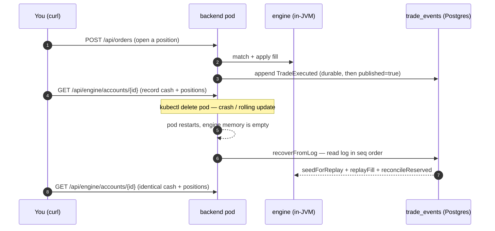

# Runbook — verifying warm-restart event sourcing on minikube / k3s

_How to prove, on a live cluster, that killing the backend pod **does not lose trading state** —
the engine is rebuilt from the `trade_events` log on restart._

This is the operational counterpart to the automated coverage in
[08-testing.md](08-testing.md#bootstrap--recovery--warm-restart-three-layers); the mechanism itself is
described in [05-event-sourcing-persistence.md](05-event-sourcing-persistence.md#warm-restart-recovery-engine-replay).

## What you are verifying



---

## Section 1 — Prerequisites

- A running **minikube** cluster (local) **or** SSH/kubeconfig access to the **k3s VPS** (prod).
- `kubectl` pointed at the cluster, plus `curl` and `jq`.
- The app deployed in namespace **`fx-oee`** (deployment `backend`, StatefulSet `postgres` → pod
  `postgres-0`).
- Local access to the API on `localhost:8080` — `scripts/deploy-all.sh` already starts
  `kubectl port-forward -n fx-oee svc/backend 8080:8080`. If that process died, re-run it:
  ```bash
  kubectl port-forward -n fx-oee svc/backend 8080:8080 &
  ```

> ⚠️ **Do not run `scripts/deploy-all.sh` mid-test.** It deletes the Postgres PVC
> (`postgres-data-postgres-0`) on every run — a clean slate, which is the opposite of what we are
> testing. To simulate a crash use `kubectl delete pod` (below); that preserves the PVC and the log.

## Section 2 — Verify warm restart is enabled

```bash
kubectl get configmap backend-config -n fx-oee \
  -o jsonpath='{.data.FXOEE_RECOVERY_REPLAY_ON_STARTUP}'; echo
# Expected: true
```

If this prints empty or `false`, the pod will fresh-start (wipe to 10 M) instead of replaying. Fix it
in [k8s/backend/configmap.yaml](../k8s/backend/configmap.yaml) and re-apply
(`kubectl apply -k k8s/overlays/local` or `.../prod`), then roll the deployment.

## Section 3 — End-to-end scenario

`TRADER_01` is the seeded `trader/trader` account, id
`00000000-0000-0000-0000-000000000001`, starting balance 10 M USD.

### Step 1 — Log in

```bash
TOKEN=$(curl -s -X POST http://localhost:8080/api/auth/login \
  -H 'Content-Type: application/json' \
  -d '{"username":"trader","password":"trader"}' | jq -r .token)
ACC=00000000-0000-0000-0000-000000000001
```

### Step 2 — Open a position

Submit a LIMIT BUY; the `MockMarketMaker` (`MOCK_MARKET_ENABLED=true`) provides resting liquidity, so
it fills:

```bash
curl -s -X POST http://localhost:8080/api/orders \
  -H "Authorization: Bearer $TOKEN" -H 'Content-Type: application/json' \
  -d '{"pair":"GBP_USD","side":"BUY","type":"LIMIT","price":"1.2700","quantity":"1000"}' | jq .
```

### Step 3 — Record engine state BEFORE the restart

```bash
curl -s http://localhost:8080/api/engine/accounts/$ACC | jq '{cash, reserved, positions}'
# Save this output — it is what must survive the restart.
```

`/api/engine/accounts/{id}` reads the **in-JVM engine** (`cash`, `reserved`, open `positions`) — the
exact state warm restart has to reconstruct.

> ℹ️ **Resting orders are recovered 1:1.** Warm restart rebuilds both positions/cash (`trade_events`)
> **and** the live order books (`resting_orders`). An open, unfilled LIMIT order placed before the
> restart comes back with the same id, price, remaining quantity, and time priority, and its margin is
> re-locked — so `reserved` after the restart equals `positions + resting` margin, exactly as before.
> To see it directly, place a **non-crossing** LIMIT (one that rests) in Step 2 and verify it is still
> on the book after Step 6.

### Step 4 — Kill the pod (simulate crash / rolling update)

```bash
kubectl delete pod -n fx-oee -l app=backend
kubectl rollout status deployment/backend -n fx-oee --timeout=5m
```

The Deployment controller starts a fresh pod with an empty engine. The PVC (and the `trade_events`
log) are untouched.

### Step 5 — Watch the warm-restart logs

```bash
kubectl logs -n fx-oee -l app=backend | grep -iE "bootstrap|warm|replay|relayed"
# Expected:
#   Bootstrap: warm restart — replaying trade_events into the engine
#   Bootstrap: warm restart complete — replayed N trades across M accounts
```

If you instead see `Bootstrap: Initializing accounts with 10M balance (fresh start)`, the flag from
Section 2 is off.

### Step 6 — Verify state AFTER the restart

```bash
# port-forward may have dropped with the old pod — restart it if needed:
kubectl port-forward -n fx-oee svc/backend 8080:8080 >/dev/null 2>&1 &
sleep 2
curl -s http://localhost:8080/api/engine/accounts/$ACC | jq '{cash, reserved, positions}'
# Expected: identical cash + positions to Step 3.
```

## Section 4 — Verify DB ↔ engine consistency

In a stable state every log row should be published (the relay has nothing to do):

```bash
kubectl exec -n fx-oee postgres-0 -- \
  psql -U fxoee -d fxoee -c \
  "SELECT count(*) AS total, count(*) FILTER (WHERE published) AS published FROM trade_events;"
# Expected: total == published
```

## Section 5 — Test the recovery relay (crash between DB append and Kafka publish)

Simulate the narrow window where a trade was durably logged but the Kafka confirm never landed, by
flipping the newest row back to `published=false`:

```bash
kubectl exec -n fx-oee postgres-0 -- \
  psql -U fxoee -d fxoee -c \
  "UPDATE trade_events SET published=false WHERE seq=(SELECT max(seq) FROM trade_events);"

kubectl delete pod -n fx-oee -l app=backend
kubectl rollout status deployment/backend -n fx-oee --timeout=5m

kubectl logs -n fx-oee -l app=backend | grep "relayed"
# Expected: Bootstrap: relayed 1 unpublished trade_events to Kafka
```

`FillConsumer` de-duplicates the replayed event by `event_id`, so the projection self-heals without
double-counting.

## Section 5b — Verify resting orders survived 1:1

Before the restart, place a **non-crossing** LIMIT (well away from the market so it rests instead of
filling), then confirm it returns after the pod is killed:

```bash
# place a resting order (far-from-market BUY) and note its id
curl -s -X POST http://localhost:8080/api/orders \
  -H "Authorization: Bearer $TOKEN" -H 'Content-Type: application/json' \
  -d '{"pair":"GBP_USD","side":"BUY","type":"LIMIT","price":"1.0000","quantity":"1000"}' | jq '{id, status}'

# it should be durably mirrored
kubectl exec -n fx-oee postgres-0 -- psql -U fxoee -d fxoee -c \
  "SELECT id, remaining_quantity FROM resting_orders WHERE account_id='$ACC';"

kubectl delete pod -n fx-oee -l app=backend
kubectl rollout status deployment/backend -n fx-oee --timeout=5m
kubectl logs -n fx-oee -l app=backend | grep "restored"
# Expected: Bootstrap: warm restart complete — replayed N trades, restored M resting orders across K accounts

# after restart the order is back on the book with the same remaining quantity
curl -s http://localhost:8080/api/orderbook/GBP_USD | jq '.bids'
```

## Section 6 — On the k3s VPS (production)

Same scenario; the API base is `https://fxoee.mcieslik.me` (or port-forward as above). Every push to
`master` triggers a CI rolling restart, so warm restart fires on **every deploy** — confirm it landed:

```bash
kubectl logs -n fx-oee -l app=backend | grep "warm restart complete"
```

A first-ever deploy onto an empty database logs `replayed 0 trades` and behaves like a fresh start —
warm restart on an empty log is a graceful no-op.
